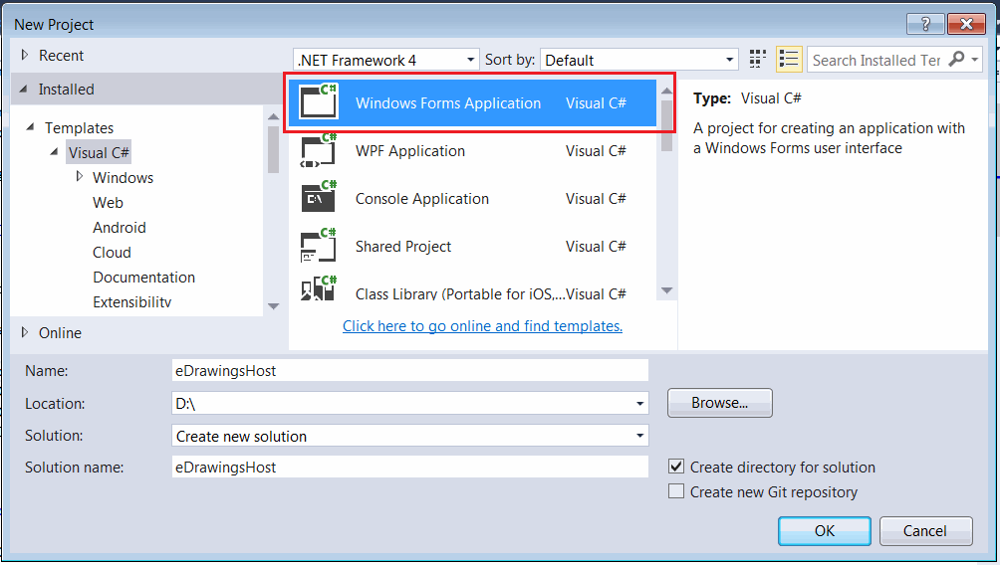
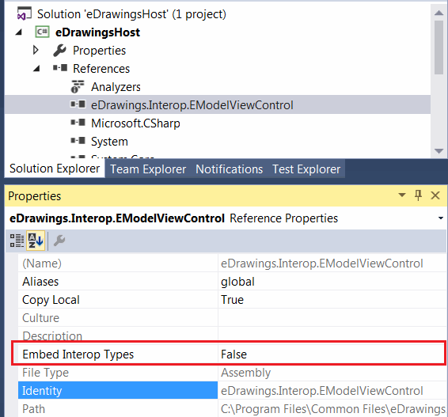
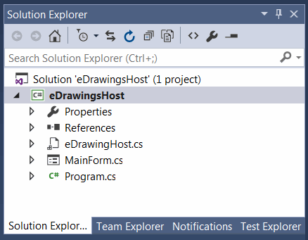
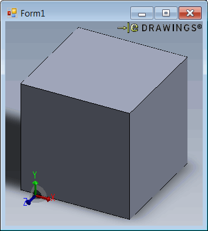

This tutorial is a step-by-step guide of hosting the eDrawings control in the Windows Forms using C#.

## Creating new Windows Form project

* Open Visual Studio
* Create new project and select *Windows Forms Application* in the *Visual C#* templates section

{ width=550 }

## Adding eDrawings interop

It is required to add interop for eDrawings control. Note that interop only contains the signature of the methods and classes (it doesn't contain implementation). eDrawings stil needs to be installed to use its API. However SOLIDWORKS application doesn't need to be installed.

Locate the eDrawings interop library by searching for *eDrawings.Interop.EModelViewControl.dll* file in the installation folder of eDrawings. Usually the path will be equal to 
*C:\Program Files\Common Files\eDrawings[Version]\eDrawings.Interop.EModelViewControl.dll*

I would recommend to disable the embedding of the interop to avoid potential cast errors:

{ width=350 }

## Creating eDrawings control wrapper

By default eDrawings API doesn't provide the .NET control to be hosted on the Windows Forms. So it is required to create the corresponding wrapper by implementing the [AxHost](https://docs.microsoft.com/en-us/dotnet/api/system.windows.forms.axhost) control and providing eDrawings GUID in the constructor. In the below implementation the version independent (*22945A69-1191-4DCF-9E6F-409BDE94D101*) guid is used which means that you application is backward compatible and will work with newer versions of eDrawings. Find the version dependent guids for eDrawing controls in the Registry if required.

### eDrawingHost.cs

~~~ cs
using eDrawings.Interop.EModelViewControl;
using System;
using System.Windows.Forms;

namespace CodeStack.Examples.eDrawings
{
    public class eDrawingHost : AxHost
    {
        public event Action<EModelViewControl> ControlLoaded;

        private bool m_IsLoaded;

        public eDrawingHost() : base("22945A69-1191-4DCF-9E6F-409BDE94D101")
        {
            m_IsLoaded = false;
        }

        protected override void OnCreateControl()
        {
            base.OnCreateControl();

            if (!m_IsLoaded)
            {
                m_IsLoaded = true;
                var ctrl = this.GetOcx() as EModelViewControl;
                ControlLoaded?.Invoke(this.GetOcx() as EModelViewControl);
            }
        }
    }
}

~~~

> eDrawings control is not loaded immediately and calling the [AxHost::GetOcx](https://docs.microsoft.com/en-us/dotnet/api/system.windows.forms.axhost.getocx) directly after the constructor will result in null reference. Calling this method when control is not fully loaded might result into the deadlock.

## Adding control to Windows Form

Add new form to the project and name it *MainForm*.

The solution tree will look similar to the one below:

{ width=350 }

Add the following code to the form code behind. Set the path to the SOLIDWORKS file as the *FILE_PATH* constant. The code will wait until eDrawings control is fully loaded and open the specified file automatically.

{ width=350 }

### MainForm.cs

~~~ cs
using eDrawings.Interop.EModelViewControl;
using System;
using System.Diagnostics;
using System.Windows.Forms;

namespace CodeStack.Examples.eDrawings
{
    public partial class MainForm : Form
    {
        private const string FILE_PATH = @"D:\Box.sldprt";

        public MainForm()
        {
            InitializeComponent();

            var host = new eDrawingHost();
            host.ControlLoaded += OnControlLoaded;
            this.Controls.Add(host);
            host.Dock = DockStyle.Fill;
        }

        private void OnControlLoaded(EModelViewControl ctrl)
        {
            ctrl.OnFinishedLoadingDocument += OnFinishedLoadingDocument;
            ctrl.OnFailedLoadingDocument += OnFailedLoadingDocument;
            ctrl.OpenDoc(FILE_PATH, false, false, false, "");
        }

        private void OnFailedLoadingDocument(string fileName, int errorCode, string errorString)
        {
            Trace.WriteLine($"{fileName} failed to loaded: {errorString}");
        }

        private void OnFinishedLoadingDocument(string fileName)
        {
            Trace.WriteLine($"{fileName} loaded");
        }
    }
}

~~~

Source code is available on [GitHub](https://github.com/codestackdev/solidworks-api-examples/tree/master/edrawings-api/eDrawingsWinFormsHost)
