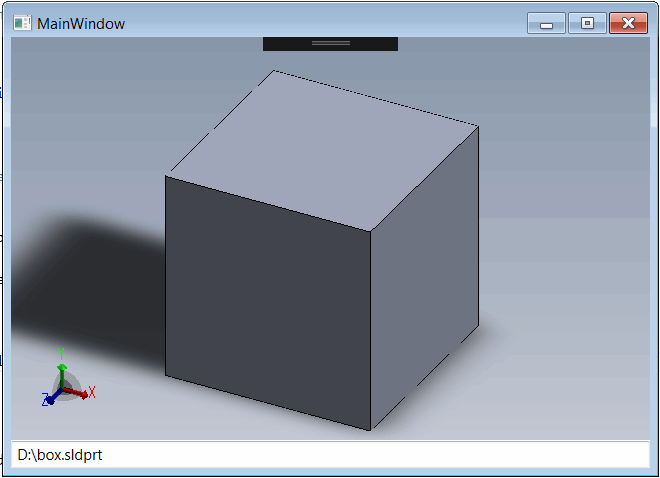

eDrawings API doesn't provide a native WPF control to be used in WPF. It is however possible to use the [WindowsFormsIntegration](https://docs.microsoft.com/en-us/dotnet/api/system.windows.forms.integration) framework to host Windows Forms Control in the Windows Presentation Foundation (WPF) environment. Follow [Hosting eDrawings control in Windows Forms](/docs/codestack/edrawings-api/gettings-started/winforms/) guide of creating the eDrawings control for Windows Forms.

## Creating new project

* Start Visual Studio
* Create new project and select *WPF Application* in the *Visual C#* templates section
{ width=550 }
* Follow the [Hosting eDrawings control in Windows Forms](/docs/codestack/edrawings-api/gettings-started/winforms/) guide for steps of adding eDrawings interop
* Add reference to *WindowsFormsIntegration*

## Creating the eDrawings WPF control

Create a wrapper for the eDrawings host Windows Forms control

### eDrawingHost.cs

~~~ cs
using eDrawings.Interop.EModelViewControl;
using System;
using System.Windows.Forms;

namespace CodeStack.Examples.eDrawings
{
    public class eDrawingHost : AxHost
    {
        public event Action<EModelViewControl> ControlLoaded;

        private bool m_IsLoaded;

        public eDrawingHost() : base("22945A69-1191-4DCF-9E6F-409BDE94D101")
        {
            m_IsLoaded = false;
        }

        protected override void OnCreateControl()
        {
            base.OnCreateControl();

            if (!m_IsLoaded)
            {
                m_IsLoaded = true;
                var ctrl = this.GetOcx() as EModelViewControl;
                ControlLoaded?.Invoke(this.GetOcx() as EModelViewControl);
            }
        }
    }
}

~~~

Create new WPF User Control which will host eDrawings and can be placed on other WPF controls or WPF windows

The solution tree will be similar to the one below.

{ width=350 }

### eDrawingsHostControl.xaml

There will be no logic or additional markup in the XAML of the control and all will be implemented in the code behind

~~~ xaml
<UserControl x:Class="CodeStack.Examples.eDrawings.eDrawingsHostControl"
             xmlns="http://schemas.microsoft.com/winfx/2006/xaml/presentation"
             xmlns:x="http://schemas.microsoft.com/winfx/2006/xaml"
             xmlns:mc="http://schemas.openxmlformats.org/markup-compatibility/2006" 
             xmlns:d="http://schemas.microsoft.com/expression/blend/2008" 
             xmlns:local="clr-namespace:CodeStack.Examples.eDrawings"
             mc:Ignorable="d" 
             d:DesignHeight="300" d:DesignWidth="300">
</UserControl>

~~~

### eDrawingsHostControl.xaml.cs

~~~ cs
using eDrawings.Interop.EModelViewControl;
using System;
using System.Diagnostics;
using System.IO;
using System.Windows;
using System.Windows.Controls;
using System.Windows.Forms.Integration;

namespace CodeStack.Examples.eDrawings
{
    public partial class eDrawingsHostControl : UserControl
    {
        private EModelViewControl m_Ctrl;

        public eDrawingsHostControl()
        {
            InitializeComponent();

            var host = new WindowsFormsHost();
            var ctrl = new eDrawingHost();
            ctrl.ControlLoaded += OnControlLoaded;
            host.Child = ctrl;
            this.AddChild(host);
        }
        
        public string FilePath
        {
            get { return (string)GetValue(FilePathProperty); }
            set { SetValue(FilePathProperty, value); }
        }

        public static readonly DependencyProperty FilePathProperty =
            DependencyProperty.Register(nameof(FilePath), typeof(string),
                typeof(eDrawingsHostControl), new FrameworkPropertyMetadata(OnFilePathPropertyChanged));

        private static void OnFilePathPropertyChanged(DependencyObject d, DependencyPropertyChangedEventArgs e)
        {
            (d as eDrawingsHostControl).OpenFile(e.NewValue as string);
        }

        private void OpenFile(string filePath)
        {
            if (m_Ctrl == null)
            {
                throw new NullReferenceException("eDrawings control is not loaded");
            }

            if (string.IsNullOrEmpty(filePath) || !File.Exists(filePath))
            {
                m_Ctrl.CloseActiveDoc("");
            }
            else
            {
                m_Ctrl.OpenDoc(filePath, false, false, false, "");
            }
        }

        private void OnControlLoaded(EModelViewControl ctrl)
        {
            m_Ctrl = ctrl;
            m_Ctrl.OnFinishedLoadingDocument += OnFinishedLoadingDocument;
            m_Ctrl.OnFailedLoadingDocument += OnFailedLoadingDocument;
        }

        private void OnFailedLoadingDocument(string fileName, int errorCode, string errorString)
        {
            Trace.WriteLine($"{fileName} failed to loaded: {errorString}");
        }

        private void OnFinishedLoadingDocument(string fileName)
        {
            Trace.WriteLine($"{fileName} loaded");
        }
    }
}

~~~

In this example the control defines the dependency property *FilePath* which can be bound and represent the path to the SOLIDWORKS file to be opened in the eDrawings

### MainWindow.xaml

Add the following markup to the MainWindow. It defines the text box control whose *Text* property is bound to *FilePath* dependency property of WPF eDrawing control. Which means that the file will be loaded immediately once the value in the text box is changed.

~~~ xaml
<Window x:Class="CodeStack.Examples.eDrawings.MainWindow"
        xmlns="http://schemas.microsoft.com/winfx/2006/xaml/presentation"
        xmlns:x="http://schemas.microsoft.com/winfx/2006/xaml"
        xmlns:d="http://schemas.microsoft.com/expression/blend/2008"
        xmlns:mc="http://schemas.openxmlformats.org/markup-compatibility/2006"
        xmlns:local="clr-namespace:CodeStack.Examples.eDrawings"
        mc:Ignorable="d"
        Title="MainWindow" Height="350" Width="525">
	<Grid>
		<Grid.RowDefinitions>
			<RowDefinition Height="*"/>
			<RowDefinition Height="Auto"/>
		</Grid.RowDefinitions>
		<local:eDrawingsHostControl Grid.Row="0" FilePath="{Binding Path=Text, ElementName=txtFilePath, UpdateSourceTrigger=Explicit}"/>
		<TextBox Grid.Row="1" x:Name="txtFilePath"/>
	</Grid>
</Window>

~~~

Change the path to file in the text box to see the file loaded into the WPF form.

{ width=350 }

Source code is available on [GitHub](https://github.com/codestackdev/solidworks-api-examples/tree/master/edrawings-api/eDrawingsWpfHost)
