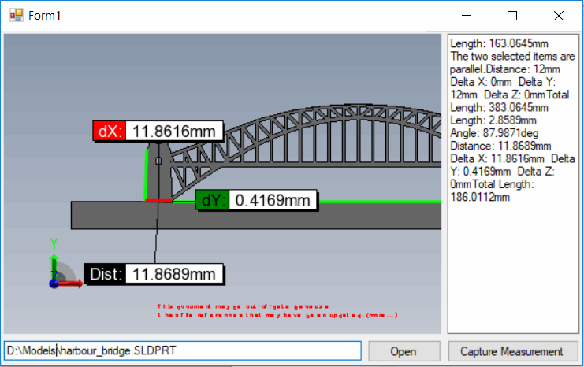

{ width=450 }

This example demonstrate how to use eDrawings markup API to capture the measurements of selected entities into a text box.

This example is based on [Hosting eDrawings control in Windows Forms](/docs/codestack/edrawings-api/gettings-started/winforms/)

* Run the form
* Open any SOLIDWORKS or eDrawings file by specifying the full path to a file and clicking *Open* button
* Measurement is automatically enabled
* Select any entity or entities and click *Capture Measurement*. The measurement value is appended into a text box

~~~ cs
using eDrawings.Interop.EModelMarkupControl;
using eDrawings.Interop.EModelViewControl;
using System;
using System.Diagnostics;
using System.Windows.Forms;

namespace CodeStack.Examples.eDrawingsApi
{
    public partial class MainForm : Form
    {
        private EModelViewControl m_EDrawingsCtrl;
        private EModelMarkupControl m_EDrawingsMarkupCtrl;

        public MainForm()
        {
            InitializeComponent();
        }

        protected override void OnShown(EventArgs e)
        {
            base.OnShown(e);

            ctrlEDrw.LoadEDrawings();
        }

        private void OnControlLoaded(EModelViewControl ctrl)
        {
            m_EDrawingsCtrl = ctrl;

            m_EDrawingsCtrl.OnFinishedLoadingDocument += OnFinishedLoadingDocument;
            m_EDrawingsCtrl.OnFailedLoadingDocument += OnFailedLoadingDocument;

            m_EDrawingsMarkupCtrl = m_EDrawingsCtrl.CoCreateInstance("EModelViewMarkup.EModelMarkupControl") as EModelMarkupControl;
        }

        private void OnFailedLoadingDocument(string fileName, int errorCode, string errorString)
        {
            Trace.WriteLine($"{fileName} failed to loaded: {errorString}");
        }

        private void OnFinishedLoadingDocument(string fileName)
        {
            Trace.WriteLine($"{fileName} loaded");
            
            m_EDrawingsMarkupCtrl.ViewOperator = EMVMarkupOperators.eMVOperatorMeasure;
        }
        
        private void OnOpen(object sender, EventArgs e)
        {
            var filePath = txtFilePath.Text;

            if (!string.IsNullOrEmpty(filePath))
            {
                if (m_EDrawingsCtrl == null)
                {
                    throw new NullReferenceException("eDrawings control is not loaded");
                }

                txtMeasurements.Clear();
                m_EDrawingsCtrl.CloseActiveDoc("");
                m_EDrawingsCtrl.OpenDoc(filePath, false, false, false, "");
            }
        }

        private void OnCaptureMeasurement(object sender, EventArgs e)
        {
            txtMeasurements.Text += (!string.IsNullOrEmpty(txtMeasurements.Text) ? Environment.NewLine : "") 
                + m_EDrawingsMarkupCtrl.MeasureResultString;
        }
    }
}

~~~

Source code is available on [GitHub](https://github.com/codestackdev/solidworks-api-examples/tree/master/edrawings-api/MeasurementSurveying).
