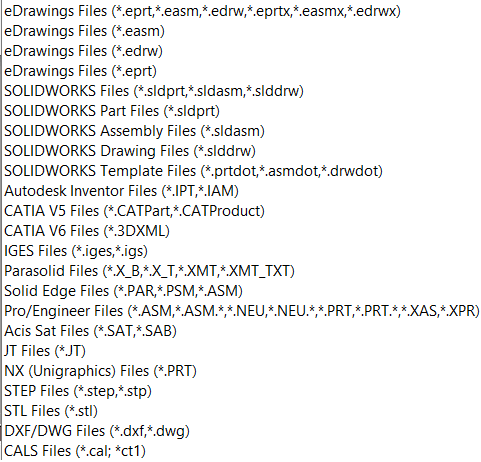
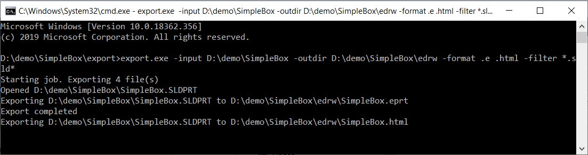

This console application developed in C# allows to export SOLIDWORKS, DXF, DWG, eDrawings files to foreign format (.jpg, .tif, .bmp, .stl, .exe, .htm, .zip, .edrw, .eprt, and .easm) using free version of SOLIDWORKS eDrawings via its API. It is not required to have SOLIDWORKS installed or use its license to use this tool.

This functionality has been integrated into the [xPort](https://cadplus.xarial.com/xport/) utility.

## Running the tool

This application can be run from the command line and with the following parameters:

* **-input** list of input directories or file paths to process. These are files which can be opened by eDrawings (e.g. SOLIDWORKS files, CATIA, STEP, DXF/DWG, etc.). Please see the complete list below:

{ width=250 }

* **-filter** filter to extract input files, if **-input** parameter contains directories
* **-outdir** - path to the directory to export results to. Tool will automatically create directory if it doesn't exist. If this parameter is not specified, files will be exported to the same folder as the input file.
* **-format** - list of formats to export the files to. Supported formats: .jpg, .tif, .bmp, .png, .stl, .exe, .htm, .zip, .edrw, .eprt, and .easm. Specify .e to export to the corresponding format of eDrawings (e.g. .sldprt is exported to .eprt, .sldasm to .easm, .slddrw to .edrw). If this parameter is not specified than file will be exported to eDrawings.

Tool should be called with the following format:

~~~
[parameter name] parameterValue1, parameterValue2 ... parameterValueN
~~~

Please see below example of parameters

## Example commands

* Export all SOLIDWORKS files (matching the filter *.sld*, i.e. extension starts with .sld) from the *SW Drawings* and *SW Models* folders in drive C (including sub folders) to the *C:\EDRW* folder in eDrawings format (.eprt for parts, .easm for assemblies, .edrw for drawing) and html format.

~~~
> export.exe -input "C:\SW Drawings" "C:\SW Models" -output C:\EDRW -filter *.sld* -format .e .html
~~~

* Export *C:\Models\Part.sldprt* into *C:\Models\Part.eprt*

~~~
> export.exe -input "C:\Models\Part.sldprt"
~~~

* Export all files in the *C:\Models* folder into the executable eDrawings format. Each file will be saved into the same folder as original input file.

~~~
> export.exe -input C:\Models -format .exe
~~~

## Results

Operation progress is displayed in the console window

Output files are created as per settings.

## EDrawingsHost.cs

~~~ cs
using System;
using System.Windows.Forms;
using eDrawings.Interop.EModelViewControl;

namespace Export
{
    public class EDrawingsHost : AxHost
    {
        public event Action<EModelViewControl> ControlLoaded;
        private bool m_IsLoaded;

        public EDrawingsHost() : base("22945A69-1191-4DCF-9E6F-409BDE94D101")
        {
            m_IsLoaded = false;
        }

        protected override void OnCreateControl()
        {
            base.OnCreateControl();

            if (!m_IsLoaded)
            {
                m_IsLoaded = true;
                var ctrl = GetOcx() as EModelViewControl;
                ControlLoaded?.Invoke(GetOcx() as EModelViewControl);
            }
        }
    }
}

~~~

## Program.cs

~~~ cs
using eDrawings.Interop.EModelViewControl;
using System;
using System.Collections.Generic;
using System.IO;
using System.Linq;
using System.Windows.Forms;

namespace Export
{
    class Program
    {
        private class ExportData
        {
            public string InputFilePath { get; private set; }
            public string OutputFilePath { get; private set; }

            public ExportData(string input, string output)
            {
                InputFilePath = input;
                OutputFilePath = output;
            }
        }

        private const string ARG_INPUT = "-input";
        private const string ARG_FILTER = "-filter";
        private const string ARG_OUTPUT_DIR = "-outdir";
        private const string ARG_FORMAT = "-format";

        private const string EDRW_FORMAT = ".e";

        private static EModelViewControl m_Ctrl;

        private static List<ExportData> m_Job;

        private static ExportData m_CurrentExport;

        [STAThread]
        static void Main(string[] args)
        {
            try
            {
                ParseArguments(args);

                var eDrwCtrl = new EDrawingsHost();

                eDrwCtrl.ControlLoaded += OnEdrawingsControlLoaded;

                var winForm = new Form();
                winForm.Controls.Add(eDrwCtrl);
                eDrwCtrl.Dock = DockStyle.Fill;
                winForm.ShowIcon = false;
                winForm.ShowInTaskbar = false;
                winForm.WindowState = FormWindowState.Minimized;
                winForm.ShowDialog();
            }
            catch (Exception ex)
            {
                PrintError(ex.Message);
            }
        }

        private static void ParseArguments(string[] args)
        {
            var inputs = new List<string>();
            var filters = new List<string>();
            var outDirs = new List<string>();
            var formats = new List<string>();

            List<string> curList = null;

            for (int i = 0; i < args.Length; i++)
            {
                if (args[i].Equals(ARG_INPUT, StringComparison.CurrentCultureIgnoreCase))
                {
                    curList = inputs;
                }
                else if (args[i].Equals(ARG_FILTER, StringComparison.CurrentCultureIgnoreCase))
                {
                    curList = filters;
                }
                else if (args[i].Equals(ARG_OUTPUT_DIR, StringComparison.CurrentCultureIgnoreCase))
                {
                    curList = outDirs;
                }
                else if (args[i].Equals(ARG_FORMAT, StringComparison.CurrentCultureIgnoreCase))
                {
                    curList = formats;
                }
                else
                {
                    if (curList != null)
                    {
                        curList.Add(args[i]);
                    }
                    else
                    {
                        throw new ArgumentException("Arguments are invalid, specify the correct switch");
                    }
                }
            }
            
            foreach (var outDir in outDirs)
            {
                if (!Directory.Exists(outDir))
                {
                    Directory.CreateDirectory(outDir);
                }
            }

            if (!outDirs.Any())
            {
                outDirs.Add("");
            }

            if (!inputs.Any())
            {
                throw new ArgumentException($"Inputs are not specified. Use {ARG_INPUT} switch to specify the input directory(s) or file(s)");
            }

            if (!formats.Any())
            {
                formats.Add(EDRW_FORMAT);
            }

            var filter = filters.Any() ? filters.First() : "*.*";

            var files = new List<string>();

            foreach (var input in inputs)
            {
                if (Directory.Exists(input))
                {
                    files.AddRange(Directory.GetFiles(input, filter, SearchOption.AllDirectories).ToList());
                }
                else if (File.Exists(input))
                {
                    files.Add(input);
                }
                else
                {
                    throw new Exception("Specify input file or directory");
                }
            }

            m_Job = new List<ExportData>();

            foreach (var file in files)
            {
                foreach (var outDir in outDirs)
                {
                    foreach (var format in formats)
                    {
                        var ext = format;

                        if (!ext.StartsWith("."))
                        {
                            ext = "." + ext;
                        }

                        if (ext.Equals(EDRW_FORMAT, StringComparison.CurrentCultureIgnoreCase))
                        {
                            switch (Path.GetExtension(file).ToLower())
                            {
                                case ".sldprt":
                                    ext = ".eprt";
                                    break;
                                case ".sldasm":
                                    ext = ".easm";
                                    break;
                                case ".slddrw":
                                    ext = ".edrw";
                                    break;
                                default:
                                    throw new ArgumentException($"{EDRW_FORMAT} format is only applicable for SOLIDWORKS files");
                            }
                        }

                        var outFile = Path.Combine(!string.IsNullOrEmpty(outDir) ? outDir : Path.GetDirectoryName(file),
                            Path.GetFileNameWithoutExtension(file) + ext);

                        m_Job.Add(new ExportData(file, outFile));
                    }
                }
            }
        }

        public static void OnEdrawingsControlLoaded(EModelViewControl ctrl)
        {
            Console.WriteLine(string.Format("Starting job. Exporting {0} file(s)", m_Job.Count));

            m_Ctrl = ctrl;

            m_Ctrl.OnFinishedLoadingDocument += OnDocumentLoaded;
            m_Ctrl.OnFailedLoadingDocument += OnDocumentLoadFailed;
            m_Ctrl.OnFinishedSavingDocument += OnDocumentSaved;
            m_Ctrl.OnFailedSavingDocument += OnSaveFailed;

            ExportNext();
        }

        public static void ExportNext()
        {
            m_CurrentExport = null;

            if (m_Job.Any())
            {
                m_CurrentExport = m_Job.First();
                m_Job.RemoveAt(0);

                if (!string.Equals(m_Ctrl.FileName, m_CurrentExport.InputFilePath, StringComparison.CurrentCultureIgnoreCase))
                {
                    m_Ctrl.CloseActiveDoc("");
                    m_Ctrl.OpenDoc(m_CurrentExport.InputFilePath, false, false, false, "");
                }
                else
                {
                    ExportCurrentFile();
                }
            }
            else
            {
                Console.WriteLine("Completed");
                Environment.Exit(0);
            }
        }

        public static void OnDocumentLoaded(string fileName)
        {
            Console.WriteLine(string.Format("Opened {0}", fileName));
            ExportCurrentFile();
        }

        private static void ExportCurrentFile()
        {
            Console.WriteLine($"Exporting {m_CurrentExport.InputFilePath} to {m_CurrentExport.OutputFilePath}");
            m_Ctrl.Save(m_CurrentExport.OutputFilePath, false, "");
        }

        public static void OnDocumentLoadFailed(string fileName, int errorCode, string errorString)
        {
            PrintError(string.Format("Failed to load {0}: {1}", fileName, errorString));
            ExportNext();
        }

        private static void OnDocumentSaved()
        {
            Console.WriteLine("Export completed");
            ExportNext();
        }

        private static void OnSaveFailed(string FileName, int ErrorCode, string ErrorString)
        {
            PrintError($"Failed to export 'FileName': {ErrorString} [{ErrorCode}]");
            ExportNext();
        }
        
        public static void PrintError(string msg)
        {
            Console.ForegroundColor = ConsoleColor.Red;
            Console.WriteLine(msg);
            Console.ResetColor();
        }
    }
}

~~~

Source code is available on [GitHub](https://github.com/codestackdev/solidworks-api-examples/tree/master/edrawings-api/Export)
