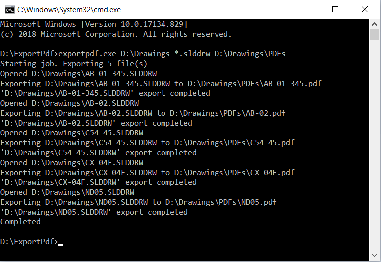
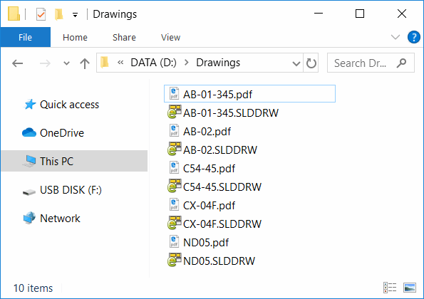

{ width=200 }

This console application developed in VB.NET allows to export SOLIDWORKS, DXF, DWG files to PDF using free version of SOLIDWORKS eDrawings via its API. It is not required to have SOLIDWORKS installed or use its license to use this tool. This tool is supported on Windows 8.1 onwards.

This functionality has been integrated into the [xPort](https://cadplus.xarial.com/xport/) utility.

## Running the tool

This application can be run from the command line and expects 2 mandatory and one optional argument as described below:

1. Full path to input file or folder (in this case all files which match the filter will be exported)
1. Filter. Specify * for all files. Or *.slddrw for all SOLIDWORKS drawing files
1. (optional) Output folder to save PDF files. If not specified PDF files will be created in the same folder as input SOLIDWORKS files. Folder is automatically created if doesn't exist.

## Example commands

* Export all slddrw files in the *C:\SOLIDWORKS Drawings* folder (including sub folders) to the same location as source file

~~~
> exportpdf.exe "C:\SOLIDWORKS Drawings" "*.slddrw"
~~~

* Export all SOLIDWORKS drawings from *C:\SOLIDWORKS Drawings* folder (including sub folders) whose file name starts with *print_* to the *C:\PDFs* directory

~~~
> exportpdf.exe "C:\SOLIDWORKS Drawings" "print_*.slddrw" "C:\PDFs"
~~~

## Results

Operation progress is displayed in the console window

{ width=450 }

PDF files are created as per settings. PDF files are named after the source files they were generated from.

{ width=450 }

## EDrawingsHost.vb

~~~ vb
Imports System.Windows.Forms
Imports eDrawings.Interop.EModelViewControl

Public Class EDrawingsHost
    Inherits AxHost

    Public Event ControlLoaded As Action(Of EModelViewControl)
    Private m_IsLoaded As Boolean

    Public Sub New()
        MyBase.New("22945A69-1191-4DCF-9E6F-409BDE94D101")
        m_IsLoaded = False
    End Sub

    Protected Overrides Sub OnCreateControl()
        MyBase.OnCreateControl()

        If Not m_IsLoaded Then
            m_IsLoaded = True
            Dim ctrl = TryCast(Me.GetOcx(), EModelViewControl)
            RaiseEvent ControlLoaded(TryCast(Me.GetOcx(), EModelViewControl))
        End If
    End Sub

End Class

~~~

## Module1.vb

~~~ vb
Imports System.Drawing.Printing
Imports System.IO
Imports System.Windows.Forms
Imports eDrawings.Interop
Imports eDrawings.Interop.EModelViewControl

Module Module1

    Dim m_Ctrl As EModelViewControl

    Dim m_Files As List(Of String)
    Dim m_OutDir As String

    Sub Main()

        Try
            ExtractInputParameters()

            Dim eDrwCtrl = New EDrawingsHost()

            AddHandler eDrwCtrl.ControlLoaded, AddressOf OnEdrawingsControlLoaded

            Dim winForm As Form = New Form
            winForm.Controls.Add(eDrwCtrl)
            eDrwCtrl.Dock = DockStyle.Fill
            winForm.ShowIcon = False
            winForm.ShowInTaskbar = False
            winForm.WindowState = FormWindowState.Minimized
            winForm.ShowDialog()

        Catch ex As Exception
            PrintError(ex.Message)
        End Try

    End Sub

    Private Sub ExtractInputParameters()

        Dim args As String() = Environment.GetCommandLineArgs()
        Dim input As String = args(1)
        Dim filter As String = args(2)
        m_OutDir = ""

        If args.Length > 3 Then
            m_OutDir = args(3)
        End If

        If Not String.IsNullOrEmpty(m_OutDir) Then
            If Not Directory.Exists(m_OutDir) Then
                Directory.CreateDirectory(m_OutDir)
            End If
        End If

        If Directory.Exists(input) Then
            m_Files = Directory.GetFiles(input, filter, SearchOption.AllDirectories).ToList()
        ElseIf File.Exists(input) Then
            m_Files = New List(Of String)()
            m_Files.Add(input)
        Else
            Throw New Exception("Specify input file or directory")
        End If

    End Sub

    Sub OnEdrawingsControlLoaded(ctrl As EModelViewControl)

        Console.WriteLine(String.Format("Starting job. Exporting {0} file(s)", m_Files.Count))

        m_Ctrl = ctrl

        AddHandler m_Ctrl.OnFinishedLoadingDocument, AddressOf OnDocumentLoaded
        AddHandler m_Ctrl.OnFailedLoadingDocument, AddressOf OnDocumentLoadFailed
        AddHandler m_Ctrl.OnFinishedPrintingDocument, AddressOf OnDocumentPrinted
        AddHandler m_Ctrl.OnFailedPrintingDocument, AddressOf OnPrintFailed

        PrintNext()

    End Sub

    Sub PrintNext()

        If m_Files.Any() Then

            Dim filePath As String
            filePath = m_Files.First()
            m_Files.RemoveAt(0)

            m_Ctrl.CloseActiveDoc("")
            m_Ctrl.OpenDoc(filePath, False, False, False, "")

        Else
            Console.WriteLine("Completed")
            Environment.Exit(0)
        End If

    End Sub

    Sub OnDocumentLoaded(fileName As String)

        Const PRINTER_NAME As String = "Microsoft Print to PDF"
        Const AUTO_SOURCE As Integer = 7

        Console.WriteLine(String.Format("Opened {0}", fileName))
        m_Ctrl.SetPageSetupOptions(EMVPrintOrientation.eLandscape, CInt(PaperKind.A4), 100, 100, 1, AUTO_SOURCE, PRINTER_NAME, 0, 0, 0, 0)

        Dim pdfFileName = Path.GetFileNameWithoutExtension(fileName) + ".pdf"
        Dim outDir As String

        If Not String.IsNullOrEmpty(m_OutDir) Then
            outDir = m_OutDir
        Else
            outDir = Path.GetDirectoryName(fileName)
        End If

        Dim pdfFilePath As String
        pdfFilePath = Path.Combine(outDir, pdfFileName)

        Console.WriteLine(String.Format("Exporting {0} to {1}", fileName, pdfFilePath))

        m_Ctrl.Print5(False, fileName, False, False, True, EMVPrintType.eOneToOne, 1, 0, 0, True, 1, 1, pdfFilePath)

    End Sub

    Sub OnDocumentLoadFailed(fileName As String, errorCode As Integer, errorString As String)
        PrintError(String.Format("Failed to load {0}: {1}", fileName, errorString))
        PrintNext()
    End Sub

    Sub OnDocumentPrinted(printJobName As String)
        Console.WriteLine(String.Format("'{0}' export completed", printJobName))
        PrintNext()
    End Sub

    Sub OnPrintFailed(printJobName As String)
        PrintError(String.Format("Failed to export '{0}'", printJobName))
        PrintNext()
    End Sub

    Sub PrintError(msg As String)
        Console.ForegroundColor = ConsoleColor.Red
        Console.WriteLine(msg)
        Console.ResetColor()
    End Sub

End Module

~~~

Source code is available on [GitHub](https://github.com/codestackdev/solidworks-api-examples/tree/master/edrawings-api/BatchExportPdf)
