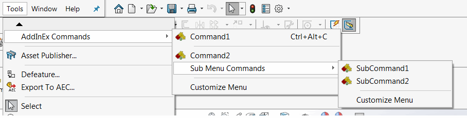

## Adding spacer

Spacer can be added between the commands by decorating the command using the [CommandSpacerAttribute](https://docs.codestack.net/swex/add-in/html/T_CodeStack_SwEx_AddIn_Attributes_CommandSpacerAttribute.htm). Spacer will be added before this command.

~~~vb
<Title("AddInEx Commands")>
Public Enum Commands_e

    Command1

    <CommandSpacer>
    Command2

End Enum
~~~

~~~cs
public enum Commands_e
{
    Command1,

    [CommandSpacer]
    Command2
}
~~~

If command tab tab boxes are created for this command group (i.e. *showInCmdTabBox* parameter is set to *true* in the [CommandItemInfoAttribute](https://docs.codestack.net/swex/add-in/html/M_CodeStack_SwEx_AddIn_Attributes_CommandItemInfoAttribute__ctor_2.htm)), spacer is not reflected in the corresponding command tab box.

## Adding sub-menus

Sub-menus for the command groups can be defined by calling the corresponding overload of the [CommandGroupInfoAttribute](https://docs.codestack.net/swex/add-in/html/M_CodeStack_SwEx_AddIn_Attributes_CommandGroupInfoAttribute__ctor_2.htm) attribute and specifying the type of the parent menu group

~~~vb
<Title("Sub Menu Commands")>
<CommandGroupInfo(GetType(Commands_e))>
Public Enum SubCommands_e
    SubCommand1
    SubCommand2
End Enum
~~~

~~~cs
[CommandGroupInfo(typeof(Commands_e))]
public enum SubCommands_e
{
    SubCommand1,
    SubCommand2
}
~~~

Sub menus are rendered in separate tab boxes in the command tab.

## Example

~~~vb
<Title("AddInEx Commands")>
Public Enum Commands_e

    Command1

    <CommandSpacer>
    Command2

End Enum

<Title("Sub Menu Commands")>
<CommandGroupInfo(GetType(Commands_e))>
Public Enum SubCommands_e
    SubCommand1
    SubCommand2
End Enum

Public Overrides Function OnConnect() As Boolean
    AddCommandGroup(Of Commands_e)(AddressOf OnButtonClick)
    AddCommandGroup(Of SubCommands_e)(AddressOf OnButtonClick)
    Return True
End Function

Private Sub OnButtonClick(ByVal cmd As Commands_e)
End Sub

Private Sub OnButtonClick(ByVal cmd As SubCommands_e)
End Sub
~~~

~~~cs
[Title("AddInEx Commands")]
public enum Commands_e
{
    Command1,

    [CommandSpacer]
    Command2
}

[Title("Sub Menu Commands")]
[CommandGroupInfo(typeof(Commands_e))]
public enum SubCommands_e
{
    SubCommand1,
    SubCommand2
}

public override bool OnConnect()
{
    AddCommandGroup<Commands_e>(OnButtonClick);
    AddCommandGroup<SubCommands_e>(OnButtonClick);
    return true;
}

private void OnButtonClick(Commands_e cmd)
{
}

private void OnButtonClick(SubCommands_e cmd)
{
}
~~~

The above commands configuration would result in the following menu and command tab boxes created:

* Command1 and Command2 are commands of the top level menu defined in Commands_e enumeration
* Spacer is added between Command1 and Command2
* SubCommand1 and SubCommand2 are commands of SubCommands_e enumeration which is a sub menu of Commands_e enumeration

* All commands (including sub menu commands) are added on the same command tab
* Command1 and Command2 are placed in a separate command tab boxes of SubCommand1 and SubCommand2
* Spacer between Command1 and Command2 is ignored in the commands tab
