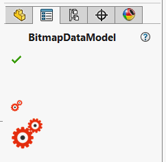

Static bitmap will be created in the property manager page for the properties of [Image](https://docs.microsoft.com/en-us/dotnet/api/system.drawing.image?view=netframework-4.8) type or other types assignable from this type, e.g. [Bitmap](https://docs.microsoft.com/en-us/dotnet/api/system.drawing.bitmap?view=netframework-4.8)

~~~vb
Imports CodeStack.SwEx.PMPage.Attributes
Imports System.Drawing
Imports CodeStack.SwEx.My.Resources

Public Class BitmapDataModel

    Public Property Bitmap As Image = Resources.BitmapSample

End Class
~~~

~~~cs
using CodeStack.SwEx.PMPage.Attributes;
using CodeStack.SwEx.Properties;
using System.Drawing;

public class BitmapDataModel
{
    public Image Bitmap { get; set; } = Resources.BitmapSample;

}
~~~

## Bitmap size

Default size of the bitmap is 18x18 pixels, however this could be overridden using the [BitmapOptionsAttribute](https://docs.codestack.net/swex/pmpage/html/T_CodeStack_SwEx_PMPage_Attributes_BitmapOptionsAttribute.htm) by providing width and height values in the constructor parameters:

~~~vb
<BitmapOptions(48, 48)>
Public Property BitmapLarge As Image = Resources.BitmapSample
~~~

~~~cs
[BitmapOptions(48, 48)]
public Image BitmapLarge { get; set; } = Resources.BitmapSample;
~~~

> Due to SOLIDWORKS API limitation bitmap cannot be changed as [dynamic value](/docs/codestack/labs/solidworks/swex/pmpage/controls/dynamic-values/) after property manager page is displayed. Assign the image in the data model class constructor or as a default value of the property.
