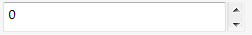

Number box will be automatically created for the properties of *int* and *double* types.

~~~vb
Imports CodeStack.SwEx.PMPage.Attributes
Imports SolidWorks.Interop.swconst

Public Class NumberBoxDataModel

    Public Property Number As Integer
    Public Property FloatingNumber As Double

End Class
~~~

~~~cs
using CodeStack.SwEx.PMPage.Attributes;
using SolidWorks.Interop.swconst;

public class NumberBoxDataModel
{
    public int Number { get; set; }
    public double FloatingNumber { get; set; }

}
~~~

Style of the number box can be customized via the [NumberBoxOptionsAttribute](https://docs.codestack.net/swex/pmpage/html/T_CodeStack_SwEx_PMPage_Attributes_NumberBoxOptionsAttribute.htm)

~~~vb
Imports CodeStack.SwEx.PMPage.Attributes
Imports SolidWorks.Interop.swconst

Public Class NumberBoxDataModel

	<NumberBoxOptions(swNumberboxUnitType_e.swNumberBox_Length, 0, 1000, 0.01, True, 0.02, 0.001,
					  swPropMgrPageNumberBoxStyle_e.swPropMgrPageNumberBoxStyle_Thumbwheel)>
	Public Property Length As Double

End Class
~~~

~~~cs
using CodeStack.SwEx.PMPage.Attributes;
using SolidWorks.Interop.swconst;

public class NumberBoxDataModel
{

    [NumberBoxOptions(swNumberboxUnitType_e.swNumberBox_Length, 0, 1000, 0.01, true, 0.02, 0.001,
        swPropMgrPageNumberBoxStyle_e.swPropMgrPageNumberBoxStyle_Thumbwheel)]
    public double Length { get; set; }
}
~~~

