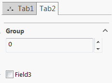

Tab containers are created for the complex types decorated with [TabAttribute](https://docs.codestack.net/swex/pmpage/html/T_CodeStack_SwEx_PMPage_Attributes_TabAttribute.htm).

~~~vb
Imports CodeStack.SwEx.Common.Attributes
Imports CodeStack.SwEx.My.Resources
Imports CodeStack.SwEx.PMPage.Attributes

Public Class TabDataModel

	<Tab>
	<Icon(GetType(Resources), NameOf(Resources.OffsetImage))>
	Public Class TabControl1
		Public Property Field1 As String
	End Class

	Public Property Tab1 As TabControl1

End Class
~~~

~~~cs
using CodeStack.SwEx.Common.Attributes;
using CodeStack.SwEx.PMPage.Attributes;
using CodeStack.SwEx.Properties;

public class TabDataModel
{
    [Tab]
    [Icon(typeof(Resources), nameof(Resources.OffsetImage))]
    public class TabControl1
    {
        public string Field1 { get; set; }
    }

    public TabControl1 Tab1 { get; set; }

}
~~~

## Tab with nested groups

Controls can be added directly to tabs or can reside in the nested groups:

~~~vb
Public Class TabControl2
	Public Class Group1
		Public Property Field2 As Integer
	End Class

	Public Property Group As Group1
	Public Property Field3 As Boolean
End Class

<Tab>
Public Property Tab2 As TabControl2
~~~

~~~cs
public class TabControl2
{
    public class Group1
    {
        public int Field2 { get; set; }
    }

    public Group1 Group { get; set; }
    public bool Field3 { get; set; }
}

[Tab]
public TabControl2 Tab2 { get; set; }
~~~
