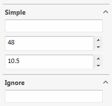

{ width=250 }

## Data model

Start by defining the data model required to be filled by property manager page.

~~~vb
Public Class DataModelSimple
	Public Property Text As String
	Public Property Size As Integer = 48
	Public Property Number As Double = 10.5
End Class
~~~

~~~cs
public class DataModelSimple
{
    public string Text { get; set; }
    public int Size { get; set; } = 48;
    public double Number { get; set; } = 10.5;
}
~~~

Use properties with public getters and setters

## Events handler

Create handler for property manager page by inheriting the public class from 	
[PropertyManagerPageHandlerEx](https://docs.codestack.net/swex/pmpage/html/T_CodeStack_SwEx_PMPage_PropertyManagerPageHandlerEx.htm) class.

This class will be instantiated by the framework and will allow handling the property manager specific events from the add-in.

~~~vb
<ComVisible(True)>
      Public Class MyPMPageHandler
          Inherits PropertyManagerPageHandlerEx
      End Class
~~~

~~~cs
[ComVisible(true)]
public class MyPMPageHandler : PropertyManagerPageHandlerEx
{
}
~~~

> Class must be com visible and have public parameterless constructor.

## Ignoring members

If it is required to exclude the members in the data model from control generation such members should be decorated with [IgnoreBindingAttribute](https://docs.codestack.net/swex/pmpage/html/T_CodeStack_SwEx_PMPage_Attributes_IgnoreBindingAttribute.htm)

~~~vb
Public Class DataModelIgnore
	Public Property Text As String

	<IgnoreBinding>
	Public Property CalculatedField As Integer 'control will not be generated for this field
End Class
~~~

~~~cs
public class DataModelIgnore
{
    public string Text { get; set; }

    [IgnoreBinding]
    public int CalculatedField { get; set; } //control will not be generated for this field
}
~~~

## Creating instance

Create instance of the property manager page by passing the type of the handler and data model instance into the generic arguments

> Data model can contain predefined (default) values. Framework will automatically use this values in the corresponding controls.

~~~vb
Private m_Page As PropertyManagerPageEx(Of MyPMPageHandler, DataModel)
Private m_Data As DataModel = New DataModel()

Private Enum Commands_e
	ShowPmpPage
End Enum

Public Overrides Function OnConnect() As Boolean
	m_Page = New PropertyManagerPageEx(Of MyPMPageHandler, DataModel)(App)
	AddCommandGroup(Of Commands_e)(AddressOf ShowPmpPage)
	Return True
End Function

Private Sub ShowPmpPage(cmd As Commands_e)
	AddHandler m_Page.Handler.Closed, AddressOf OnPageClosed
	m_Page.Show(m_Data)
End Sub

Private Sub OnPageClosed(ByVal reason As swPropertyManagerPageCloseReasons_e)
	Debug.Print($"Text: {m_Data.Simple.Text}")
	Debug.Print($"Size: {m_Data.Simple.Size}")
	Debug.Print($"Number: {m_Data.Simple.Number}")
End Sub
~~~

~~~cs
private PropertyManagerPageEx<MyPMPageHandler, DataModel> m_Page;
private DataModel m_Data = new DataModel();

private enum Commands_e
{
    ShowPmpPage
}

public override bool OnConnect()
{
    m_Page = new PropertyManagerPageEx<MyPMPageHandler, DataModel>(App);
    AddCommandGroup<Commands_e>(ShowPmpPage);
    return true;
}

private void ShowPmpPage(Commands_e cmd)
{
    m_Page.Handler.Closed += OnPageClosed;
    m_Page.Show(m_Data);
}

private void OnPageClosed(swPropertyManagerPageCloseReasons_e reason)
{
    Debug.Print($"Text: {m_Data.Simple.Text}");
    Debug.Print($"Size: {m_Data.Simple.Size}");
    Debug.Print($"Number: {m_Data.Simple.Number}");
}
~~~

> Store instance of the data model and the property page in the class variables. This will allow to reuse the data model in the different page instances.
