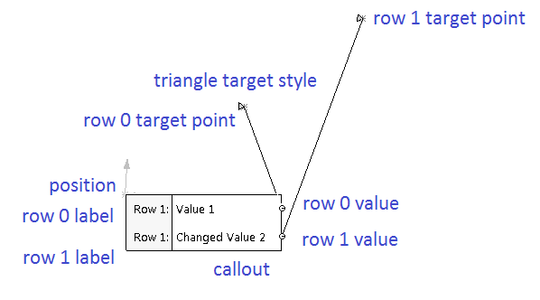

This example demonstrates how to create a callout with multiple rows while selecting the object using [ISelectionMgr::CreateCallout2](https://help.solidworks.com/2018/english/api/sldworksapi/solidworks.interop.sldworks~solidworks.interop.sldworks.iselectionmgr~createcallout2.html) SOLIDWORKS API method.

{ width=640 height=354 }

First row of the displayed callout is not editable (read only). Value of second row can be changed. The changed value will be displayed in the message box.

*Macro*

~~~ vb
Dim swApp As SldWorks.SldWorks
Dim swModel As ModelDoc2
Dim swSelMgr As SelectionMgr
Dim swMathUtilss As MathUtility

Sub main()

    Set swApp = Application.SldWorks
    
    Set swMathUtils = swApp.GetMathUtility
    
    Set swModel = swApp.ActiveDoc
    
    If Not swModel Is Nothing Then
    
        Set swSelMgr = swModel.SelectionManager
        
        Dim swMathPt As MathPoint
        Dim dPt(2) As Double
    
        dPt(0) = 0#: dPt(1) = 0#: dPt(2) = 0#
    
        Set swMathPt = swMathUtils.CreatePoint(dPt)
    
        Dim swCallout As SldWorks.Callout
        Dim swCalloutHandler As CalloutHandler
        
        Set swCalloutHandler = New CalloutHandler
        
        Set swCallout = swSelMgr.CreateCallout2(2, swCalloutHandler)
        swCallout.TargetStyle = swCalloutTargetStyle_e.swCalloutTargetStyle_Triangle
             
        swCallout.Label2(0) = "Row 1"
        swCallout.Value(0) = "Value 1"
        swCallout.SetTargetPoint 0, 0.01, 0.01, 0.01
        swCallout.ValueInactive(0) = True
        
        swCallout.Label2(1) = "Row 1"
        swCallout.Value(1) = "Value 1"
        swCallout.SetTargetPoint 1, 0.02, 0.02, 0.02
        swCallout.ValueInactive(1) = False
        
        swCallout.SetLeader True, True
        swCallout.Position = swMathPt
                
        swCallout.Display True
        
        Stop
        
        swCallout.Display False
        Set swCallout = Nothing
        
    Else
        MsgBox "Please open the model"
    End If
        
End Sub
~~~

*CalloutHandler class*

~~~ vb
Implements swCalloutHandler

Private Function SwCalloutHandler_OnStringValueChanged(ByVal pManipulator As Object, ByVal RowID As Long, ByVal Text As String) As Boolean

        MsgBox "Text changed at row " & RowID & ": " & Text
                
        SwCalloutHandler_OnStringValueChanged = True

End Function
~~~

