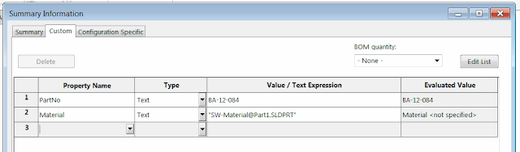

This macro copies all the file specific properties into the properties of the active configuration using SOLIDWORKS API.

{ width=640 }

~~~ vb
Dim swApp As SldWorks.SldWorks
Dim swModel As SldWorks.ModelDoc2
Dim swCustPrpMgr As SldWorks.CustomPropertyManager
Dim swConfCustPrpMgr As SldWorks.CustomPropertyManager
 
Sub main()
 
    Set swApp = Application.SldWorks
 
    Set swModel = swApp.ActiveDoc

    If Not swModel Is Nothing Then
   
        Set swCustPrpMgr = swModel.Extension.CustomPropertyManager("")
       
        Dim vNames As Variant
        Dim vTypes As Variant
        Dim vValues As Variant
        swCustPrpMgr.GetAll vNames, vTypes, vValues
   
        Dim activeConfName As String
        activeConfName = swModel.ConfigurationManager.ActiveConfiguration.Name

        Set swConfCustPrpMgr = swModel.Extension.CustomPropertyManager(activeConfName)
 
        Dim i As Integer
   
        For i = 0 To UBound(vNames)
            swConfCustPrpMgr.Add2 vNames(i), vTypes(i), vValues(i)
            swConfCustPrpMgr.Set vNames(i), vValues(i)
        Next

    Else

        MsgBox "Please open part or assembly"

    End If
   
End Sub

~~~

