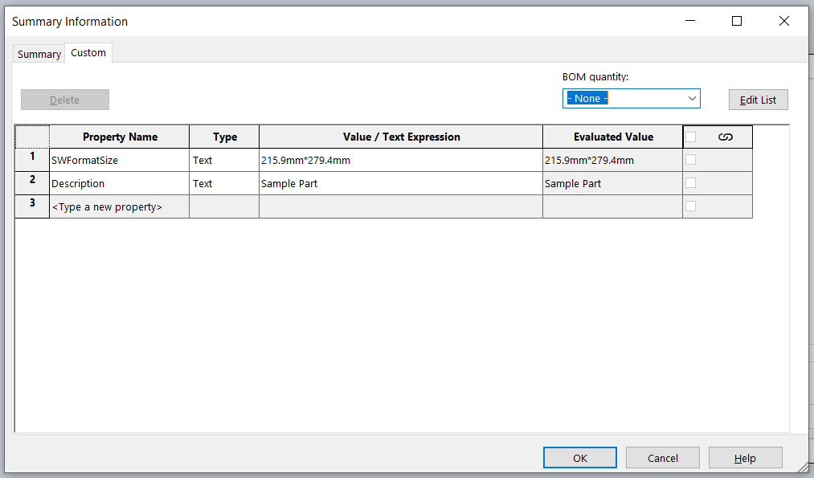
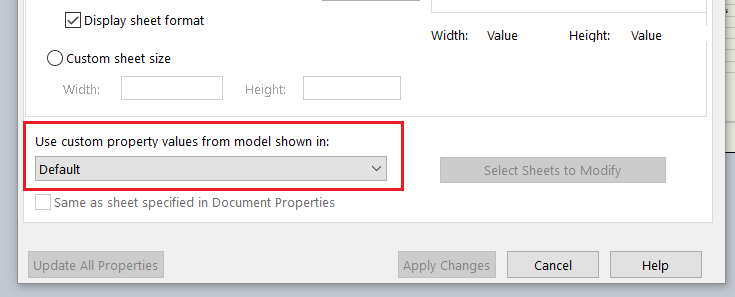

{ width=500 }

This macro copies the specified custom properties from the SOLIDWORKS part or assembly referenced in the drawing view to the drawing view itself.

Custom properties can be specified in the *PRP_NAMES* constant in the macro. Use comma to specify multiple properties to copy.

~~~ vb
Const PRP_NAMES As String = "PartNo,Description,Title"
~~~

In order to select the properties to copy at runtime, specify an empty string as the value of *PRP_NAMES*

~~~ vb
Const PRP_NAMES As String = ""
~~~

In this case the following input box will be displayed.

User can specify either single property or multiple properties, separated by comma.

If drawing view is selected when running the macro, properties will be copied from this drawing view. Otherwise, the default properties view will be used as specified in the sheet properties (this is usually the first view in the drawing):

{ width=500 }

At first, custom property value will be extracted from the configuration of the model which corresponds to the referenced configuration of the drawing view. If the property doesn't exist or empty, file specific custom property will be extracted.

~~~ vb
Const PRP_NAMES As String = "Description" 'comma separated, empty string for popup select

Dim swApp As SldWorks.SldWorks

Sub main()

    Set swApp = Application.SldWorks
        
    On Error GoTo catch
    
try:
    
    Dim swDraw As SldWorks.DrawingDoc
    
    Set swDraw = swApp.ActiveDoc
    
    If swDraw Is Nothing Then
        Err.Raise vbError, , "Please open the drawing"
    End If
    
    Dim vPrpNames As Variant
    vPrpNames = GetPropertyNames()
    
    Dim swPrpsView As SldWorks.view
    Set swPrpsView = GetPropertiesView(swDraw)
    
    If swPrpsView Is Nothing Then
        Err.Raise vbError, , "Failed to find the drawing view with properties"
    End If
    
    Dim i As Integer
    
    Dim swDrwPrpMgr As SldWorks.CustomPropertyManager
    Set swDrwPrpMgr = swDraw.Extension.CustomPropertyManager("")
    
    For i = 0 To UBound(vPrpNames)
        
        Dim prpName As String
        Dim prpVal As String
        
        prpName = vPrpNames(i)
        prpVal = GetPropertyValue(swPrpsView, prpName)
        
        swDrwPrpMgr.Add2 prpName, swCustomInfoType_e.swCustomInfoText, prpVal
        swDrwPrpMgr.Set prpName, prpVal
        
    Next
    
    GoTo finally
    
catch:
    swApp.SendMsgToUser2 Err.Description, swMessageBoxIcon_e.swMbStop, swMessageBoxBtn_e.swMbOk
finally:
    
End Sub

Function GetPropertyValue(view As SldWorks.view, prpName As String)
    
    Dim swViewDoc As SldWorks.ModelDoc2
    Set swViewDoc = view.ReferencedDocument
    
    If swViewDoc Is Nothing Then
        Err.Raise vbError, , "Cannot get document from the view. Make sure view is not empty and document is not lightweigh"
    End If

    Dim prpVal As String
          
    Dim swCustPrpMgr As SldWorks.CustomPropertyManager
    Set swCustPrpMgr = swViewDoc.Extension.CustomPropertyManager(view.ReferencedConfiguration)
    
    swCustPrpMgr.Get3 prpName, False, "", prpVal
    
    If prpVal = "" Then
        Set swCustPrpMgr = swViewDoc.Extension.CustomPropertyManager("")
        
        swCustPrpMgr.Get3 prpName, False, "", prpVal
    End If
    
    GetPropertyValue = prpVal
    
End Function

Function GetPropertyNames() As Variant
    
    Dim prpNames As String
    prpNames = PRP_NAMES
    
    If prpNames = "" Then
        prpNames = InputBox("Please specify comma separated custom property names to transfer to drawing")
    End If
    
    If prpNames = "" Then
        End
    End If
    
    Dim vPrpNames As Variant
    vPrpNames = Split(prpNames, ",")
    
    Dim i As Integer
    
    For i = 0 To UBound(vPrpNames)
        vPrpNames(i) = Trim(CStr(vPrpNames(i)))
    Next
    
    GetPropertyNames = vPrpNames
    
End Function

Function GetPropertiesView(draw As SldWorks.DrawingDoc) As SldWorks.view
    
    Dim swSelMgr As SldWorks.SelectionMgr
    Set swSelMgr = draw.SelectionManager
    
    Dim swCustPrpView As SldWorks.view
    Set swCustPrpView = swSelMgr.GetSelectedObjectsDrawingView2(1, -1)
    
    If Not swCustPrpView Is Nothing Then
        Set GetPropertiesView = swCustPrpView
        Exit Function
    End If
    
    Dim vSheetNames As Variant
    vSheetNames = draw.GetSheetNames
    
    Dim i As Integer
    
    For i = 0 To UBound(vSheetNames)
        
        Dim swSheet As SldWorks.Sheet
        Set swSheet = draw.Sheet(vSheetNames(i))
        
        Dim custPrpViewName As String
        custPrpViewName = swSheet.CustomPropertyView
        
        Dim vViews As Variant
        vViews = swSheet.GetViews()
        
        Dim j As Integer
        
        For j = 0 To UBound(vViews)
            
            Dim swView As SldWorks.view
            Set swView = vViews(j)
            
            If LCase(swView.Name) = LCase(custPrpViewName) Then
                Set swCustPrpView = swView
                Exit For
            End If
            
        Next
        
        If swCustPrpView Is Nothing Then
            Set swCustPrpView = vViews(0)
        End If
        
    Next
    
    Set GetPropertiesView = swCustPrpView
    
End Function
~~~

