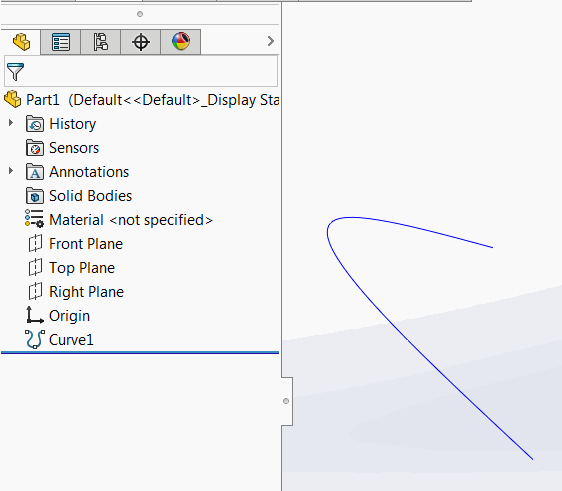

{ width=450 }

SOLIDWORKS allows to insert the free form curve through XYZ coordinates from the external text file. This file however is not linked to the feature itself and the curve is not updated when external file changes.

{ width=300 }

This VBA macro allow to automatically link the external file with coordinates and update the selected curve with single click.

Example of curve file:

~~~
0mm 0mm 0mm
10mm 10mm 10mm
5mm 1mm 25mm
~~~

Curve text file must be saved in the same folder where the SOLIDWORKS file is saved and must be named as [Model Title]_[Feature Name].sldcrv. For example if curve feature is named *Curve1* and resides in the SOLIDWORKS file named Part1.sldprt, the curve text file must be named *Part1_Curve1.sldcrv*.

~~~ vb
Dim swApp As SldWorks.SldWorks

Sub main()

    Set swApp = Application.SldWorks
    
    Dim swModel As SldWorks.ModelDoc2
    
    Set swModel = swApp.ActiveDoc
    
    If Not swModel Is Nothing Then
        
        Dim swFeat As SldWorks.Feature
        Set swFeat = swModel.SelectionManager.GetSelectedObject6(1, -1)
        
        If Not swFeat Is Nothing Then
            
            Dim swCurveFeatDef As SldWorks.FreePointCurveFeatureData
            Set swCurveFeatDef = swFeat.GetDefinition
            
            If Not swCurveFeatDef Is Nothing Then
                
                Dim filePath As String
                filePath = swModel.GetPathName
                filePath = Left(filePath, InStrRev(filePath, ".") - 1)
                filePath = filePath & "_" & swFeat.Name & ".sldcrv"
                
                If False = swCurveFeatDef.LoadPointsFromFile(filePath) Then
                    MsgBox "Failed to update curve"
                End If
                
                swFeat.ModifyDefinition swCurveFeatDef, swModel, Nothing
                
            Else
                MsgBox "Selected feature is not XYZ points curve"
            End If
        Else
            MsgBox "Please select Curve XYZ feature"
        End If
        
    Else
        MsgBox "Please open model"
    End If
    
End Sub
~~~

