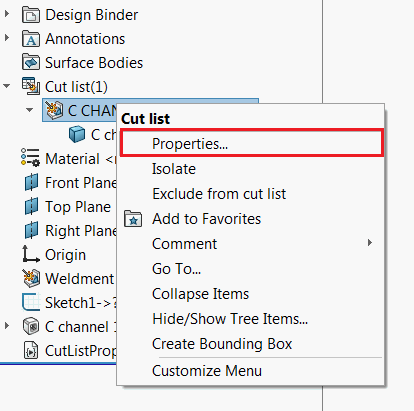

{ width=450 }

This VBA macro inserts the macro feature using SOLIDWORKS API into the part file which allows to dynamically link specified cut-list custom properties to the file generic custom properties.

{ width=250 }

Macro feature rebuilds automatically when the parent weldment feature (e.g. structural member feature) is changed. Regeneration method is handling the post update notification which allows to read the up-to-date values of cut-list custom properties.

> Reading the custom properties directly from the swmRebuild function will not return the up-to-date values as at the moment of the regeneration all the properties are not evaluated yet.

Macro feature is inserted into the feature tree and can be suppressed or removed.

There are several benefits of this approach comparing to linking the properties directly with the expression (e.g. `"LENGTH@@@Al I BEAM STD 4x3.28<1>@Part1.SLDPRT"`)

* Link is not name dependent, i.e. properties will remain linked even if cut-list renamed (for example when structural member profile is changed)
* Macro will work for older sheet metal part architecutre. The linking with an expression will not work for sheet metal parts build in older versions of SOLIDWORKS

{ width=250 }

## Instructions

* Create new macro and copy the code below

~~~ vb
Const BASE_NAME As String = "CutListPropertiesLink"

Dim swPostGenList As PostRegenerateListener

Sub main()

    Dim swApp As SldWorks.SldWorks
    Set swApp = Application.SldWorks
    
    Dim swModel As SldWorks.ModelDoc2
    
    Set swModel = swApp.ActiveDoc
    
    If Not swModel Is Nothing Then
        
        If swModel.GetType() = swDocumentTypes_e.swDocPART Then
        
            Dim swWeldFeat As SldWorks.Feature
            Set swWeldFeat = TryGetSelectedFeatureAtIndex(swModel.SelectionManager, 1)
            
            Dim swCutListFeat As SldWorks.Feature
            
            If Not swWeldFeat Is Nothing Then
                Set swCutListFeat = GetCutListFromWeldmentFeature(swModel, swWeldFeat)
            End If
    
            If Not swCutListFeat Is Nothing Then
                
                Dim curMacroPath As String
                curMacroPath = swApp.GetCurrentMacroPathName
                
                Dim vMethods(8) As String
                Dim moduleName As String
                
                GetMacroEntryPoint swApp, curMacroPath, moduleName, ""
                
                vMethods(0) = curMacroPath: vMethods(1) = moduleName: vMethods(2) = "swmRebuild"
                vMethods(3) = curMacroPath: vMethods(4) = moduleName: vMethods(5) = "swmEditDefinition"
                vMethods(6) = curMacroPath: vMethods(7) = moduleName: vMethods(8) = "swmSecurity"
                
                Dim swFeat As SldWorks.Feature
                Set swFeat = swModel.FeatureManager.InsertMacroFeature3(BASE_NAME, "", vMethods, _
                    Empty, Empty, Empty, Empty, Empty, Empty, _
                    Empty, swMacroFeatureOptions_e.swMacroFeatureEmbedMacroFile)
                
                If swFeat Is Nothing Then
                    MsgBox "Failed to create cut-list proeprties linker"
                End If
            
            Else
                MsgBox "Select weldment feature (e.g. Structural Member)"
            End If
            
        Else
            MsgBox "Only part documents are supported"
        End If
        
    Else
        MsgBox "Please open model"
    End If
    
End Sub

Function TryGetSelectedFeatureAtIndex(selMgr As SldWorks.SelectionMgr, index As Integer) As SldWorks.Feature
    On Error Resume Next
    Set TryGetSelectedFeatureAtIndex = selMgr.GetSelectedObject6(index, -1)
End Function

Sub GetMacroEntryPoint(app As SldWorks.SldWorks, macroPath As String, ByRef moduleName As String, ByRef procName As String)
        
    Dim vMethods As Variant
    vMethods = app.GetMacroMethods(macroPath, swMacroMethods_e.swMethodsWithoutArguments)
    
    Dim i As Integer
    
    If Not IsEmpty(vMethods) Then
    
        For i = 0 To UBound(vMethods)
            Dim vData As Variant
            vData = Split(vMethods(i), ".")
            
            If i = 0 Or LCase(vData(1)) = "main" Then
                moduleName = vData(0)
                procName = vData(1)
            End If
        Next
        
    End If
    
End Sub

Function swmRebuild(varApp As Variant, varDoc As Variant, varFeat As Variant) As Variant

    Dim swApp As SldWorks.SldWorks
    Dim swModel As SldWorks.ModelDoc2
    Dim swFeat As SldWorks.Feature
    
    Set swApp = varApp
    Set swModel = varDoc
    Set swFeat = varFeat
    
    Dim swMacroFeat As SldWorks.MacroFeatureData
    Set swMacroFeat = swFeat.GetDefinition()
    
    Dim vObjects As Variant
    swMacroFeat.GetSelections3 vObjects, Empty, Empty, Empty, Empty
    
    Dim swWeldFeat As SldWorks.Feature
    Set swWeldFeat = vObjects(0)
    
    If swWeldFeat Is Nothing Then
        swmRebuild = "Linked weldment feature is missing"
        Exit Function
    End If
        
    Dim swCutListFeat As SldWorks.Feature
    Set swCutListFeat = GetCutListFromWeldmentFeature(swModel, swWeldFeat)
        
    If Not swCutListFeat Is Nothing Then
    
        If swPostGenList Is Nothing Then
            Set swPostGenList = New PostRegenerateListener
        End If
        
        swPostGenList.Init swApp, swModel, swCutListFeat
    
    Else
        swmRebuild = "Cannot get cut-list from the linked feature"
    End If
End Function

Function swmEditDefinition(varApp As Variant, varDoc As Variant, varFeat As Variant) As Variant
    swmEditDefinition = True
End Function

Function swmSecurity(varApp As Variant, varDoc As Variant, varFeat As Variant) As Variant
    swmSecurity = SwConst.swMacroFeatureSecurityOptions_e.swMacroFeatureSecurityByDefault
End Function

Function GetCutListFromWeldmentFeature(model As SldWorks.ModelDoc2, weldFeat As SldWorks.Feature) As SldWorks.Feature
    
    On Error Resume Next
    
    Dim swApp As SldWorks.SldWorks
    Set swApp = Application.SldWorks
    
    Dim swWeldFeatCutListBody As SldWorks.Body2
    Set swWeldFeatCutListBody = weldFeat.GetFaces()(0).GetBody
        
    Dim swFeat As SldWorks.Feature
    Dim swBodyFolder As SldWorks.BodyFolder
    
    Set swFeat = model.FirstFeature
    
    Do While Not swFeat Is Nothing
        
        If swFeat.GetTypeName2 = "CutListFolder" Then
            
            Set swBodyFolder = swFeat.GetSpecificFeature2
            
            Dim vBodies As Variant
            
            vBodies = swBodyFolder.GetBodies
            
            Dim i As Integer
            
            If Not IsEmpty(vBodies) Then
                For i = 0 To UBound(vBodies)
                    
                    Dim swCutListBody As SldWorks.Body2
                    Set swCutListBody = vBodies(i)
                    
                    If swApp.IsSame(swCutListBody, swWeldFeatCutListBody) = swObjectEquality.swObjectSame Then
                        Set GetCutListFromWeldmentFeature = swFeat
                        Exit Function
                    End If
                    
                Next
            End If
            
        End If
        
        Set swFeat = swFeat.GetNextFeature
        
    Loop

End Function
~~~

* Add new class module to the macro and name it *PostRegenerateListener*. Place the code below into the class module

~~~ vb
Dim WithEvents swApp As SldWorks.SldWorks

Dim swCutListFeat As SldWorks.Feature
Dim swModel As SldWorks.ModelDoc2
Dim LinkedProperties As Variant

Private Sub Class_Initialize()
    LinkedProperties = Array("DESCRIPTION", "LENGTH", "QUANTITY")
End Sub

Sub Init(app As SldWorks.SldWorks, model As SldWorks.ModelDoc2, cutListFeat As SldWorks.Feature)
    
    Set swApp = app
    
    Set swModel = model
    Set swCutListFeat = cutListFeat
    
End Sub

Private Function swApp_OnIdleNotify() As Long
    CopyProperties
    Set swApp = Nothing 'unsubscribe from the event
End Function

Sub CopyProperties()
    
    Dim i As Integer
    
    Dim swSrcPrpMgr As SldWorks.CustomPropertyManager
    Set swSrcPrpMgr = swCutListFeat.CustomPropertyManager
    
    Dim swDestPrpMgr As SldWorks.CustomPropertyManager
    Set swDestPrpMgr = swModel.Extension.CustomPropertyManager("")
    
    For i = 0 To UBound(LinkedProperties)
    
        Dim prpName As String
        prpName = CStr(LinkedProperties(i))
        
        Dim prpVal As String

        swSrcPrpMgr.Get2 prpName, "", prpVal
        
        swDestPrpMgr.Add2 prpName, swCustomInfoType_e.swCustomInfoText, prpVal
        swDestPrpMgr.Set prpName, prpVal
        
    Next
    
End Sub
~~~

* Configure the properties which needs to be linked in the *Class_Initialize* function in *PostRegenerateListener*

~~~ vb
Private Sub Class_Initialize()
    LinkedProperties = Array("DESCRIPTION", "LENGTH", "QUANTITY", "Another Property", "...")
End Sub
~~~

* Select the weldment feature (e.g. structural member) and run the macro. Macro feature is inserted and embedded into the model. You can close and reopen model and SOLIDWORKS session - feature will automatically rebuild. Model can be shared with other users and the behavior will be preserved.
