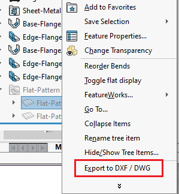

This VBA macro exports the sheet metal part or selected flat pattern feature in the multi-body sheet metal part to the DXF or DWG.

Change the value of *OUT_PATH* variable to save output to different location (change the extension to export to DXF or DWG).

~~~ vb
Enum SheetMetalOptions_e
    ExportFlatPatternGeometry = 1
    IncludeHiddenEdges = 2
    ExportBendLines = 4
    IncludeSketches = 8
    MergeCoplanarFaces = 16
    ExportLibraryFeatures = 32
    ExportFormingTools = 64
    ExportBoundingBox = 2048
End Enum

Const OUT_PATH As String = "D:\sm.dwg"

Dim swApp As SldWorks.SldWorks

Sub main()

    Set swApp = Application.SldWorks
    
    Dim swPart As SldWorks.PartDoc
    
    Set swPart = swApp.ActiveDoc
    
    Dim modelPath As String
    
    modelPath = swPart.GetPathName
    
    If modelPath = "" Then
        Err.Raise vbError, "", "Part document must be saved"
    End If
    
    If False = swPart.ExportToDWG2(OUT_PATH, modelPath, swExportToDWG_e.swExportToDWG_ExportSheetMetal, True, Empty, False, False, SheetMetalOptions_e.ExportFlatPatternGeometry + SheetMetalOptions_e.ExportBendLines, Empty) Then
        Err.Raise vbError, "", "Failed to export flat pattern"
    End If
    
End Sub
~~~

