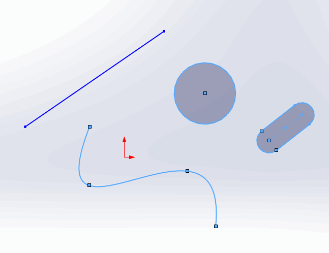

{ width=450 }

This VBA macro demonstrates how to extract specific sketch segment information from the selected segments using SOLIDWORKS API.

Macro will traverse all selected objects and filter sketch segments. Macro identifies the type of the segments and cast the pointer to the specific sub-type (e.g. line, spline, arc, parabola, text etc.).

Information is output to the immediate window of VBA editor.

{ width=350 }

~~~ vb
Dim swApp As SldWorks.SldWorks

Sub main()

    Set swApp = Application.SldWorks
    
    Dim swModel As SldWorks.ModelDoc2
    
    Set swModel = swApp.ActiveDoc
    
    If Not swModel Is Nothing Then
    
        Dim swSelMgr As SldWorks.SelectionMgr
        
        Set swSelMgr = swModel.SelectionManager
        
        Dim i As Integer
        
        For i = 1 To swSelMgr.GetSelectedObjectCount2(-1)
            If swSelMgr.GetSelectedObjectType3(i, -1) = swSelectType_e.swSelSKETCHSEGS Or _
                swSelMgr.GetSelectedObjectType3(i, -1) = swSelectType_e.swSelEXTSKETCHSEGS Then
                
                Dim swSkSeg As SldWorks.SketchSegment
                Set swSkSeg = swSelMgr.GetSelectedObject6(i, -1)
                
                Debug.Print "Sketch segment at index " & i
                
                PrintSketchSegmentInfo swSkSeg
                
                Debug.Print ""
                
            End If
        Next
        
    Else
        MsgBox "Please open model"
    End If
    
End Sub

Function PrintSketchSegmentInfo(skSeg As SldWorks.SketchSegment)

    Select Case skSeg.GetType()
        Case swSketchSegments_e.swSketchARC
            Dim swSkArc As SldWorks.SketchArc
            Set swSkArc = skSeg
            Debug.Print "Arc"
            Debug.Print "Radius: " & swSkArc.GetRadius()
        
        Case swSketchSegments_e.swSketchELLIPSE
            Dim swSkEllipse As SldWorks.SketchEllipse
            Set swSkEllipse = skSeg
            Dim swMajPoint As SldWorks.SketchPoint
            Set swMajPoint = swSkEllipse.GetMajorPoint2()
            Debug.Print "Ellipse"
            Debug.Print "Major Point: " & swMajPoint.X & "," & swMajPoint.Y & "," & swMajPoint.Z
        
        Case swSketchSegments_e.swSketchLINE
            Dim swSkLine As SldWorks.SketchLine
            Set swSkLine = skSeg
            Debug.Print "Line"
            Debug.Print "Angle: " & swSkLine.Angle
            
        Case swSketchSegments_e.swSketchPARABOLA
            Dim swSkParabola As SldWorks.SketchParabola
            Set swSkParabola = skSeg
            Dim swApexPoint As SldWorks.SketchPoint
            Set swApexPoint = swSkParabola.GetApexPoint2
            Debug.Print "Parabola"
            Debug.Print "Apex Point: " & swApexPoint.X & "," & swApexPoint.Y & "," & swApexPoint.Z
        
        Case swSketchSegments_e.swSketchSPLINE
            Dim swSkSpline As SldWorks.SketchSpline
            Set swSkSpline = skSeg
            Dim vSplinePts As Variant
            vSplinePts = swSkSpline.GetPoints2()
            Debug.Print "Spline"
            Debug.Print "Points: " & UBound(vSplinePts) + 1
        
        Case swSketchSegments_e.swSketchTEXT
            Dim swSkText As SldWorks.SketchText
            Set swSkText = skSeg
            Debug.Print "Text"
            Debug.Print swSkText.Text
        Case Else
            Err.Raise vbError, "", "Unsupported sketch segment"
    End Select
    
End Function
~~~

