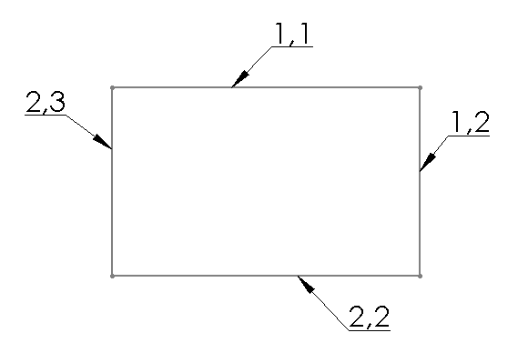

{ width=350 }

Internal ids are usually Integer or Long values which uniquely identify the SOLIDWORKS object within the model. Ids are persistent and do not change across rebuild operations or sessions. Ids also updated when the object is changed (e.g. feature is renamed or sketch line changes the coordinates).

> Sketch elements (points, segments, hatches) consist of 2 Integer or Long ids

Same as [Persistent Reference IDs](/docs/codestack/solidworks-api/document/tracking-objects/persist-references) internal ids cannot be changed or assigned and not visible from the GUI (e.g. only available within the APIs). But unlike persistent reference ids, object cannot be looked up by internal id, i.e. it is required to traverse all objects in order to find required one by id.

Internal ids should be used if it is required to index all elements (e.g. sketch segments or features) and minimize the size of the indexed data (for example if it is required to store the data within the 3rd party storage or send via network).

Internal ids can be accessed for the following objects

* Component
* Configuration
* Feature
* Layer
* Light
* Sheet
* Sketch Hatch
* Sketch Point
* Sketch Segment

Following example demonstrates how to retrieve the internal id from the selected object using SOLIDWORKS API. The returned array of ids also contains the type of the object as defined in ElementType_e enumerator.

~~~ vb
Enum ElementType_e
    Component
    Configuration
    Feature
    Layer
    Light
    Sheet
    SketchHatch
    SketchPoint
    SketchSegment
End Enum

Dim swApp As SldWorks.SldWorks

Sub main()

    Set swApp = Application.SldWorks
    
    Dim swModel As SldWorks.ModelDoc2

    Set swModel = swApp.ActiveDoc
    
    If Not swModel Is Nothing Then
        
        Dim swSelMgr As SldWorks.SelectionMgr
        Set swSelMgr = swModel.SelectionManager
        
        Dim swObj As Object
        Set swObj = swSelMgr.GetSelectedObject6(1, -1)
        
        If Not swObj Is Nothing Then        
        
            Dim vId As Variant
            vId = GetObjectId(swObj)
        
            Dim i As Integer
            For i = 0 To UBound(vId)
                Debug.Print vId(i);
            Next
        Else
            MsgBox "Please select object to get id"
        End If
        
    Else
        MsgBox "Please open the model"
    End If
        
End Sub

Function GetObjectId(obj As Object) As Variant
    
    Dim id As Variant
    
    If TypeOf obj Is SldWorks.Component2 Then
        
        Dim swComp As SldWorks.Component2
        Set swComp = obj
        id = Array(ElementType_e.Component, swComp.GetId())
        
    ElseIf TypeOf obj Is SldWorks.Configuration Then
        
        Dim swConf As SldWorks.Configuration
        Set swConf = obj
        id = Array(ElementType_e.Configuration, swConf.GetId())
        
    ElseIf TypeOf obj Is SldWorks.Feature Then
        
        Dim swFeat As SldWorks.Feature
        Set swFeat = obj
        id = Array(ElementType_e.Feature, swFeat.GetId())
        
    ElseIf TypeOf obj Is SldWorks.Layer Then
        
        Dim swLayer As SldWorks.Layer
        Set swLayer = obj
        id = Array(ElementType_e.Layer, swLayer.GetId())
        
    ElseIf TypeOf obj Is SldWorks.Light Then
        
        Dim swLight As SldWorks.Light
        Set swLight = obj
        id = Array(ElementType_e.Light, swLight.GetId())
        
    ElseIf TypeOf obj Is SldWorks.Sheet Then
        
        Dim swSheet As SldWorks.Sheet
        Set swSheet = obj
        id = Array(ElementType_e.Sheet, swSheet.GetId())
        
    ElseIf TypeOf obj Is SldWorks.SketchHatch Then
        
        Dim swSkHatch As SldWorks.SketchHatch
        Set swSkHatch = obj
        Dim hatchId As Variant
        hatchId = swSkHatch.GetId()
        id = Array(ElementType_e.SketchHatch, swSkHatch.GetSketch().GetId(), hatchId(0), hatchId(1))
        
    ElseIf TypeOf obj Is SldWorks.SketchPoint Then
        
        Dim swSkPt As SldWorks.SketchPoint
        Set swSkPt = obj
        Dim skPtId As Variant
        skPtId = swSkPt.GetId()
        id = Array(ElementType_e.SketchPoint, swSkPt.GetSketch().GetId(), skPtId(0), skPtId(1))
        
    ElseIf TypeOf obj Is SldWorks.SketchSegment Then
        
        Dim swSkSeg As SldWorks.SketchSegment
        Set swSkSeg = obj
        Dim skSegId As Variant
        skSegId = swSkSeg.GetId()
        id = Array(ElementType_e.SketchSegment, swSkSeg.GetSketch().GetId(), skSegId(0), skSegId(1))
        
    Else
        Err.Raise vbObjectError, , "Object doesn't have id"
    End If
    
    GetObjectId = id
    
End Function
~~~

