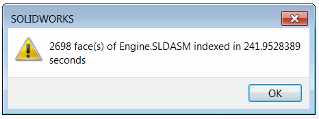

One of the main limitations of the stand-alone automation of COM based application automation (including SOLIDWORKS) is performance.

When hundreds of API calls need to be called from out-of-process applications, the performance may be dropped in hundreds or even thousands of times compared to in-process invocation.

The exact same limitation would apply when invoking add-in API in any of the following approaches: [via add-in object](/docs/codestack/solidworks-api/getting-started/inter-process-communication/invoke-add-in-functions/via-add-in-object/), [via Running Object Table](/docs/codestack/solidworks-api/getting-started/inter-process-communication/invoke-add-in-functions/via-rot/), etc.

It can be mistakenly assumed that all of the SOLIDWORKS API calls inside the add-in are invoked in-process as only single API function is called form stand-alone. But in fact all of the SOLIDWORKS API calls within the SOLIDWORKS add-in are invoked as out-of-process calls. This means that calling the add-in API would result in the same performance loses as calling the stand-alone application.

There is however a way to maximize this performance and gain the same results as in-process calls by calling this from out-of-process application.

The following add-in example implements a function to index all faces of the active assembly documents.

Add-in is developed using the [SwEx.AddIn Framework](/docs/codestack/labs/solidworks/swex/add-in/), but the same technique can apply to add-in built with different methods.

It traverses all components, all bodies and all faces and outputs some information about the face in the trace window.

Add-in has a menu command allowing to invoke its function in-process.

{ width=350 }

Once completed the message box with the result is displayed.

{ width=300 }

## FaceIndexer Add-In
This is a main project which implements SOLIDWORKS add-in and API object interface.

### FaceIndexerAddIn.cs

Add-in class

~~~ cs
using CodeStack.SwEx.AddIn;
using CodeStack.SwEx.AddIn.Attributes;
using SolidWorks.Interop.sldworks;
using SolidWorks.Interop.swconst;
using System;
using System.Collections.Generic;
using System.Diagnostics;
using System.Runtime.InteropServices;

namespace CodeStack.FaceIndexer
{
    [AutoRegister("FaceIndexer")]
    [ComVisible(true)]
    [Guid("D85E0EEB-87AA-48BE-8C8A-DFD71CF12525")]
    [ProgId("CodeStack.FaceIndexer")]
    public class FaceIndexerAddIn : SwAddInEx, IFaceIndexerAddIn
    {
        private readonly List<KeyValuePair<IAssemblyDoc, IFaceIndexerCallback>> m_ProcessingQueue
            = new List<KeyValuePair<IAssemblyDoc, IFaceIndexerCallback>>();

        [SwEx.Common.Attributes.Title("Face Indexer")]
        public enum Commands_e
        {
            [CommandItemInfo(SwEx.AddIn.Enums.swWorkspaceTypes_e.Assembly)]
            IndexFaces
        }
        
        public override bool OnConnect()
        {
            AddCommandGroup<Commands_e>(OnButtonClick);
            (App as SldWorks).OnIdleNotify += OnIdleNotify;
            return true;
        }

        public void BeginIndexFaces(IAssemblyDoc assm, IFaceIndexerCallback callback)
        {
            m_ProcessingQueue.Add(new KeyValuePair<IAssemblyDoc, IFaceIndexerCallback>(assm, callback));
        }

        private void OnButtonClick(Commands_e cmd)
        {
            switch (cmd)
            {
                case Commands_e.IndexFaces:        
                    IndexFaces(App.IActiveDoc2 as IAssemblyDoc);
                    break;
            }
        }

        public int IndexFaces(IAssemblyDoc assm)
        {
            var count = 0;

            var start = DateTime.Now;
            {
                var comps = assm.GetComponents(false) as object[];

                if (comps != null)
                {
                    foreach (IComponent2 comp in comps)
                    {
                        object bodyInfo;
                        var bodies = comp.GetBodies3((int)swBodyType_e.swAllBodies, out bodyInfo) as object[];

                        if (bodies != null)
                        {
                            foreach (IBody2 body in bodies)
                            {
                                var faces = body.GetFaces() as object[];

                                if (faces != null)
                                {
                                    foreach (IFace2 face in faces)
                                    {
                                        var surf = face.IGetSurface();
                                        var type = (swSurfaceTypes_e)surf.Identity();
                                        count++;

                                        Trace.WriteLine($"Area: {face.GetArea()}. Type: {type}");
                                    }
                                }
                            }
                        }
                    }
                }
            }
            App.SendMsgToUser($"{count} face(s) of {(assm as IModelDoc2).GetTitle()} indexed in {DateTime.Now.Subtract(start).TotalSeconds} seconds");

            return count;
        }

        private int OnIdleNotify()
        {
            const int S_OK = 0;

            foreach (var assmInQueue in m_ProcessingQueue)
            {
                var count = IndexFaces(assmInQueue.Key);

                assmInQueue.Value?.IndexFacesCompleted(assmInQueue.Key, count);
            }

            m_ProcessingQueue.Clear();

            return S_OK;
        }
    }
}

~~~

### FaceIndexerAddInApi.cs

API object definition.

~~~ cs
using SolidWorks.Interop.sldworks;
using System.Runtime.InteropServices;

namespace CodeStack.FaceIndexer
{
    [ComVisible(true)]
    public interface IFaceIndexerCallback
    {
        void IndexFacesCompleted(IAssemblyDoc assm, int count);
    }

    [ComVisible(true)]
    public interface IFaceIndexerAddIn
    {
        void BeginIndexFaces(IAssemblyDoc assm, IFaceIndexerCallback callback);
        int IndexFaces(IAssemblyDoc assm);
    }
}

~~~

This add-in exposes the API for 3rd parties. *IndexFaces* method is an out-of-process API call and can be used with the following snippet:

~~~ cs
var count = addIn.IndexFaces(assm);
Console.WriteLine($"Indexed {count} face(s)");
~~~

As the result the performance dropped in almost hundred times:

{ width=300 }

Using [ISldWorks::CommandInProgress](https://help.solidworks.com/2016/English/api/sldworksapi/SolidWorks.Interop.sldworks~SolidWorks.Interop.sldworks.ISldWorks~CommandInProgress.html) SOLIDWORKS API property improves things a little bit, but still performance is dropped more than 10 times compared to the baseline results.

~~~ cs
app.CommandInProgress = true;
var count = addIn.IndexFaces(assm);
app.CommandInProgress = false;
Console.WriteLine($"Indexed {count} face(s)");
~~~

Below is a comparison table of results. Results may vary depending on the size of the assembly and API calls being used.

| Environment                     | Result, seconds | Ratio, % |
|---------------------------------|-----------------|----------|
| Add-In In-Process               | 2.63            | 1        |
| Stand-Alone                     | 241.95          | 92       |
| Stand-Alone Command In Progress | 36.14           | 13.74    |
| VBA Macro                       | 2.57            | 0.98     |
| VBA Macro In-Process Invoking   | 2.20            | 0.84     |
| Stand-Alone In-Process Invoking | 1.77            | 0.67     |

The best performance is gained when add-in API is invoked as in-process call from stand-alone application. This functionality can be achieved by providing deferred call to index faces. This call would put the request into the queue and return the control immediately. The request then will be processed in add-in. [OnIdle](https://help.solidworks.com/2018/english/api/sldworksapi/solidworks.interop.sldworks~solidworks.interop.sldworks.dsldworksevents_onidlenotifyeventhandler.html) SOLIDWORKS API notification can be used to process the queue. As this event is handled in-process, the actual API calls will be handled in process as well.

It is also important to register the callback which can be called by the add-in to notify the stand-alone application that operation is completed.

Below is an example of the stand-alone application invoking the add-in API in-process.

## Stand-Alone Application

C# application calling the add-in function.

### FaceIndexerCallback.cs

Callback function which notifies the stand-alone application when in-process call is completed. This must be registered as COM object.

~~~ cs
using CodeStack.FaceIndexer;
using SolidWorks.Interop.sldworks;
using System;
using System.Runtime.InteropServices;

namespace StandAlone
{
    [ComVisible(true)]
    public class FaceIndexerCallback : IFaceIndexerCallback
    {
        public void IndexFacesCompleted(IAssemblyDoc assm, int count)
        {
            Console.WriteLine($"Indexing completed in '{(assm as IModelDoc2).GetTitle()}' for {count} face(s) in stand-alone application");
        }
    }
}

~~~

### Program.cs

Console application invoking the in-process call to add-in API and awaiting result in the callback.

~~~ cs
using CodeStack.FaceIndexer;
using SolidWorks.Interop.sldworks;
using System;
using System.Diagnostics;
using System.Linq;
using System.Runtime.InteropServices;
using System.Runtime.InteropServices.ComTypes;

namespace StandAlone
{
    class Program
    {
        [DllImport("ole32.dll")]
        private static extern int CreateBindCtx(uint reserved, out IBindCtx ppbc);
        
        static void Main(string[] args)
        {
            var app = GetSwAppFromProcess(Process.GetProcessesByName("SLDWORKS").First().Id);

            var addIn = app.GetAddInObject("CodeStack.FaceIndexer") as IFaceIndexerAddIn;

            var assm = app.IActiveDoc2 as IAssemblyDoc;
            
            addIn.BeginIndexFaces(app.IActiveDoc2 as IAssemblyDoc, new FaceIndexerCallback());
            
            Console.ReadLine();
        }

        private static ISldWorks GetSwAppFromProcess(int processId)
        {
            var monikerName = "SolidWorks_PID_" + processId.ToString();

            IBindCtx context = null;
            IRunningObjectTable rot = null;
            IEnumMoniker monikers = null;

            try
            {
                CreateBindCtx(0, out context);

                context.GetRunningObjectTable(out rot);
                rot.EnumRunning(out monikers);

                var moniker = new IMoniker[1];

                while (monikers.Next(1, moniker, IntPtr.Zero) == 0)
                {
                    var curMoniker = moniker.First();

                    string name = null;

                    if (curMoniker != null)
                    {
                        try
                        {
                            curMoniker.GetDisplayName(context, null, out name);
                        }
                        catch (UnauthorizedAccessException)
                        {
                        }
                    }

                    if (string.Equals(monikerName,
                        name, StringComparison.CurrentCultureIgnoreCase))
                    {
                        object app;
                        rot.GetObject(curMoniker, out app);
                        return app as ISldWorks;
                    }
                }
            }
            finally
            {
                if (monikers != null)
                {
                    Marshal.ReleaseComObject(monikers);
                }

                if (rot != null)
                {
                    Marshal.ReleaseComObject(rot);
                }

                if (context != null)
                {
                    Marshal.ReleaseComObject(context);
                }
            }

            return null;
        }
    }
}

~~~

It can also be invoked from the macro or any other type of applications.

## VBA Macro

VBA macro to call the add-in API. In this example User Form is used to keep macro running until the callback function is called.

{ width=250 }

### Macro Module

Main module which is starting the user form

~~~ vb
Sub main()

    UserForm1.Show vbModeless
    
End Sub

~~~

### FaceIndexerCallback Class Module

Implementation of callback class to receive the notification of completion

~~~ vb
Implements IFaceIndexerCallback

Private Sub IFaceIndexerCallback_IndexFacesCompleted(ByVal assm As SldWorks.IAssemblyDoc, ByVal count As Long)
    Debug.Print "Indexing completed for " & count & " face(s)"
End Sub
~~~

### Form1 Form

User form to connect to add-in and call its API

~~~ vb
Dim swFaceIndexer As IFaceIndexerAddIn

Private Sub UserForm_Initialize()
    
    Dim swApp As SldWorks.SldWorks
    
    Set swApp = Application.SldWorks
    Set swFaceIndexer = swApp.GetAddInObject("CodeStack.FaceIndexer")
    
    Dim swAssy As SldWorks.AssemblyDoc
    Set swAssy = swApp.ActiveDoc
    
    swFaceIndexer.BeginIndexFaces swAssy, New FaceIndexerCallback
    
End Sub
~~~

Source code can be downloaded from [GitHub](https://github.com/codestackdev/solidworks-api-examples/tree/master/swex/add-in/face-indexer)