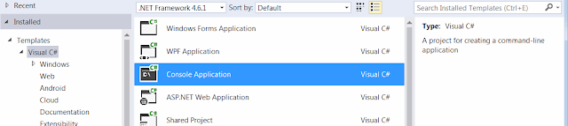
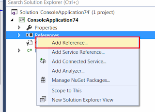
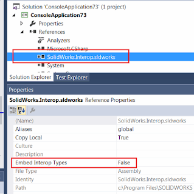

In this tutorial I will demonstrate how to connect to SOLIDWORKS application from out-of-process (a.k.a Stand-Alone) application (e.g. Windows Forms, Windows Console) using C# and Microsoft Visual Studio.  

For more detailed explanation of the approaches discussed in this article please read the [Connect To SOLIDWORKS From Stand-Alone Application](/docs/codestack/solidworks-api/getting-started/stand-alone/) article.

## Creating new project

I will be using Microsoft Visual Studio development environment. You can use any edition of Visual Studio. The same code will work in Professional, Express or Community editions. Follow this link to download [Visual Studio](https://www.visualstudio.com/vs/community/)  

1. Open Visual Studio. 
1. Start new project:

{ width=400 }

1. Select the project template. I would recommend to start with Console Application project template as it contains the minimum pregenerated code:

{ width=640 }

1. Add reference to SolidWorks Interop library. Interop libraries are located at **SOLIDWORKS Installation Folder**\api\redist\SolidWorks.Interop.sldworks.dll for projects targeting Framework 4.0 onwards and **SOLIDWORKS Installation Folder**\api\redist\CLR2\SolidWorks.Interop.sldworks.dll for projects targeting Framework 2.0 and 3.5.

{ width=320 }

For projects targeting Framework 4.0 I recommend to set the **[Embed Interop Types](https://docs.microsoft.com/en-us/dotnet/framework/interop/type-equivalence-and-embedded-interop-types)** option to false.
Otherwise it is possible to have unpredictable behaviour of the application when calling the SOLIDWORKS API due to a type cast issue.  

{ width=320 }

Now we can add the code to connect to SOLIDWORKS instance.  

## Creating or connecting to instance

Probably the most common and quick way to connect to COM server is using the [Activator::CreateInstance](https://msdn.microsoft.com/en-us/library/system.activator.createinstance(v=vs.110).aspx) method.  

~~~ cs
var progId = "SldWorks.Application";

var progType = System.Type.GetTypeFromProgID(progId);

var app = System.Activator.CreateInstance(progType) as SolidWorks.Interop.sldworks.ISldWorks;
app.Visible = true;
~~~

This method will construct the instance of the type from the type definition. As SOLIDWORKS application is registered as COM server we can create the type from its program identifier via [Type::GetTypeFromProgID](https://msdn.microsoft.com/en-us/library/system.type.gettypefromprogid(v=vs.110).aspx) method.
Please read the [Connect To SOLIDWORKS From Stand-Alone Application](/docs/codestack/solidworks-api/getting-started/stand-alone#method-a---activator-and-progid) article for explanations of limitation of this approach.  

Alternatively you can connect to active (already started) session of SOLIDWORKS using the [Marshal::GetActiveObject](https://msdn.microsoft.com/en-us/library/system.runtime.interopservices.marshal.getactiveobject(v=vs.110).aspx) method.
This approach will ensure that  there will be no new instances of SOLIDWORKS created and will throw an exception if there is no running SOLIDWORKS session to connect to.

~~~ cs
var progId = "SldWorks.Application";

var app = System.Runtime.InteropServices.Marshal.GetActiveObject(progId) as SolidWorks.Interop.sldworks.ISldWorks;
~~~

## Getting the running instance via ROT

In order to connect to already running specific session of SOLIDWORKS or to be able to create multiple sessions you can use Running Object Table APIs.
Please read the [Connect To SOLIDWORKS From Stand-Alone Application](/docs/codestack/solidworks-api/getting-started/stand-alone#method-b---running-object-table-rot) article for more details about this approach.

~~~ cs
using System;
using System.Diagnostics;
using System.Linq;
using System.Runtime.InteropServices;
using System.Runtime.InteropServices.ComTypes;
using SolidWorks.Interop.sldworks;

namespace CodeStack.Sample
{
    class Program
    {
        [DllImport("ole32.dll")]
        private static extern int CreateBindCtx(uint reserved, out IBindCtx ppbc);
        
        static void Main(string[] args)
        {
            const string SW_PATH = @"C:\Program Files\SOLIDWORKS Corp\SOLIDWORKS\SLDWORKS.exe";

            try
            {
                var app = StartSwApp(SW_PATH);
                Console.WriteLine(app.RevisionNumber());
            }
            catch(Exception ex)
            {
                Console.WriteLine("Failed to connect to SOLIDWORKS instance: " + ex.Message);
            }

            Console.ReadLine();
        }

        private static ISldWorks StartSwApp(string appPath, int timeoutSec = 10)
        {
            var timeout = TimeSpan.FromSeconds(timeoutSec);

            var startTime = DateTime.Now;

            var prc = Process.Start(appPath);
            ISldWorks app = null;

            while (app == null)
            {
                if (DateTime.Now - startTime > timeout)
                {
                    throw new TimeoutException();
                }

                app = GetSwAppFromProcess(prc.Id);
            }

            return app;
        }

        private static ISldWorks GetSwAppFromProcess(int processId)
        {
            var monikerName = "SolidWorks_PID_" + processId.ToString();

            IBindCtx context = null;
            IRunningObjectTable rot = null;
            IEnumMoniker monikers = null;

            try
            {
                CreateBindCtx(0, out context);

                context.GetRunningObjectTable(out rot);
                rot.EnumRunning(out monikers);

                var moniker = new IMoniker[1];

                while (monikers.Next(1, moniker, IntPtr.Zero) == 0)
                {
                    var curMoniker = moniker.First();

                    string name = null;

                    if (curMoniker != null)
                    {
                        try
                        {
                            curMoniker.GetDisplayName(context, null, out name);
                        }
                        catch (UnauthorizedAccessException)
                        {
                        }
                    }

                    if (string.Equals(monikerName,
                        name, StringComparison.CurrentCultureIgnoreCase))
                    {
                        object app;
                        rot.GetObject(curMoniker, out app);
                        return app as ISldWorks;
                    }
                }
            }
            finally
            {
                if (monikers != null)
                {
                    Marshal.ReleaseComObject(monikers);
                }

                if (rot != null)
                {
                    Marshal.ReleaseComObject(rot);
                }

                if (context != null)
                {
                    Marshal.ReleaseComObject(context);
                }
            }

            return null;
        }
    }
}

~~~

In the above example new session of SOLIDWORKS is launched by starting new process from SOLIDWORKS application installation path.
*StartSwApp* function requires the full path to **sldworks.exe** as first parameter and optional timeout in seconds as second parameter.
Timeout will ensure that the application won't be locked in case process failed to start.  

You can also make this call asynchronous and display some progress indication in your application while SOLIDWORKS process is starting:

~~~ cs
static async System.Threading.Tasks.Task<SolidWorks.Interop.sldworks.ISldWorks> StartSwAppAsync(
    string appPath, int timeoutSec = 10)
{
    return await System.Threading.Tasks.Task.Run(() =>
    {
        return StartSwApp(appPath, timeoutSec);
    });
}
~~~

