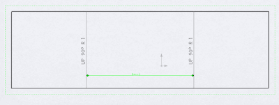

This example demonstrates how to add dimensions to bend lines in the drawing view of sheet metal flat pattern using SOLIDWORKS API.

{ width=400 height=150 }

It is required to select the sketch lines using the select data object with the view assigned, otherwise the dimensions creating will fail.

[IModelDoc2::AddDimension2](https://help.solidworks.com/2018/english/api/sldworksapi/solidworks.interop.sldworks~solidworks.interop.sldworks.imodeldoc~adddimension2.html) SOLIDWORKS API is used to add the dimension. Dimension is positioned at (0, 0, 0) coordinate. Refer the [Dimension Visible Entities](/docs/codestack/solidworks-api/document/drawing/view-dimension-drawing-entities/) example for code snippet for calculating the optimal dimension position.

~~~ vb
Dim swApp As SldWorks.SldWorks
Dim swModel As SldWorks.ModelDoc2
Dim swSelMgr As SldWorks.SelectionMgr
Dim swView As SldWorks.View

Sub main()

    Set swApp = Application.SldWorks

    Set swModel = swApp.ActiveDoc
    
    If Not swModel Is Nothing Then
    
        Set swSelMgr = swModel.SelectionManager
        
        Set swView = swSelMgr.GetSelectedObject6(1, -1)
        
        If Not swView Is Nothing Then
        
            Dim vBendLines As Variant
            vBendLines = swView.GetBendLines
            
            If UBound(vBendLines) >= 1 Then
            
                Dim swSelData As SldWorks.SelectData
                Set swSelData = swSelMgr.CreateSelectData
                swSelData.View = swView 'must be set
                
                swModel.ClearSelection2 True
                
                Dim i As Integer
                
                For i = 0 To 1
                    
                    Dim swSkSeg As SldWorks.SketchSegment
                                        
                    Set swSkSeg = vBendLines(i)
                    
                    swSkSeg.Select4 True, swSelData
                    
                Next
                
                swModel.AddDimension2 0, 0, 0
                
            Else
                MsgBox "There should be at least 2 bend lines in the drawing view"
            End If
            
        Else
            MsgBox "Please select drawing view with flat pattern"
        End If
    
    Else
        MsgBox "Please open drawing"
    End If
End Sub

~~~

