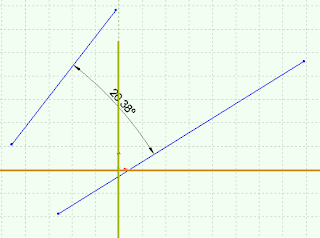

This example adds the dimension between 2 selected sketch segments (e.g. sketch lines) using SOLIDWORKS API. The dimension will be placed in the middle of 2 selection points.  

{ width=320 height=237 }

When adding dimensions programmatically using SOLIDWORKS API it is important to disable the Input Dimension Value option otherwise the macro will be interrupted and will require user inputs.

The example below temporarily removes this option and restores the original value after the dimension inserted so user settings are not affected.  

{ width=640 height=198 }

~~~ vb
Dim swApp As SldWorks.SldWorks
Dim swModel As SldWorks.ModelDoc2
Dim swSelMgr As SldWorks.SelectionMgr

Sub main()

    Set swApp = Application.SldWorks
    
    Set swModel = swApp.ActiveDoc
    
    If Not swModel Is Nothing Then
    
        Set swSelMgr = swModel.SelectionManager
                
        If swSelMgr.GetSelectedObjectCount2(-1) = 2 Then
    
            Dim vPt1 As Variant
            Dim vPt2 As Variant
            
            vPt1 = swSelMgr.GetSelectionPoint2(1, -1)
            vPt2 = swSelMgr.GetSelectionPoint2(2, -1)
            
            Dim inputDimDefVal As Boolean
            inputDimDefVal = swApp.GetUserPreferenceToggle(swUserPreferenceToggle_e.swInputDimValOnCreate)
        
            swApp.SetUserPreferenceToggle swUserPreferenceToggle_e.swInputDimValOnCreate, False

            swModel.AddDimension2 (vPt1(0) + vPt2(0)) / 2, (vPt1(1) + vPt2(1)) / 2, (vPt1(2) + vPt2(2)) / 2
            
            swApp.SetUserPreferenceToggle swUserPreferenceToggle_e.swInputDimValOnCreate, inputDimDefVal
    
        Else
            MsgBox "Please select sketch segments to add dimension"
        End If
        
    Else
        MsgBox "Please open the model"
    End If
    
End Sub

~~~

