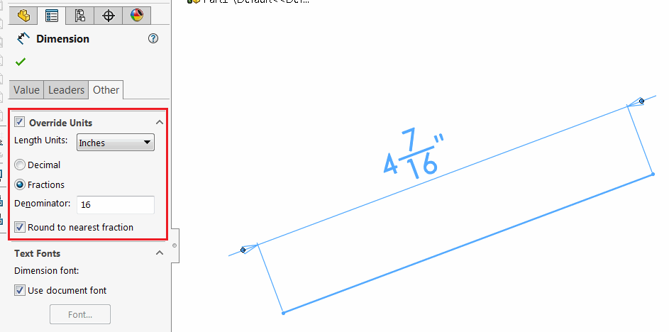

This VBA macro converts the value specified in system units (meters) into the fraction inches with specified denominator.

For example the value of 0.112713 with denominator 16 would be converted to 4 7/16"

Configure the parameters as per the settings below:

~~~ vb
Const DENOMINATOR As Integer = 16 'denominator value
Const ROUND_TO_NEAREST_FRACTION As Boolean = True 'True to round to nearest fraction, False to not
~~~

The result and available options are equal to the dimension property manager page in SOLIDWORKS

~~~ vb
Const DENOMINATOR As Integer = 16
Const ROUND_TO_NEAREST_FRACTION As Boolean = True

Dim swApp As SldWorks.SldWorks

Sub main()

    Set swApp = Application.SldWorks
    
    Debug.Print ConvertMetersToFractionInches(0.112713, DENOMINATOR, ROUND_TO_NEAREST_FRACTION)
    
End Sub

Function ConvertMetersToFractionInches(value As Double, denom As Integer, round As Boolean) As String
    
    Dim swUserUnits As SldWorks.UserUnit
    Set swUserUnits = swApp.GetUserUnit(swUserUnitsType_e.swLengthUnit)
    
    swUserUnits.FractionBase = swFractionDisplay_e.swFRACTION
    swUserUnits.SpecificUnitType = swLengthUnit_e.swINCHES
    
    swUserUnits.RoundToFraction = round
    swUserUnits.FractionValue = denom

    ConvertMetersToFractionInches = swUserUnits.ConvertToUserUnit(value, True, True)
    
End Function
~~~

