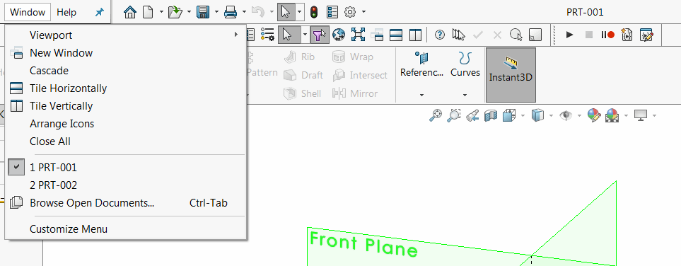

{ width=450 }

This VBA macro automatically increments the part number and sets this as a title for newly created file using SOLIDWORKS API.

Part number is incremented and stored in the external text file which can be shared across different users if needed.

{ width=350 }

Macro provides several options to format the title which can be modified by changes in the values of the constants in the macro.

~~~ vb
Const NMB_SRC_FILE_PATH As String = "D:\prt.txt" 'path to store the current part index
Const NMB_FORMAT As String = "000" 'padding for the number, e.g. 001, 002, instead of 1, 2
Const BASE_NAME As String = "PRT-" 'Base prefix for file naming
~~~

Follow the video tutorial in the [Run Macro On Document Load](/docs/codestack/solidworks-api/application/documents/handle-document-load/) article for the guide of running this macro automatically for each newly created model.

~~~ vb
Const NMB_SRC_FILE_PATH As String = "D:\prt.txt"
Const NMB_FORMAT As String = "000"
Const BASE_NAME As String = "PRT-"

Dim swApp As SldWorks.SldWorks

Sub main()

    Set swApp = Application.SldWorks
        
    Dim swModel As SldWorks.ModelDoc2
        
    Set swModel = swApp.ActiveDoc
    
    Dim lastNumber As Integer
    
    lastNumber = ReadNumber(NMB_SRC_FILE_PATH)
    
    Dim thisNumber As Integer
    thisNumber = lastNumber + 1
    
    Dim name As String
    name = BASE_NAME & Format(thisNumber, NMB_FORMAT)
    
    If False = swModel.SetTitle2(name) Then
        Err.Raise vbError, "", "Failed to set title"
    End If
    
    StoreNumber NMB_SRC_FILE_PATH, thisNumber
    
End Sub

Function ReadNumber(filePath As String) As Integer
    
    Dim fileNo As Integer

    fileNo = FreeFile
    
    Dim number As String
    
    Open filePath For Input As #fileNo
        
    Line Input #fileNo, number
    
    Close #fileNo
    
    ReadNumber = CInt(number)
    
End Function

Sub StoreNumber(filePath As String, number As Integer)
    
    Dim fileNo As Integer
    fileNo = FreeFile
    
    Open filePath For Output As #fileNo
    
    Print #fileNo, CStr(number)
    
    Close #fileNo
    
End Sub
~~~

