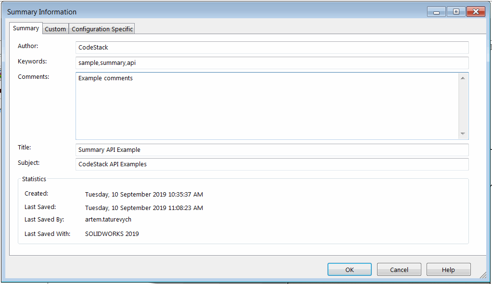

{ width=500 }

This VBA macro extracts the data from the *Summary Information* tab from custom properties of the active SOLIDWORKS document using SOLIDWORKS API. This information includes author, keywords, comments, title, creation info, last saved info.

This macro additionally extracts the SOLIDWORKS version the file was created in.

Result is output to the [immediate window of VBA editor](/docs/codestack/visual-basic/vba/vba-editor/windows#immediate-window) in the following format:

~~~
Author: CodeStack
Keywords: sample,summary,api
Comments: Example comments
Title: Summary API Example
Subject: CodeStack API Examples
Created: Tuesday, 10 September 2019 10:35:37 AM
Last Saved: Tuesday, 10 September 2019 11:08:23 AM
Last Saved By: artem.taturevych
Last Saved With: SOLIDWORKS 2019
Created With: SOLIDWORKS 2012
~~~

~~~ vb
Dim swApp As SldWorks.SldWorks

Sub main()

    Set swApp = Application.SldWorks
    
    Dim swModel As SldWorks.ModelDoc2
    
    Set swModel = swApp.ActiveDoc
    
    If Not swModel Is Nothing Then
    
        Dim vHistory As Variant
        vHistory = swModel.VersionHistory()
            
        Debug.Print "Author: " & swModel.SummaryInfo(swSummInfoField_e.swSumInfoAuthor)
        Debug.Print "Keywords: " & swModel.SummaryInfo(swSummInfoField_e.swSumInfoKeywords)
        Debug.Print "Comments: " & swModel.SummaryInfo(swSummInfoField_e.swSumInfoComment)
        Debug.Print "Title: " & swModel.SummaryInfo(swSummInfoField_e.swSumInfoTitle)
        Debug.Print "Subject: " & swModel.SummaryInfo(swSummInfoField_e.swSumInfoSubject)
        
        Debug.Print "Created: " & swModel.SummaryInfo(swSummInfoField_e.swSumInfoCreateDate2)
        Debug.Print "Last Saved: " & swModel.SummaryInfo(swSummInfoField_e.swSumInfoSaveDate2)
        Debug.Print "Last Saved By: " & swModel.SummaryInfo(swSummInfoField_e.swSumInfoSavedBy)
        Debug.Print "Last Saved With: " & ConvertFileVersionToSwMajorVersion(ExtractSwRevisonFromHistoryRecord(CStr(vHistory(UBound(vHistory)))))
        Debug.Print "Created With: " & ConvertFileVersionToSwMajorVersion(ExtractSwRevisonFromHistoryRecord(CStr(vHistory(0))))
        
    Else
        Err.Raise vbError, "", "Please open model"
    End If
    
End Sub

Function ExtractSwRevisonFromHistoryRecord(fileVers As String) As String
    
    ExtractSwRevisonFromHistoryRecord = Left(fileVers, InStr(fileVers, "[") - 1)
    
End Function

Function ConvertFileVersionToSwMajorVersion(versNumber As Integer) As String
    
    Dim swVersMajor As String
    
    If versNumber >= 5000 Then
        swVersMajor = 2012 + (versNumber - 5000) / 1000
    Else
        Select Case versNumber
            Case 44
                swVersMajor = 95
            Case 243
                swVersMajor = 96
            Case 483
                swVersMajor = 97
            Case 629
                swVersMajor = "97Plus"
            Case 822
                swVersMajor = 98
            Case 1008
                swVersMajor = "98Plus"
            Case 1137
                swVersMajor = 99
            Case 1500
                swVersMajor = 2000
            Case 1750
                swVersMajor = 2001
            Case 1950
                swVersMajor = "2001Plus"
            Case 2200
                swVersMajor = 2003
            Case 2500
                swVersMajor = 2004
            Case 2800
                swVersMajor = 2005
            Case 3100
                swVersMajor = 2006
            Case 3400
                swVersMajor = 2007
            Case 3800
                swVersMajor = 2008
            Case 4100
                swVersMajor = 2009
            Case 4400
                swVersMajor = 2010
            Case 4700
                swVersMajor = 2011
        End Select
    End If
    
    ConvertFileVersionToSwMajorVersion = "SOLIDWORKS " & swVersMajor
    
End Function
~~~

