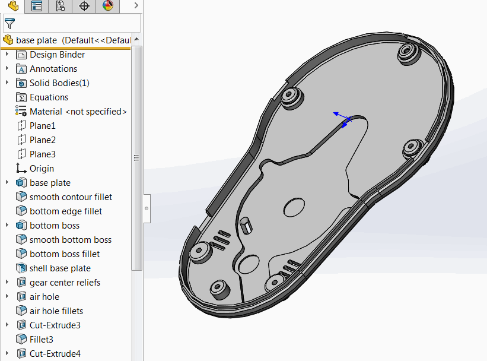
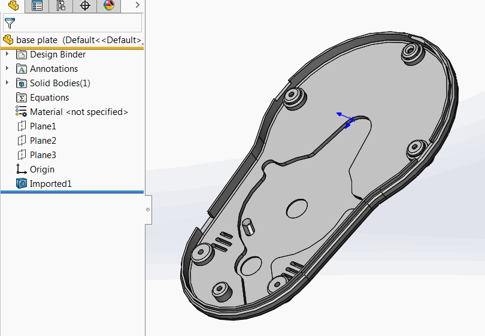

This macro emulates the functionality of [Defeature for Part](https://help.solidworks.com/2018/english/solidworks/sldworks/c_defeature_for_parts.htm) but not using it directly.

Macro copies all visible solid and surface bodies, deletes all user features and imports the copied bodies using SOLIDWORKS API.

**Before:**

{ width=350 }

**After:**
{ width=350 }

~~~ vb
Dim swApp As SldWorks.SldWorks

Sub main()

    Set swApp = Application.SldWorks
    
    Dim swPart As SldWorks.PartDoc
    
    Set swPart = swApp.ActiveDoc
    
    If Not swPart Is Nothing Then
        
        Dim vBodies As Variant
        vBodies = GetBodyCopies(swPart)
        
        DeleteAllUserFeatures swPart
        
        CreateFeaturesForBodies swPart, vBodies
        
    Else
        MsgBox "Please open part document"
    End If
    
End Sub

Function GetBodyCopies(part As SldWorks.PartDoc) As Variant
    
    Dim vBodies As Variant
        
    vBodies = part.GetBodies2(swBodyType_e.swAllBodies, True)
    Dim i As Integer
    
    For i = 0 To UBound(vBodies)
        
        Dim swBody As SldWorks.Body2
        Set swBody = vBodies(i)
        Set swBody = swBody.Copy()
        Set vBodies(i) = swBody
        
    Next
    
    GetBodyCopies = vBodies
    
End Function

Sub CreateFeaturesForBodies(part As SldWorks.PartDoc, vBodies As Variant)
    
    Dim i As Integer
    
    For i = 0 To UBound(vBodies)
        Dim swBody As SldWorks.Body2
        Set swBody = vBodies(i)
        part.CreateFeatureFromBody3 swBody, False, swCreateFeatureBodyOpts_e.swCreateFeatureBodySimplify
    Next
    
End Sub

Sub DeleteAllUserFeatures(model As SldWorks.ModelDoc2)
    
    SelectAllTopLevelUserFeatures model
            
    model.Extension.DeleteSelection2 swDeleteSelectionOptions_e.swDelete_Children + swDeleteSelectionOptions_e.swDelete_Absorbed
            
End Sub

Sub SelectAllTopLevelUserFeatures(model As SldWorks.ModelDoc2)
    
    model.ClearSelection2 True
    
    Dim swFeat As SldWorks.Feature
    
    Set swFeat = model.FirstFeature
    
    Dim selectFeat As Boolean
    selectFeat = False
    
    While Not swFeat Is Nothing
        
        If selectFeat Then
            swFeat.Select2 True, -1
        Else
            If swFeat.GetTypeName2() = "OriginProfileFeature" Then
                selectFeat = True
            End If
        End If
        
        Set swFeat = swFeat.GetNextFeature
        
    Wend
    
End Sub
~~~

