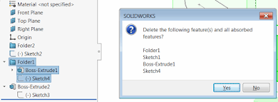

When deleting the top folder in SOLIDWORKS features tree all sub features are not get deleted so it is required to select all of them one-by-one in order to delete folder content.

This is not always possible to do in one step due to the features relations:  

{ width=400 }

The macro below allows to delete all of the features in the selected folder in one click using SOLIDWORKS API. Nested folders are also supported.

{ width=400 }

Macro can optionally display the confirmation dialog with the list of features about to be deleted

Watch [video demonstration](https://youtu.be/9uZCecGg25I?t=396)

~~~ vb
Const SHOW_CONFIRMATION_DIALOG As Boolean = True

Dim swApp As SldWorks.SldWorks
Dim swModel As SldWorks.ModelDoc2

Sub main()

    Set swApp = Application.SldWorks
    
    Set swModel = swApp.ActiveDoc
    
    If Not swModel Is Nothing Then
        
        Dim swSelMgr As SldWorks.SelectionMgr
        Set swSelMgr = swModel.SelectionManager
        
        Dim swFolderFeat As SldWorks.Feature
        
        Set swFolderFeat = swSelMgr.GetSelectedObject6(1, -1)
        
        If Not swFolderFeat Is Nothing Then
            
            If swFolderFeat.GetTypeName2() = "FtrFolder" Then
                
                Dim vFeats As Variant
                vFeats = GetFeaturesInFolder(swFolderFeat)
                Dim i As Integer
                
                If Not IsEmpty(vFeats) Then
                    For i = 0 To UBound(vFeats)
                        Dim swFeat As SldWorks.Feature
                        Set swFeat = vFeats(i)
                        swFeat.Select2 True, -1
                    Next
                End If
                
                If SHOW_CONFIRMATION_DIALOG Then
                    
                    Dim featNames As String
                    
                    For i = 1 To swSelMgr.GetSelectedObjectCount2(-1)
                        
                        On Error Resume Next
                        
                        Set swFeat = swSelMgr.GetSelectedObject6(i, -1)
                        If Not swFeat Is Nothing Then
                            featNames = featNames & vbCrLf & swFeat.Name
                        End If
                        
                    Next
                
                    If swApp.SendMsgToUser2( _
                        "Delete the following feature(s) and all absorbed features?" & vbCrLf & featNames, _
                        swMessageBoxIcon_e.swMbQuestion, _
                        swMessageBoxBtn_e.swMbYesNo) = swMessageBoxResult_e.swMbHitNo Then
                        End
                    End If
                End If
                
                swModel.Extension.DeleteSelection2 swDeleteSelectionOptions_e.swDelete_Absorbed
                
            Else
                MsgBox "Selected feature is not a folder"
            End If
            
        Else
            MsgBox "Please select folder feature"
        End If
        
    Else
        MsgBox "Please open model"
    End If
    
End Sub

Function GetFeaturesInFolder(folderFeat As SldWorks.Feature) As Variant
    
    Const FOLDER_CLOSE_TAG As String = "___EndTag___"
    
    Dim swFeatsColl As Collection
    Set swFeatsColl = New Collection
        
    Dim swNextFeat As SldWorks.Feature
    
    Set swNextFeat = folderFeat.GetNextFeature
    
    Dim nestedFolderLevel As Integer
    nestedFolderLevel = 0
    
    While Not swNextFeat Is Nothing
        
        Dim isEndFolderTagFeat As Boolean
        isEndFolderTagFeat = False
        
        If swNextFeat.GetTypeName2() = "FtrFolder" Then
                        
            isEndFolderTagFeat = Right(swNextFeat.Name, Len(FOLDER_CLOSE_TAG)) = FOLDER_CLOSE_TAG
            
            If isEndFolderTagFeat Then
                If nestedFolderLevel = 0 Then
                    GetFeaturesInFolder = CollectionToArray(swFeatsColl)
                    Exit Function
                Else
                    nestedFolderLevel = nestedFolderLevel - 1
                End If
            Else
                nestedFolderLevel = nestedFolderLevel + 1
            End If
            
        End If
    
        If Not isEndFolderTagFeat Then
            If Not Contains(swFeatsColl, swNextFeat) Then
                swFeatsColl.Add swNextFeat
            End If
        
            CollectAllSubFeatures swNextFeat, swFeatsColl
        End If
        
        Set swNextFeat = swNextFeat.GetNextFeature
        
    Wend
        
End Function

Sub CollectAllSubFeatures(swFeat As SldWorks.Feature, coll As Collection)
    
    Dim swSubFeat As SldWorks.Feature
    Set swSubFeat = swFeat.GetFirstSubFeature
        
    While Not swSubFeat Is Nothing
        
        If Not Contains(coll, swSubFeat) Then
            coll.Add swNextFeat
        End If
        
        CollectAllSubFeatures swSubFeat, coll
        Set swSubFeat = swSubFeat.GetNextSubFeature
        
    Wend
    
End Sub

Function Contains(coll As Collection, item As Object) As Boolean
    
    Dim i As Integer
    
    For i = 1 To coll.Count
        If coll.item(i) Is item Then
            Contains = True
            Exit Function
        End If
    Next
    
    Contains = False
    
End Function

Function CollectionToArray(coll As Collection) As Variant
    
    If coll.Count() > 0 Then
        
        Dim arr() As Object
        
        ReDim arr(coll.Count() - 1)
        Dim i As Integer
        
        For i = 1 To coll.Count
            Set arr(i - 1) = coll(i)
        Next
        
        CollectionToArray = arr
        
    Else
        CollectionToArray = Empty
    End If
    
End Function
~~~

