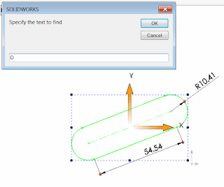

This macro finds and replaces the text in the dimension names of the selected feature or features (similar to Find-Replace feature in text editors) using SOLIDWORKS API:

{ width=320 }

1. Open SOLIDWORKS assembly or part
1. Select features to lookup dimensions in
1. Run the macro
1. Specify the text to find and the text to replace. Only include short dimension name.
For example the dimension D1 in Sketch1 will have a short name *D1* and full name *D1@Sketch1.* Specifying *D* in find field and *B* in replace field will result in dimension to be renamed to *B1@Sketch1*.

~~~ vb
Dim swApp As SldWorks.SldWorks
Dim swModel As SldWorks.ModelDoc2
Dim swSelMgr As SldWorks.SelectionMgr

Sub main()

    Set swApp = Application.SldWorks
    
    Set swModel = swApp.ActiveDoc
    
    Set swSelMgr = swModel.SelectionManager
    
    If Not swModel Is Nothing Then
    
        Dim fromText As String
        Dim toText As String
        
        fromText = InputBox("Specify the text to find")
        toText = InputBox("Specify the text to replace")
    
        Dim i As Integer
        Dim isFeatSelected As Boolean
        isFeatSelected = False
        
        For i = 1 To swSelMgr.GetSelectedObjectCount2(-1)
            
            Dim swFeat As SldWorks.Feature
                
            Set swFeat = swSelMgr.GetSelectedObject6(i, -1)
                
            If Not swFeat Is Nothing Then
                
                isFeatSelected = True
                
                Dim swDispDim As SldWorks.DisplayDimension
                Set swDispDim = swFeat.GetFirstDisplayDimension
                
                While Not swDispDim Is Nothing
                    
                    Dim swDim As SldWorks.Dimension
                    Set swDim = swDispDim.GetDimension2(0)
                    
                    swDim.Name = Replace(swDim.Name, fromText, toText)
                    
                    Set swDispDim = swFeat.GetNextDisplayDimension(swDispDim)
                    
                Wend
                
            End If
            
        Next
        
        If Not isFeatSelected Then
            MsgBox "Please select feature(s) you want to rename dimensions in"
        End If
        
    Else
        MsgBox "Please open the model"
    End If
    
End Sub
~~~

