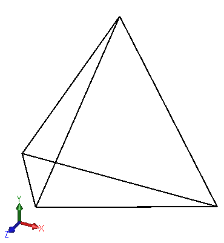

This example demonstrates how to render the tetrahedron geometry using OpenGL graphics and handle the different display modes (shaded, shaded with edges, hlr, hlv, wireframe).

Once add-in is compiled, tetrahedron will be rendered in each newly opened or created 3D model (part or assembly).

Change display modes in the heads up menu of SOLIDWORKS model view to see the graphics updated.

{ width=350 }

## Display Modes

### Shaded with edges

Achieved by rendering two layers of graphics: filled triangles and not filled lines on top of the triangles.

{ width=200 }

### Shaded

Achieved by rendering the triangles

{ width=200 }

### Hidden lines removed

Achieved by rendering triangles with polygon mode set to lines.

{ width=200 }

### Hidden lines visible

Achieved by rendering dashed line in lines mode

{ width=200 }

### Wireframe

Achieved by rendering graphics in lines mode

{ width=200 }

Source code can be downloaded from [GitHub](https://github.com/codestackdev/solidworks-api-examples/tree/master/swex/add-in/opengl/OglTetrahedron)

## AddIn.vb

This the add-in entry point. [SwEx.AddIn](/docs/codestack/labs/solidworks/swex/add-in/) framework is used to manage documents lifecycle by providing the wrapper class.

~~~ vb
Imports CodeStack.SwEx.AddIn
Imports CodeStack.SwEx.AddIn.Attributes
Imports System.Runtime.InteropServices

<ComVisible(True), Guid("A28F5BB7-E468-48B6-9BBD-9E7A31FF8CC8")>
<AutoRegister("OpenGL Box Tetrahedron")>
Public Class AddIn
	Inherits SwAddInEx

	Public Overrides Function OnConnect() As Boolean
		CreateDocumentsHandler(Of OpenGlDocumentHandler)()
		Return True
	End Function
End Class
~~~

## OpenGlDocumentHandler.vb

This is a handler class for each model document which subscribes to the OpenGL Buffer Swap notification provided by SOLIDWORKS and performs the calculation of tetrahedron triangle coordinates and renders the geometry. 

~~~ vb
Imports CodeStack.SwEx.AddIn.Base
Imports SolidWorks.Interop.sldworks
Imports System.Drawing
Imports SolidWorks.Interop.swconst
Imports CodeStack.OglTetrahedron.OpenGl

Public Class OpenGlDocumentHandler
	Implements IDocumentHandler

	ReadOnly m_FaceColor As Color = Color.Green
	ReadOnly m_EdgeColor As Color = Color.Black

	Dim m_MathUtils As IMathUtility
	Dim m_Model As IModelDoc2
	Dim m_View As ModelView

	Public Sub Init(ByVal app As ISldWorks, ByVal model As IModelDoc2) Implements IDocumentHandler.Init

		m_MathUtils = app.IGetMathUtility
		m_Model = model
		m_View = model.IActiveView

		If m_View IsNot Nothing Then
			AddHandler m_View.BufferSwapNotify, AddressOf OnBufferSwapNotify
		End If

	End Sub

	Private Function OnBufferSwapNotify() As Integer

		Dim a As Double() = New Double() {0, 0, 0}
		Dim b As Double() = New Double() {1, 0, 0}
		Dim c As Double() = New Double() {0.5, Math.Sqrt(3) / 2, 0}
		Dim d As Double() = New Double() {0.5, Math.Sqrt(3) / 6, Math.Sqrt(6) / 3}

		Select Case CType(m_View.DisplayMode, swViewDisplayMode_e)
			Case swViewDisplayMode_e.swViewDisplayMode_ShadedWithEdges
				DrawTetrahedron(m_FaceColor, True, False, False, 3.0F)
				DrawTetrahedron(m_EdgeColor, True, True, False, 3.0F)
			Case swViewDisplayMode_e.swViewDisplayMode_Shaded
				DrawTetrahedron(m_FaceColor, True, False, False, 3.0F)
			Case swViewDisplayMode_e.swViewDisplayMode_HiddenLinesRemoved '
				DrawTetrahedron(m_EdgeColor, False, False, False, 3.0F)
			Case swViewDisplayMode_e.swViewDisplayMode_HiddenLinesGrayed '
				DrawTetrahedron(m_EdgeColor, True, True, True, 1.0F)
			Case swViewDisplayMode_e.swViewDisplayMode_Wireframe
				DrawTetrahedron(m_EdgeColor, True, True, False, 3.0F)
		End Select

		Dim pt1 As IMathPoint = m_MathUtils.CreatePoint(New Double() {0, 0, 0})
		Dim pt2 As IMathPoint = m_MathUtils.CreatePoint(New Double() {1, 1, 1})

		m_Model.Extension.SetVisibleBox(pt1, pt2)

		Return 0

	End Function

	Private Sub DrawTetrahedron(color As Color, fill As Boolean, wireframe As Boolean, dashed As Boolean, width As Single)

		Dim a As Double() = New Double() {0, 0, 0}
		Dim b As Double() = New Double() {1, 0, 0}
		Dim c As Double() = New Double() {0.5, Math.Sqrt(3) / 2, 0}
		Dim d As Double() = New Double() {0.5, Math.Sqrt(3) / 6, Math.Sqrt(6) / 3}

		DrawTriangle(a, c, b, color, fill, wireframe, dashed, width)
		DrawTriangle(a, d, c, color, fill, wireframe, dashed, width)
		DrawTriangle(c, d, b, color, fill, wireframe, dashed, width)
		DrawTriangle(d, a, b, color, fill, wireframe, dashed, width)

	End Sub

	Private Sub DrawTriangle(a() As Double, b() As Double, c() As Double, color As Color, fill As Boolean, wireframe As Boolean, dashed As Boolean, width As Single)

		glPolygonMode(GL_FRONT_AND_BACK, IIf(fill, GL_FILL, GL_LINE))

		glDisable(GL_LIGHTING)

		If wireframe Then

			glEnable(GL_LINE_SMOOTH)

			If dashed Then
				glEnable(GL_LINE_STIPPLE)
				glLineStipple(4, &HAAAA)
			End If

		End If

		glBegin(IIf(wireframe, GL_LINE_LOOP, GL_TRIANGLES))

		If wireframe Then
			glLineWidth(width)
		End If

		glColor4f(color.R / 255.0F, color.G / 255.0F, color.B / 255.0F, color.A / 255.0F)
		glVertex3d(a(0), a(1), a(2))
		glVertex3d(b(0), b(1), b(2))
		glVertex3d(c(0), c(1), c(2))

		glEnd()

		glDisable(GL_LINE_SMOOTH)
		glDisable(GL_LINE_STIPPLE)

	End Sub

	Public Sub Dispose() Implements IDisposable.Dispose
		If m_View IsNot Nothing Then
			RemoveHandler m_View.BufferSwapNotify, AddressOf OnBufferSwapNotify
		End If
	End Sub

End Class

~~~

## OpenGL.vb

List of imports for OpenGL functions.

~~~ vb
Imports System.Runtime.InteropServices

Public Class OpenGl

	<DllImport("opengl32")>
	Public Shared Sub glBegin(ByVal mode As UInteger)
	End Sub

	<DllImport("opengl32")>
	Public Shared Sub glEnd()
	End Sub

	<DllImport("opengl32")>
	Public Shared Sub glVertex3d(ByVal x As Double, ByVal y As Double, ByVal z As Double)
	End Sub

	<DllImport("opengl32.dll")>
	Public Shared Sub glDisable(ByVal cap As UInteger)
	End Sub

	<DllImport("opengl32.dll")>
	Public Shared Sub glColor4f(ByVal R As Single, ByVal G As Single, ByVal B As Single, ByVal A As Single)
	End Sub

	<DllImport("opengl32.dll")>
	Public Shared Sub glEnable(ByVal cap As UInteger)
	End Sub

	<DllImport("opengl32.dll")>
	Public Shared Sub glPolygonMode(ByVal face As UInteger, ByVal mode As UInteger)
	End Sub

	<DllImport("opengl32.dll")>
	Public Shared Sub glLineWidth(ByVal width As Single)
	End Sub

	<DllImport("opengl32.dll")>
	Public Shared Sub glLineStipple(ByVal factor As Integer, ByVal pattern As UShort)
	End Sub

	Public Const GL_FRONT_AND_BACK As Integer = &H408
	Public Const GL_LINE As UInteger = &H1B01
	Public Const GL_FILL As UInteger = &H1B02

	Public Const GL_TRIANGLES As UInteger = &H4
	Public Const GL_LINE_LOOP As UInteger = &H2
	Public Const GL_LIGHTING As UInteger = &HB50
	Public Const GL_LINE_SMOOTH As UInteger = &HB20
	Public Const GL_LINE_STIPPLE As UInteger = &HB24

End Class

~~~

