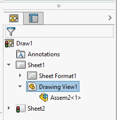
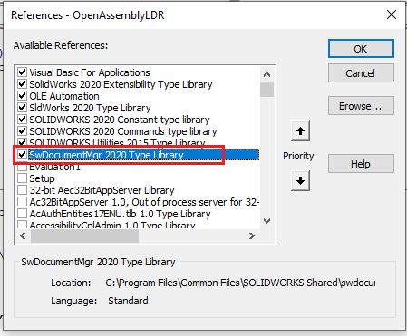
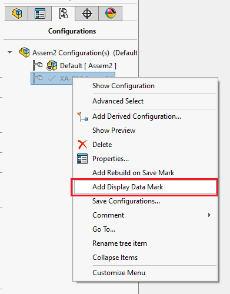

This VBA macro can be run from the assembly opened in the Large Design Review (LDR) mode or drawing opened in the Detailing mode. Macro will open all selected components in their own windows, but unlike out-of-the-box functionality assemblies will not be resolved and will preserve the LDR mode.

It is then possible to enable the editing in the LDR mode, modify the assembly and update the graphics in the top level assembly.

Preserving the LDR mode on all the steps will significantly improve the performance.

## Drawings

This macro can also work from the drawing opened in the Detailing mode. It is required to select drawing view(s) before running the macro.

To enable drawing support it is required to enable Document Manager API in the macro. Follow [Activating Document Manager](/docs/codestack/solidworks-document-manager-api/getting-started/create-connection#activating-document-manager) section for the detailed steps to request Document Manager license key.

Add the reference to **SwDocumentMgr [Year] Type Library** under the **Tools->References** menu in VBA editor. Follow [Document Manager in VBA](/docs/codestack/solidworks-document-manager-api/getting-started/create-connection#vba) for more information.

Set the license key in the **DM_LIC_KEY** variable. Note that this macro only requires **swdocmgr_general** portion of the key. The following format would be sufficient.

~~~ vb
Const DM_LIC_KEY As String = "[CompanyName]:swdocmgr_general-00000-{31 times}"
~~~

This routine is not required if macro will only be used from assemblies.

## Notes and limitations

* Sub-assembly components will be opened in Large Design Review mode while part components will be opened in the View Only mode
* If target parts or assemblies do not have display data stored - error will be thrown
* Components must be selected from the Feature Manager Tree. Entities selected in the graphics area will be ignored
* This VBA macro is using the simplified version of the [Search Routine for Referenced Documents](https://help.solidworks.com/2016/english/SolidWorks/sldworks/c_Search_Routine_for_Referenced_Documents.htm) and only checks active assembly's folder and sub folders before falling back on the cached path of the component. In some cases this may result in incorrect reference loaded (e.g if search folders are used). But this will only apply to the assembly which was copied and cached file paths were never updated.

### Referenced Configurations

This macro will attempt to open the assembly in the referenced configuration of the component, however by default SOLIDWORKS only stores the display data in the active configuration, unless configurations are marked with 'Display Data Mark' flag

{ width=250 }

If the referenced configuration of the component is not marked with the above flag and it is not an active configuration, then it cannot be loaded in Large Design Review. In this case macro will load the default configuration and display the below warning indicating that the graphics of different configuration is loaded.

~~~ vb
Type DocumentInfo
    filePath As String
    Configuration As String
End Type

Type DmDrawingViewInfo
    viewName As String
    RefDocPath As String
    RefConfigName As String
End Type

Const DM_LIC_KEY As String = "YOUR LICENSE KEY"

Dim swApp As SldWorks.SldWorks

Sub main()

    Set swApp = Application.SldWorks
    
    Dim swModel As SldWorks.ModelDoc2
    
    Set swModel = swApp.ActiveDoc
    
try_:
    On Error GoTo catch_
    
    If Not swModel Is Nothing Then
    
        If swModel.GetType() = swDocumentTypes_e.swDocASSEMBLY Then
            If False = swModel.IsOpenedViewOnly Then
                Err.Raise vbError, "", "Active assembly is not opened in Large Design Review mode"
            End If
        ElseIf swModel.GetType() = swDocumentTypes_e.swDocDRAWING Then
            Dim swDraw As SldWorks.DrawingDoc
            Set swDraw = swModel
            If False = swDraw.IsDetailingMode Then
                Err.Raise vbError, "", "Active drawing is not opened in Detailing mode"
            End If
        Else
            Err.Raise vbError, "", "Active document is not an assembly or drawing"
        End If
                
        Dim swDocsInfo() As DocumentInfo
        
        swDocsInfo = GetReferenceDocuments(swModel)
                
        OpenDocuments swModel, swDocsInfo
        
        GoTo finally_
        
    Else
        Err.Raise vbError, "", "Please open assembly or drawing document"
    End If

catch_:
    swApp.SendMsgToUser2 Err.Description, swMessageBoxIcon_e.swMbStop, swMessageBoxBtn_e.swMbOk
finally_:
 
End Sub

Sub OpenDocuments(model As SldWorks.ModelDoc2, docsInfo() As DocumentInfo)
    
    If Not IsDocsInfoEmpty(docsInfo) Then
            
        Dim i As Integer
        
        For i = 0 To UBound(docsInfo)
            
            Dim swDocInfo As DocumentInfo
            swDocInfo = docsInfo(i)
        
            Dim compPath As String
            compPath = ResolveReferencePath(model.GetPathName(), swDocInfo.filePath)
            
            Dim swDocSpec As SldWorks.DocumentSpecification
            Set swDocSpec = swApp.GetOpenDocSpec(compPath)
            
            swDocSpec.ConfigurationName = swDocInfo.Configuration
            swDocSpec.ViewOnly = True
            
            Dim swRefModel As SldWorks.ModelDoc2
            Set swRefModel = swApp.OpenDoc7(swDocSpec)
            
            If swRefModel Is Nothing And swDocSpec.Error = swFileLoadError_e.swFileRequiresRepairError Then
                
                swDocSpec.ConfigurationName = ""
                Set swRefModel = swApp.OpenDoc7(swDocSpec)
                
                If Not swRefModel Is Nothing Then
                
                    Dim swModelView As SldWorks.ModelView
                    Set swModelView = swRefModel.ActiveView
                    
                    Dim vViewBox As Variant
                    
                    vViewBox = swModelView.GetVisibleBox
                    
                    Dim activeConfName As String
                    activeConfName = swApp.GetActiveConfigurationName(compPath)
                    
                    If LCase(activeConfName) <> LCase(swDocInfo.Configuration) Then
                        swApp.ShowBubbleTooltipAt2 vViewBox(0), vViewBox(1), swArrowPosition.swArrowLeftTop, _
                            "CodeStack", _
                            "Referenced configuration '" & swDocInfo.Configuration & "' of the assembly does not have a 'Display Data Mark' and was opened in the active configuration '" & activeConfName & "'", _
                            swBitMaps.swBitMapTreeError, "", "", 0, swLinkString.swLinkStringNone, "", ""
                    End If
                    
                End If
                
            End If
            
            If swRefModel Is Nothing Then
                Err.Raise vbError, "", "Failed to open component. Error code: " & swDocSpec.Error
            End If
            
        Next
        
    Else
        Err.Raise vbError, "", "No component selected"
    End If
    
End Sub

Function GetReferenceDocuments(model As SldWorks.ModelDoc2) As DocumentInfo()
    
    Dim swDocsInfo() As DocumentInfo
        
    Dim i As Integer
    
    Dim swSelMgr As SldWorks.SelectionMgr
    Set swSelMgr = model.SelectionManager
    
    Dim viewInfo() As DmDrawingViewInfo
    
    If model.GetType() = swDocumentTypes_e.swDocDRAWING Then
        viewInfo = GetDmDrawingViews(model.GetPathName())
    End If
    
    For i = 1 To swSelMgr.GetSelectedObjectCount2(-1)
        
        Dim path As String
        Dim confName As String
        
        If swSelMgr.GetSelectedObjectType3(i, -1) = swSelectType_e.swSelCOMPONENTS Then
            
            Dim swComp As SldWorks.Component2
            Set swComp = swSelMgr.GetSelectedObject6(i, -1)
            
            path = swComp.GetPathName()
            confName = swComp.ReferencedConfiguration
        
        ElseIf swSelMgr.GetSelectedObjectType3(i, -1) = swSelectType_e.swSelDRAWINGVIEWS Then
            
            Dim swView As SldWorks.View
            Set swView = swSelMgr.GetSelectedObject6(i, -1)
            
            GetViewReferencedDocumentInfo viewInfo, swView.Name, path, confName
            
        End If
        
        If path <> "" Then
            
            Dim unique As Boolean
            unique = False
            
            If IsDocsInfoEmpty(swDocsInfo) Then
                ReDim swDocsInfo(0)
                unique = True
            Else
                unique = Not ContainsDocumentInfo(swDocsInfo, path)
                If True = unique Then
                    ReDim Preserve swDocsInfo(UBound(swDocsInfo) + 1)
                End If
            End If
                
            If True = unique Then
                swDocsInfo(UBound(swDocsInfo)).filePath = path
                swDocsInfo(UBound(swDocsInfo)).Configuration = confName
            End If
            
        End If
        
    Next
    
    GetReferenceDocuments = swDocsInfo
    
End Function

Function GetDmDrawingViews(drwFilePath As String) As DmDrawingViewInfo()
    
    Dim viewInfos() As DmDrawingViewInfo
    
    Dim swDmApp As SwDocumentMgr.SwDMApplication4

    Dim swClassFact As SwDocumentMgr.SwDMClassFactory
    
    Set swClassFact = New SwDocumentMgr.SwDMClassFactory
    
    Set swDmApp = swClassFact.GetApplication(DM_LIC_KEY)
    
    If Not swDmApp Is Nothing Then

        Dim swDmDoc As SwDocumentMgr.SwDMDocument10

        Dim res As SwDmDocumentOpenError
        
        Set swDmDoc = swDmApp.GetDocument(drwFilePath, swDmDocumentDrawing, True, res)
        
        If Not swDmDoc Is Nothing Then
            
            Dim searchOpts As SwDocumentMgr.SwDMSearchOption
            Set searchOpts = swDmApp.GetSearchOptionObject
            searchOpts.SearchFilters = SwDmSearchFilters.SwDmSearchExternalReference + SwDmSearchFilters.SwDmSearchRootAssemblyFolder + SwDmSearchFilters.SwDmSearchSubfolders + SwDmSearchFilters.SwDmSearchInContextReference
                
            Dim vFilePaths As Variant
            
            vFilePaths = swDmDoc.GetAllExternalReferences2(searchOpts, Empty)
        
            Dim vViews As Variant
            vViews = swDmDoc.GetViews
            
            ReDim viewInfos(UBound(vViews))
            
            Dim i As Integer
            
            For i = 0 To UBound(vViews)
                Dim swDmView As SwDocumentMgr.SwDMView2
                Set swDmView = vViews(i)
                viewInfos(i).viewName = swDmView.Name
                viewInfos(i).RefConfigName = swDmView.ReferencedConfiguration
                viewInfos(i).RefDocPath = FindPathByFileName(vFilePaths, swDmView.ReferencedDocument)
            Next
            
            swDmDoc.CloseDoc
            
            GetDmDrawingViews = viewInfos
            
        Else
            Err.Raise vbError, "", "Failed to open the drawing document in Document Manager. Error code: " & res
        End If
        
    Else
        Err.Raise vbError, "", "Failed to connect to Document Manager application"
    End If
    
End Function

Function GetViewReferencedDocumentInfo(viewInfo() As DmDrawingViewInfo, viewName As String, ByRef path As String, ByRef confName As String)

    Dim i As Integer
    
    For i = 0 To UBound(viewInfo)
        If LCase(viewInfo(i).viewName) = LCase(viewName) Then
            path = viewInfo(i).RefDocPath
            confName = viewInfo(i).RefConfigName
            Exit Function
        End If
        
    Next

    Err.Raise vbError, "", "Failed to find drawing view information"
    
End Function

Function IsDocsInfoEmpty(docsInfo() As DocumentInfo)
    IsDocsInfoEmpty = ((Not docsInfo) = -1)
End Function

Function FindPathByFileName(vFilePaths As Variant, fileName As String) As String

    Dim i As Integer
    
    For i = 0 To UBound(vFilePaths)
        Dim filePath As String
        filePath = vFilePaths(i)
        
        Dim thisFileName As String
        thisFileName = Right(filePath, InStrRev(filePath, "\") + 1)
        
        If LCase(thisFileName) = LCase(fileName) Then
            FindPathByFileName = filePath
            Exit Function
        End If
        
    Next

    Err.Raise vbError, "", "Failed to find the path by file name"
    
End Function

Function ContainsDocumentInfo(docsInfo() As DocumentInfo, path As String) As Boolean
    
    Dim i As Integer
    
    For i = 0 To UBound(docsInfo)
        If LCase(path) = LCase(docsInfo(i).filePath) Then
            ContainsDocumentInfo = True
            Exit Function
        End If
    Next
    
    ContainsDocumentInfo = False
    
End Function

Function ResolveReferencePath(rootDocPath As String, refPath As String) As String
    
    Dim pathParts As Variant
    pathParts = Split(refPath, "\")
    
    Dim rootFolder As String
    rootFolder = rootDocPath
    rootFolder = Left(rootFolder, InStrRev(rootFolder, "\") - 1)

    Dim i As Integer
    
    Dim curRelPath As String
    
    For i = UBound(pathParts) To 1 Step -1
        
        curRelPath = pathParts(i) & IIf(curRelPath <> "", "\", "") & curRelPath
        Dim path As String
        path = rootFolder & "\" & curRelPath
        
        If Dir(path) <> "" Then
            ResolveReferencePath = path
            Exit Function
        End If
        
    Next
    
    ResolveReferencePath = refPath
    
End Function
~~~

