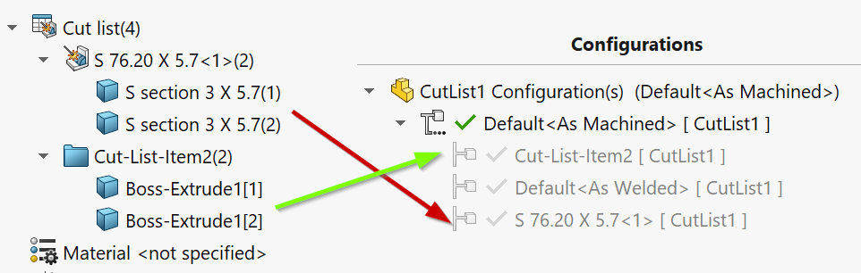
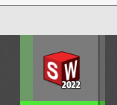

This VBA macro creates individual configuration for all cut-list bodies of the active part document.

This macro can be useful when preparing drawings for multi-body cut-list parts where drawing is required for each unique body.

Macro will create as many configurations as cut-lists feature in the document and will add the corresponding **Delete Body** feature and setup the suppression of this feature so each configuration will only display the body of the single cut-list.

Macro will name the configuration after the cut-list name.

Macro will display the progress bar in the SOLIDWORKS icon:

## Configuration

**KEEP_ALL_CUT_LIST_BODIES** constant allows to control should the macro isolate all cut-list bodies or only keep a single unique body.

~~~ vb
Const KEEP_ALL_CUT_LIST_BODIES As Boolean = True 'keep all cut-list bodies
~~~

If **KEEP_ALL_CUT_LIST_BODIES** is set to **False** only first body of each cut-list will be kept. This simplifies the drawing creation process as it is only required to select the corresponding referenced configuration to display body on drawing. However this will result in incorrect quantity of the cut-list item if BOM table is inserted (will always be equal to 1).

If **KEEP_ALL_CUT_LIST_BODIES** is set to **True** all bodies of each cut-list will be kept. in this case user is additionally required to select the single body to keep in the drawing via **Select Body** button in the drawing view. However in this case Bill Of Materials table will display the correct quantity.

~~~ vb
Const KEEP_ALL_CUT_LIST_BODIES As Boolean = True

Dim swApp As SldWorks.SldWorks

Sub main()

    Dim swProgressBar As SldWorks.UserProgressBar

try_:
    
    On Error GoTo catch_
    
    Set swApp = Application.SldWorks
    
    swApp.GetUserProgressBar swProgressBar
    
    Dim swModel As SldWorks.ModelDoc2
    
    Set swModel = swApp.ActiveDoc
    
    If Not swModel Is Nothing Then
        
        If swModel.GetType() = swDocumentTypes_e.swDocPART Then
            
            Dim vCutLists As Variant
            vCutLists = GetCutLists(swModel)
            
            swProgressBar.Start 0, UBound(vCutLists), "Creating configurations for cut-lists"
            
            Dim i As Integer
            
            For i = 0 To UBound(vCutLists)
                
                Dim swCutList As SldWorks.Feature
                Set swCutList = vCutLists(i)
                
                Dim swCutListFolder As SldWorks.BodyFolder
                Set swCutListFolder = swCutList.GetSpecificFeature2
                
                Dim vCutListBodies As Variant
                vCutListBodies = swCutListFolder.GetBodies()
                
                If Not IsEmpty(vCutListBodies) Then
                
                    Dim vBodies As Variant
                    
                    If KEEP_ALL_CUT_LIST_BODIES Then
                        vBodies = vCutListBodies
                    Else
                        Dim swBody(0) As SldWorks.Body2
                        Set swBody(0) = vCutListBodies(0)
                        vBodies = swBody
                    End If
                    
                    Debug.Print "Creating configuration for " & swCutList.Name
                    
                    CreateConfigurationForBodies swModel, vBodies, swCutList.Name
                
                Else
                    Debug.Print swCutList.Name & " has no bodies"
                End If
                
                swProgressBar.UpdateProgress i + 1
                
            Next
            
        Else
            Err.Raise vbError, "", "Only part document is supported"
        End If
    Else
        Err.Raise vbError, "", "Open part document"
    End If
    
    GoTo finally_
    
catch_:
    MsgBox Err.Description, vbCritical
finally_:

    If Not swProgressBar Is Nothing Then
        swProgressBar.End
    End If
    
End Sub

Sub CreateConfigurationForBodies(model As SldWorks.ModelDoc2, vBodies As Variant, confName As String)

    If IsEmpty(vBodies) Then
        Err.Raise vbError, "", "Bodies are nost specified"
    End If
    
    Dim activeConfName As String
    activeConfName = model.ConfigurationManager.ActiveConfiguration.Name

    Dim swBodyConf As SldWorks.Configuration
    Set swBodyConf = model.ConfigurationManager.AddConfiguration2(confName, "", "", swConfigurationOptions2_e.swConfigOption_DontActivate Or swConfigurationOptions2_e.swConfigOption_SuppressByDefault, activeConfName, "", False)
    
    If swBodyConf Is Nothing Then
        Err.Raise vbError, "", "Failed to create configuration for " & confName
    End If
    
    If model.Extension.MultiSelect2(vBodies, False, Nothing) = UBound(vBodies) + 1 Then
        
        Dim swBodyDeleteFeat As SldWorks.Feature
        Set swBodyDeleteFeat = model.FeatureManager.InsertDeleteBody2(True)
        
        If Not swBodyDeleteFeat Is Nothing Then
            
            swBodyDeleteFeat.Name = confName + "_Isolated"
            
            If False = swBodyDeleteFeat.SetSuppression2(swFeatureSuppressionAction_e.swSuppressFeature, swInConfigurationOpts_e.swThisConfiguration, Empty) Then
                Err.Raise vbError, "", "Failed suppress delete body feature for " & confName
            End If
            
            Dim targetConf(0) As String
            targetConf(0) = swBodyConf.Name
            
            If False = swBodyDeleteFeat.SetSuppression2(swFeatureSuppressionAction_e.swUnSuppressFeature, swInConfigurationOpts_e.swSpecifyConfiguration, targetConf) Then
                Err.Raise vbError, "", "Failed to configure the suppression of the delete body feature for " & confName
            End If
        Else
            Err.Raise vbError, "", "Failed to create Delete Body feature for " & confName
        End If
        
    Else
        Err.Raise vbError, "", "Failed to select bodies " & confName
    End If

End Sub

Function GetCutLists(model As SldWorks.ModelDoc2) As Variant

    Dim swFeat As SldWorks.Feature
    
    Dim swCutLists() As SldWorks.Feature
    
    Set swFeat = model.FirstFeature
    
    While Not swFeat Is Nothing
        
        If swFeat.GetTypeName2 <> "HistoryFolder" Then
        
            ProcessFeature swFeat, swCutLists
            
            TraverseSubFeatures swFeat, swCutLists
        
        End If
        
        Set swFeat = swFeat.GetNextFeature
        
    Wend
    
    GetCutLists = swCutLists
    
End Function

Sub TraverseSubFeatures(parentFeat As SldWorks.Feature, cutLists() As SldWorks.Feature)
    
    Dim swChildFeat As SldWorks.Feature
    Set swChildFeat = parentFeat.GetFirstSubFeature
    
    While Not swChildFeat Is Nothing
        ProcessFeature swChildFeat, cutLists
        Set swChildFeat = swChildFeat.GetNextSubFeature()
    Wend
    
End Sub

Sub ProcessFeature(feat As SldWorks.Feature, cutLists() As SldWorks.Feature)
    
    If feat.GetTypeName2() = "SolidBodyFolder" Then
        Dim swBodyFolder As SldWorks.BodyFolder
        Set swBodyFolder = feat.GetSpecificFeature2
        swBodyFolder.UpdateCutList
    ElseIf feat.GetTypeName2() = "CutListFolder" Then
        
        If Not Contains(cutLists, feat) Then
            If (Not cutLists) = -1 Then
                ReDim cutLists(0)
            Else
                ReDim Preserve cutLists(UBound(cutLists) + 1)
            End If
            
            Set cutLists(UBound(cutLists)) = feat
        End If
        
    End If
    
End Sub

Function Contains(arr As Variant, item As Object) As Boolean
    
    Dim i As Integer
    
    For i = 0 To UBound(arr)
        If arr(i) Is item Then
            Contains = True
            Exit Function
        End If
    Next
    
    Contains = False
    
End Function
~~~

