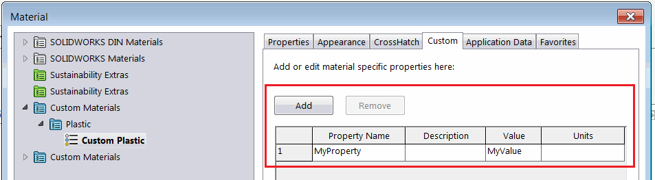

{ width=450 }

This macro demonstrates how to copy the specified custom property from the material database to the model custom property using SOLIDWORKS API and XML parsers.

*MSXML2.DOMDocument* object is used to read XML of the material database and select the required material node.

* Specify the custom property name to copy via *PRP_NAME* variable

~~~ vb
Const PRP_NAME As String = "MyProperty"
~~~

* Run the macro. Macro will find the material of active part and read the property value from the material database file
* Macro will create/update the generic custom property of the file to the corresponding value of the custom property from material

~~~ vb
Const PRP_NAME As String = "MyProperty"

Dim swApp As SldWorks.SldWorks

Sub main()

    Set swApp = Application.SldWorks
    
    Dim swPart As SldWorks.PartDoc
    
    Set swPart = swApp.ActiveDoc
    
    If Not swPart Is Nothing Then
        
        Dim materialName As String
        Dim materialDb As String
        materialDb = GetMaterialDatabase(swPart, materialName)
        
        If materialDb <> "" Then
            Dim prpVal As String
            prpVal = GetMaterialCustomProperty(materialName, materialDb, PRP_NAME)
            SetCustomProperty swPart, PRP_NAME, prpVal
        Else
            MsgBox "Failed to find the material database"
        End If
        
    Else
        MsgBox "Please open part"
    End If
    
End Sub

Function GetMaterialDatabase(part As SldWorks.PartDoc, ByRef materialName As String) As String
    
    Dim materialDbName As String
    materialName = part.GetMaterialPropertyName2("", materialDbName)

    Dim vDbs As Variant
    vDbs = swApp.GetMaterialDatabases()
    
    If Not IsEmpty(vDbs) Then
        
        Dim i As Integer
        
        For i = 0 To UBound(vDbs)
            Dim dbFilePath As String
            dbFilePath = vDbs(i)
            
            Dim dbFileName As String
            dbFileName = Right(dbFilePath, Len(dbFilePath) - InStrRev(dbFilePath, "\"))
                        
            If LCase(dbFileName) = LCase(materialDbName & ".sldmat") Then
                GetMaterialDatabase = dbFilePath
                Exit Function
            End If
            
        Next
        
    End If
    
    GetMaterialDatabase = ""
    
End Function

Function GetMaterialCustomProperty(materialName As String, materialDb As String, prpName As String) As String
    
    Dim xmlDoc As Object
    
    Set xmlDoc = CreateObject("MSXML2.DOMDocument")
    xmlDoc.Load materialDb
    
    Dim matNode As Object
    Set matNode = xmlDoc.SelectSingleNode("//classification/material[@name='" & materialName & "']/custom/prop[@name='" & prpName & "']")
    
    If Not matNode Is Nothing Then
        GetMaterialCustomProperty = matNode.Attributes.GetNamedItem("value").Text
    Else
        Err.Raise vbError, , "Failed to find the custom property " & prpName & " in material " & materialName & " in database " & materialDb
    End If
    
End Function

Sub SetCustomProperty(model As SldWorks.ModelDoc2, prpName As String, prpVal As String)
    
    Dim swPrpMgr As SldWorks.CustomPropertyManager
    Set swPrpMgr = model.Extension.CustomPropertyManager("")
    swPrpMgr.Add3 prpName, swCustomInfoType_e.swCustomInfoText, prpVal, swCustomPropertyAddOption_e.swCustomPropertyReplaceValue
    swPrpMgr.Set2 prpName, prpVal
    
End Sub
~~~

