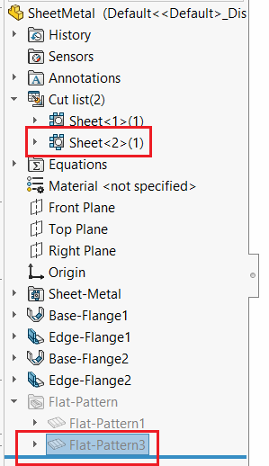

{ width=200 }

This VBA macro demonstrates how to find the corresponding cut-list folder feature from the selected sheet metal flat pattern feature.

This macro supports both flatten and unflatten state of sheet metal feature.

~~~ vb
Dim swApp As SldWorks.SldWorks
Dim swModel As SldWorks.ModelDoc2

Sub main()

    Set swApp = Application.SldWorks
    
    Set swModel = swApp.ActiveDoc
    
    Dim swFeat As SldWorks.Feature
    
    Set swFeat = swModel.SelectionManager.GetSelectedObject6(1, -1)
    
    If Not swFeat Is Nothing Then
    
        If swFeat.GetTypeName2 = "FlatPattern" Then
                    
            Dim swFlatPattern As SldWorks.FlatPatternFeatureData
            Set swFlatPattern = swFeat.GetDefinition
            
            Dim swFixedFace As SldWorks.Face2
            Set swFixedFace = swFlatPattern.FixedFace2
            
            Dim swBody As SldWorks.Body2
            Set swBody = swFixedFace.GetBody
            
            Dim swCutListFeat As SldWorks.Feature
            
            Set swCutListFeat = GetCutListFromBody(swModel, swBody)
            
            Debug.Print swCutListFeat.Name
            
        Else
            Err.Raise vbError, "", "Selected feature is not sheet metal flat pattern"
        End If
    
    Else
        Err.Raise vbError, "", "Select feature"
    End If
    
End Sub

Function GetCutListFromBody(model As SldWorks.ModelDoc2, body As SldWorks.Body2) As SldWorks.Feature
    
    Dim swFeat As SldWorks.Feature
    Dim swBodyFolder As SldWorks.BodyFolder
    
    Set swFeat = model.FirstFeature
    
    Do While Not swFeat Is Nothing
        
        If swFeat.GetTypeName2 = "CutListFolder" Then
            
            Set swBodyFolder = swFeat.GetSpecificFeature2
            
            Dim vBodies As Variant
            
            vBodies = swBodyFolder.GetBodies
            
            Dim i As Integer
            
            If Not IsEmpty(vBodies) Then
                For i = 0 To UBound(vBodies)
                    
                    Dim swCutListBody As SldWorks.Body2
                    Set swCutListBody = vBodies(i)
                    
                    If swApp.IsSame(swCutListBody, body) = swObjectEquality.swObjectSame Then
                        Set GetCutListFromBody = swFeat
                        Exit Function
                    End If
                    
                Next
            End If
            
        End If
        
        Set swFeat = swFeat.GetNextFeature
        
    Loop

End Function
~~~

