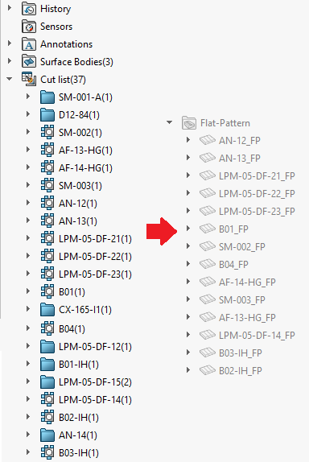

{ width=250 }

This VBA macro renames all sheet metal flat pattern features with the name of the corresponding cut-list item.

This macro can be used in conjunction with [Rename Cut List Features](/docs/codestack/solidworks-api/document/cut-lists/rename-cut-list-items/) macro.

In order to avoid the name conflict, suffix is added to flat pattern features as below.

~~~ vb jagged-bottom
Const SUFFIX As String = "_FP"
~~~

Macro will automatically add the index to the flat pattern name which shares the same cut list.

Watch [video demonstration](https://youtu.be/jsjN8zNRTuc?t=276)

~~~ vb
Const SUFFIX As String = "_FP"

Dim swApp As SldWorks.SldWorks

Sub main()

    Set swApp = Application.SldWorks
    
    Dim swModel As SldWorks.ModelDoc2
    
    Set swModel = swApp.ActiveDoc
    
try_:
    On Error GoTo catch_
    
    Dim vCutListFeats As Variant
    vCutListFeats = GetCutListFeatures(swModel)
    
    If Not IsEmpty(vCutListFeats) Then
        
        Dim vFlatPatternFeats As Variant
        vFlatPatternFeats = GetFlatPatternFeatures(swModel)
        
        If Not IsEmpty(vFlatPatternFeats) Then
            RenameFlatPatternsWithCutList swModel, vFlatPatternFeats, vCutListFeats
        Else
            Err.Raise vbError, "", "No flat pattern features found"
        End If
        
    Else
        Err.Raise vbError, "", "No cut-list items found"
    End If
    
    GoTo finally_
catch_:
    swApp.SendMsgToUser2 Err.Description, swMessageBoxIcon_e.swMbStop, swMessageBoxBtn_e.swMbOk
finally_:

End Sub

Function GetCutListFeatures(model As SldWorks.ModelDoc2) As Variant
    GetCutListFeatures = GetFeaturesByType(model, "CutListFolder")
End Function

Function GetFlatPatternFeatures(model As SldWorks.ModelDoc2) As Variant
    GetFlatPatternFeatures = GetFeaturesByType(model, "FlatPattern")
End Function

Function RenameFlatPatternsWithCutList(model As SldWorks.ModelDoc2, vFlatPatternFeats As Variant, vCutListFeats As Variant)
    
    Dim i As Integer
    
    For i = 0 To UBound(vFlatPatternFeats)
        
        Dim swFlatPatternFeat As SldWorks.Feature
        Dim swFlatPattern As SldWorks.FlatPatternFeatureData
        
        Set swFlatPatternFeat = vFlatPatternFeats(i)
        
        Set swFlatPattern = swFlatPatternFeat.GetDefinition
        
        Dim swFixedFace As SldWorks.Face2
        Set swFixedFace = swFlatPattern.FixedFace2
        
        Dim swBody As SldWorks.Body2
        Set swBody = swFixedFace.GetBody
        
        Dim swCutListFeat As SldWorks.Feature
        Set swCutListFeat = FindCutListFeature(vCutListFeats, swBody)
        
        If Not swCutListFeat Is Nothing Then
            If swFlatPatternFeat.Name <> swCutListFeat.Name Then
                
                Dim featName As String
                
                featName = swCutListFeat.Name + SUFFIX
                Dim index As Integer
                index = 0
                
                While model.FeatureManager.IsNameUsed(swNameType_e.swFeatureName, featName)
                    index = index + 1
                    featName = swCutListFeat.Name + CStr(index) + SUFFIX
                Wend
                
                swFlatPatternFeat.Name = featName
            End If
        End If
        
    Next
    
End Function

Function FindCutListFeature(vCutListFeats As Variant, body As SldWorks.Body2) As SldWorks.Feature
    
    Dim i As Integer
    
    For i = 0 To UBound(vCutListFeats)
        
        Dim swCutListFeat As SldWorks.Feature
        Set swCutListFeat = vCutListFeats(i)
        
        Dim swBodyFolder As SldWorks.BodyFolder
        Set swBodyFolder = swCutListFeat.GetSpecificFeature2
            
        Dim vBodies As Variant
        
        vBodies = swBodyFolder.GetBodies
        
        If ContainsBody(vBodies, body) Then
            Set FindCutListFeature = swCutListFeat
        End If
            
    Next
    
End Function

Function ContainsBody(vBodies As Variant, body As SldWorks.Body2) As Boolean
    
    If Not IsEmpty(vBodies) Then
    
        Dim i As Integer
        
        For i = 0 To UBound(vBodies)
            
            Dim swCutListBody As SldWorks.Body2
            Set swCutListBody = vBodies(i)
            
            If swApp.IsSame(swCutListBody, body) = swObjectEquality.swObjectSame Then
                ContainsBody = True
                Exit Function
            End If
        Next
        
    End If
    
    ContainsBody = False
    
End Function

Function GetFeaturesByType(model As SldWorks.ModelDoc2, typeName As String) As Variant
    
    Dim swFeats() As SldWorks.Feature
    
    Dim swFeat As SldWorks.Feature
    
    Set swFeat = model.FirstFeature
    
    Do While Not swFeat Is Nothing
        
        ProcessFeature swFeat, swFeats, typeName

        Set swFeat = swFeat.GetNextFeature
        
    Loop
    
    If (Not swFeats) = -1 Then
        GetFeaturesByType = Empty
    Else
        GetFeaturesByType = swFeats
    End If
    
End Function

Sub ProcessFeature(thisFeat As SldWorks.Feature, featsArr() As SldWorks.Feature, typeName As String)
    
    If thisFeat.GetTypeName2() = typeName Then
    
        If (Not featsArr) = -1 Then
            ReDim featsArr(0)
            Set featsArr(0) = thisFeat
        Else
            Dim i As Integer
            
            For i = 0 To UBound(featsArr)
                If swApp.IsSame(featsArr(i), thisFeat) = swObjectEquality.swObjectSame Then
                    Exit Sub
                End If
            Next
            
            ReDim Preserve featsArr(UBound(featsArr) + 1)
            Set featsArr(UBound(featsArr)) = thisFeat
        End If
    
    End If
    
    Dim swSubFeat As SldWorks.Feature
    Set swSubFeat = thisFeat.GetFirstSubFeature
        
    While Not swSubFeat Is Nothing
        ProcessFeature swSubFeat, featsArr, typeName
        Set swSubFeat = swSubFeat.GetNextSubFeature
    Wend
        
End Sub
~~~

