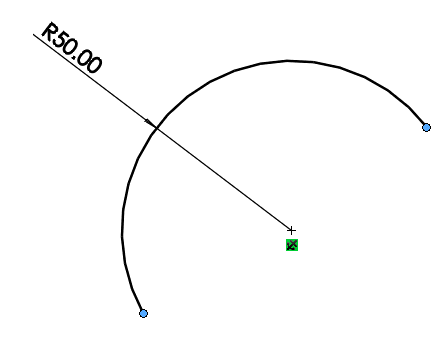

{ width=350 }

This VBA macro example demonstrates how to apply the merge sketch relation between start and end points of the selected sketch arc to convert it to sketch circle. This is the analogue of dragging the point manually until it is merged or adding the merge sketch relation in relation manager.

~~~ vb
Dim swApp As SldWorks.SldWorks

Sub main()

    Set swApp = Application.SldWorks
    
    Dim swModel As SldWorks.ModelDoc2
    
    Set swModel = swApp.ActiveDoc
    
    If Not swModel Is Nothing Then
        
        Dim swSkArc As SldWorks.SketchArc
        Set swSkArc = swModel.SelectionManager.GetSelectedObject6(1, -1)
        
        If Not swSkArc Is Nothing Then
            Dim swEndPts(1) As SldWorks.SketchPoint
            Set swEndPts(0) = swSkArc.GetStartPoint2()
            Set swEndPts(1) = swSkArc.GetEndPoint2()
            swModel.SketchManager.ActiveSketch.RelationManager.AddRelation swEndPts, swConstraintType_e.swConstraintType_MERGEPOINTS
        Else
            MsgBox "Please select sketch arc"
        End If
        
    Else
        MsgBox "Please open the model"
    End If
    
End Sub
~~~

