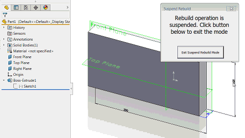

This macro us using SOLIDWORKS API to suspend rebuild operation for parts, assemblies and drawings to enhance the performance.

When macro started form is displayed. While form is open all rebuild operations (regenerations) will be suspended.
For example dimension changes or mates will not resolve until **Exit Suspend Rebuild Mode** button is clicked.

[Download Macro](FreezeRebuild.swp)

**Main Module**

~~~ vb
Sub main()

    FreezeRebuildForm.Show vbModeless

End Sub
~~~

**User Form**

~~~ vb
Const CANCEL_REGEN As Long = 1

Dim swApp As SldWorks.SldWorks

Dim WithEvents swPart As SldWorks.PartDoc
Dim WithEvents swAssy As SldWorks.AssemblyDoc
Dim WithEvents swDraw As SldWorks.DrawingDoc

Private Sub btnExit_Click()
    End
End Sub

Private Sub UserForm_Initialize()
    
    Set swApp = Application.SldWorks
    
    Dim swModel As SldWorks.ModelDoc2
    
    Set swModel = swApp.ActiveDoc
    
    If Not swModel Is Nothing Then
        Select Case swModel.GetType()
            Case swDocumentTypes_e.swDocPART
                Set swPart = swModel
            Case swDocumentTypes_e.swDocASSEMBLY
                Set swAssy = swModel
            Case swDocumentTypes_e.swDocDRAWING
                Set swDraw = swModel
        End Select
            
    Else
        MsgBox "Please open the model"
        End
    End If
    
End Sub

Private Function swAssy_RegenNotify() As Long
    swAssy_RegenNotify = CANCEL_REGEN
End Function

Private Function swDraw_RegenNotify() As Long
    swDraw_RegenNotify = CANCEL_REGEN
End Function

Private Function swPart_RegenNotify() As Long
    swPart_RegenNotify = CANCEL_REGEN
End Function
~~~

