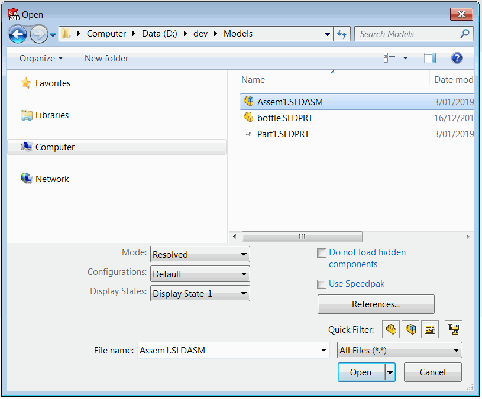
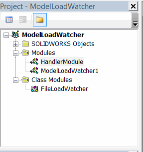



This VBA macro handles document load events using SOLIDWORKS API and runs a custom code for each of the documents.

Macro operates in the background and needs to be run once a session to start monitoring.

Both visible (opened in its own window) and invisible (opened as assembly or drawing component) documents are handled.

{ width=350 }

## Configuration

* Create new macro
* Copy the code into corresponding modules of the macro. The VBA macro tree should look similar to the image below:

{ width=250 }

* Place your code into the *main* sub of the *HandlerModule* module. The pointer to [IModelDoc2](https://help.solidworks.com/2012/english/api/sldworksapi/SolidWorks.Interop.sldworks~SolidWorks.Interop.sldworks.IModelDoc2.html) document is passed as the parameter. Use this pointer instead of [ISldWorks::ActiveDoc](https://help.solidworks.com/2012/english/api/sldworksapi/solidworks.interop.sldworks~solidworks.interop.sldworks.isldworks~activedoc.html) to properly handle invisible documents.

~~~ vb
Sub main(model As SldWorks.ModelDoc2)
    'TODO: add your routine here
End Sub
~~~

* It might be useful to automatically run this macro with each session of SOLIDWORKS. Follow the [Run SOLIDWORKS macro automatically on application start](/docs/codestack/solidworks-api/getting-started/macros/run-macro-on-solidworks-start/) link for more information.

## Macro Module

Entry point which starts events monitoring

~~~ vb
Dim swFileLoadWatcher As FileLoadWatcher

Sub main()
    
    Set swFileLoadWatcher = New FileLoadWatcher
    
    While True
        DoEvents
    Wend
    
End Sub
~~~

## FileLoadWatcher Class Module

Class which handles SOLIDWORKS API notifications

~~~ vb
Dim WithEvents swApp As SldWorks.SldWorks

Private Sub Class_Initialize()
    Set swApp = Application.SldWorks
End Sub

Private Function swApp_DocumentLoadNotify2(ByVal docTitle As String, ByVal docPath As String) As Long
    
    Dim swModel As SldWorks.ModelDoc2
        
    If docPath <> "" Then
        Set swModel = swApp.GetOpenDocumentByName(docPath)
    Else
        Dim vDocs As Variant
        vDocs = swApp.GetDocuments
        
        Dim i As Integer
        
        For i = 0 To UBound(vDocs)
            Dim swDoc As SldWorks.ModelDoc2
            Set swDoc = vDocs(i)
            If swDoc.GetTitle() = docTitle Then
                Set swModel = swDoc
                Exit For
            End If
        Next
    End If
    
    OnModelLoad swModel
    
End Function

Sub OnModelLoad(model As SldWorks.ModelDoc2)
    HandlerModule.main model
End Sub
~~~

## HandlerModule Module

Custom VBA code which needs to be run for each opened document

~~~ vb
Sub main(model As SldWorks.ModelDoc2)
    'TODO:implement the procedure
    MsgBox "File Loaded: " & model.GetTitle()
End Sub
~~~

