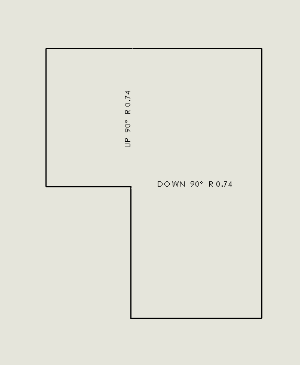
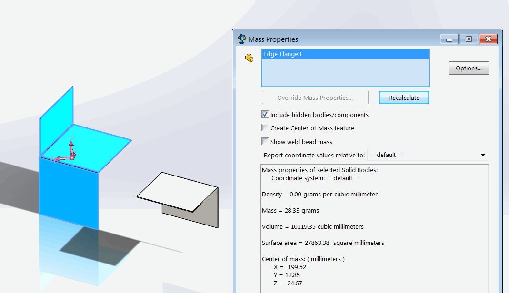

It is possible to find the mass of the specific body by using the [IBody2::GetMassProperties](https://help.solidworks.com/2016/english/api/sldworksapi/solidworks.interop.sldworks~solidworks.interop.sldworks.ibody2~getmassproperties.html) SOLIDWORKS API method, but it is required to specify the density in order to calculate mass which might not be easy to extract.

If it is required to find the mass of bodies in the drawing view, this method might not be applicable. The density is not available for the body if the material was applied to the body itself. It is possible to extract density form the material properties, but it will be required to [parse material XML file](http://localhost:4000/solidworks-api/document/materials/copy-custom-property/) to find the value of the node.

{ width=250 }

Alternative option is to use [IMassProperty](https://help.solidworks.com/2017/english/api/sldworksapi/SOLIDWORKS.Interop.sldworks~SOLIDWORKS.Interop.sldworks.IMassProperty.html) interface.

{ width=450 }

However pointers to bodies extracted at the drawing context are not applicable for the calculation. The mass value will always be equal to 0 in this case. The body pointers need to be converted to the part context in the corresponding configuration.

Below code of C# VSTA macro retrieves the mass of all bodies in the selected drawing view using SOLIDWORKS API and displays the result in the message box.

~~~ cs
using System;
using System.Collections.Generic;
using System.Linq;
using SolidWorks.Interop.sldworks;
using SolidWorks.Interop.swconst;

namespace GetMassPropertyFromBody
{
    public partial class SolidWorksMacro
    {
        public void Main()
        {
            try
            {
                var model = swApp.IActiveDoc2;

                if (model is IDrawingDoc)
                {
                    var view = model.ISelectionManager.GetSelectedObject6(1, -1) as IView;
                    
                    if (view != null)
                    {
                        var mass = GetViewBodiesMass(view);

                        swApp.SendMsgToUser2(string.Format("Mass of body(ies) in selected view is {0:0.000} kg", mass),
                                    (int)swMessageBoxIcon_e.swMbInformation,
                                    (int)swMessageBoxBtn_e.swMbOk);
                    }
                    else
                    {
                        throw new NullReferenceException("Please select drawing view");
                    }
                }
                else
                {
                    throw new InvalidCastException("Please open drawing document");
                }
            }
            catch(Exception ex)
            {
                swApp.SendMsgToUser2(ex.Message,
                    (int)swMessageBoxIcon_e.swMbStop,
                    (int)swMessageBoxBtn_e.swMbOk);
            }

            return;
        }

        private double GetViewBodiesMass(IView view)
        {
            if (view.ReferencedDocument is IPartDoc)
            {
                var bodies = GetViewBodies(view);

                var refDoc = view.ReferencedDocument;
                var activeConf = refDoc.ConfigurationManager.ActiveConfiguration.Name;
                refDoc.ShowConfiguration2(view.ReferencedConfiguration);

                try
                {
                    var partContextBodies = ConvertBodiesContext(bodies, view.ReferencedDocument as IPartDoc).ToArray();

                    var massPrp = refDoc.Extension.CreateMassProperty();

                    if (massPrp.AddBodies(partContextBodies))
                    {
                        return massPrp.Mass;
                    }
                    else
                    {
                        throw new InvalidOperationException(
                            "Failed to add bodies to the mass properties scope");
                    }
                }
                catch
                {
                    throw;
                }
                finally
                {
                    refDoc.ShowConfiguration2(activeConf);
                }
            }
            else
            {
                throw new InvalidCastException("Only part views are supported");
            }
        }

        private IBody2[] GetViewBodies(IView view)
        {
            IEnumerable<IBody2> bodies = null;

            if (view.IsFlatPatternView())
            {
                var visComps = view.GetVisibleComponents() as object[];

                if (visComps == null || !visComps.Any())
                {
                    throw new NullReferenceException("No components in this view");
                }

                var faces = view.GetVisibleEntities2(visComps.First() as Component2,
                    (int)swViewEntityType_e.swViewEntityType_Face) as object[];

                bodies = new IBody2[] 
                {
                    (faces.FirstOrDefault() as IFace2).IGetBody()
                };
            }
            else
            {
                bodies = (view.Bodies as object[]).Cast<IBody2>().ToArray();
            }

            return bodies.ToArray();
        }

        private IEnumerable<IBody2> ConvertBodiesContext(IEnumerable<IBody2> inputBodies, IPartDoc context)
        {
            var partBodies = (context.GetBodies2((int)swBodyType_e.swAllBodies, false) as object[]).Cast<IBody2>();

            return inputBodies.Select(b =>
            {
                var corrBody = partBodies.FirstOrDefault(
                    pb => pb.Name.Equals(b.Name, StringComparison.CurrentCultureIgnoreCase));

                if (corrBody == null)
                {
                    throw new NullReferenceException(string.Format("Failed to find the corresponding body of {0}", b.Name));
                }

                return corrBody;
            }).ToArray();
        }

        public SldWorks swApp;
    }
}

~~~

