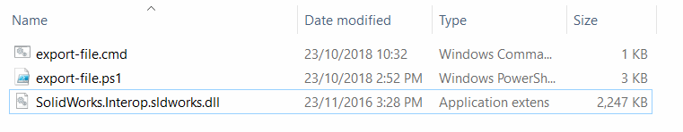
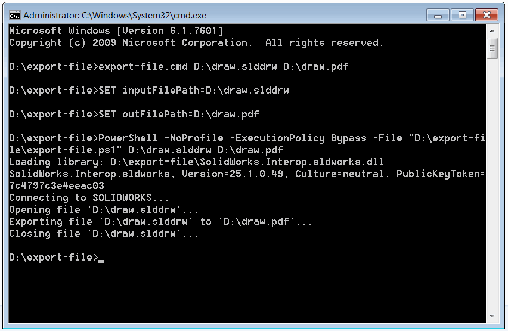

This PowerShell script allows exporting the SOLIDWORKS file into the specified foreign format from the command line using SOLIDWORKS API

## Configuration and usage instructions

* Create two files and paste the code from the below snippets

### export-file.ps1
~~~ ps1
$inputFilePath=$args[0]
$outFilePath=$args[1]

$ScriptDir = Split-Path $script:MyInvocation.MyCommand.Path

$Assem = ( 
    $ScriptDir + "\SolidWorks.Interop.sldworks.dll"
    ) 
    
$Source = @"
using SolidWorks.Interop.sldworks;
using System;

 namespace CodeStack
 {
    public static class Exporter
    {
        #region Libraries
        
        static Exporter()
        {
            AppDomain.CurrentDomain.AssemblyResolve += OnAssemblyResolve;
        }

        public static void LoadLibrary(params object[] libs)
        {
            foreach(string lib in libs)
            {
                Console.WriteLine(string.Format("Loading library: {0}", lib));
                System.Reflection.Assembly assm = System.Reflection.Assembly.LoadFrom(lib);
                Console.WriteLine(assm.GetName().ToString());
            }
        }
        
        private static System.Reflection.Assembly OnAssemblyResolve(object sender, ResolveEventArgs args)
        {
            foreach (System.Reflection.Assembly assm in AppDomain.CurrentDomain.GetAssemblies())
            {
               if(assm.GetName().ToString() == args.Name)
               {
                   return assm;
               }
            };
            
            return null;
        }
        
        #endregion
        
        public static void ExportFile(string filePath, string outFilePath)
        {
            Console.WriteLine("Connecting to SOLIDWORKS...");

            ISldWorks app = Activator.CreateInstance(Type.GetTypeFromProgID("SldWorks.Application")) as ISldWorks;

            if (app != null)
            {
                Console.WriteLine(string.Format("Opening file '{0}'...", filePath));

                IDocumentSpecification docSpec = app.GetOpenDocSpec(filePath) as IDocumentSpecification;
                docSpec.ReadOnly = true;
                docSpec.Silent = true;
                IModelDoc2 model = app.OpenDoc7(docSpec);

                if (model != null)
                {
                    const int swSaveAsCurrentVersion = 0;
                    const int swSaveAsOptions_Silent = 1;
                    int err = -1;
                    int warn = -1;

                    Console.WriteLine(string.Format("Exporting file '{0}' to '{1}'...", filePath, outFilePath));

                    if (!model.Extension.SaveAs(outFilePath, swSaveAsCurrentVersion,
                        swSaveAsOptions_Silent, null, ref err, ref warn))
                    {
                        Console.WriteLine(string.Format("Failed to export '{0}' to '{1}'. Error code: {2}", filePath, outFilePath, err));
                    }

                    Console.WriteLine(string.Format("Closing file '{0}'...", filePath));

                    app.CloseDoc(model.GetTitle());
                }
                else
                {
                    Console.WriteLine(string.Format("Failed to open document: '{0}'. Error code: {1}",
                        filePath, docSpec.Error));
                }
            }
            else
            {
                Console.WriteLine("Failed to connect to SOLIDWORKS instance");
            }
        }
    }
}
"@
 
Add-Type -TypeDefinition $Source -ReferencedAssemblies $Assem -Language CSharp
 
[CodeStack.Exporter]::LoadLibrary($Assem)
[CodeStack.Exporter]::ExportFile($inputFilePath, $outFilePath)
~~~

### export-file.cmd
~~~ cmd
SET inputFilePath=%1
SET outFilePath=%2

PowerShell -NoProfile -ExecutionPolicy Bypass -File "%~dp0export-file.ps1" %inputFilePath% %outFilePath%
~~~

* Copy the *SolidWorks.Interop.sldworks.dll* into the folder where the above scripts are created. PowerShell script is based on .NET Framework 2.0 so the SOLIDWORKS interop must target this framework. The dll can be found at: **SOLIDWORKS Installation Folder**\api\redist\CLR2\SolidWorks.Interop.sldworks.dll

{ width=450 }

Alternatively full path to SOLIDWORKS interop can be specified as shown below. In this case it is not required to copy this dll into the folder with script files.

~~~ ps1
$Assem = ( 
   "Full path to SolidWorks.Interop.sldworks.dll"
    ) 
~~~

* Start the command line and execute the following command

~~~ bat
[Full Path To export-file.cmd] [Full Path To Input SOLIDWORKS file] [Full Path to output file and extension]
~~~

As the result the file is exported and the process log is displayed directly in the console:

{ width=450 }