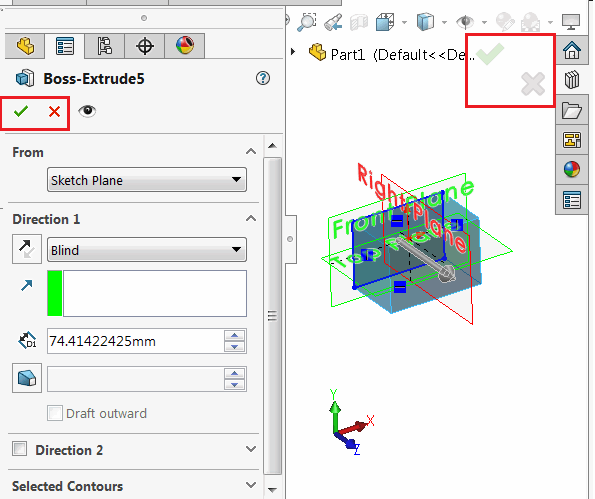

{ width=250 }

[ISldWorks::RunCommand](https://help.solidworks.com/2017/english/api/sldworksapi/solidworks.interop.sldworks~solidworks.interop.sldworks.isldworks~runcommand.html) SOLIDWORKS API method allows running any command. Usually it is used to open property manager page.

However this command runs asynchronously, which means that the control is returned to the executor once command started (e.g. Property Manager Page is opened). In some cases it is required to execute the code once this command closes (e.g. Property Manager Page is closed).

This example demonstrates how to run command synchronously using SOLIDWORKS API, so the control is returned to the executor once the command finishes (not started).

## Run Instructions

* Open/create part document
* Create any sketch with rectangle (or another shape)
* Select the sketch
* Run the macro. As the result 'Boss-Extrude' property page is displayed
* Modify options and click green tick (OK) or cross (Cancel)
* Macro displays the message when property page is closed and the result (OK or Cancel) is displayed

### VBA Macro

* Create a class module and name it *CommandRunManager*. Copy the code below:

~~~ vb
Dim WithEvents swApp As SldWorks.SldWorks

Dim CurrentCommandId As Long
Dim IsCommandCompleted As Boolean
Dim CloseReason As Long

Private Sub Class_Initialize()
    
    Set swApp = Application.SldWorks
    
End Sub

Function RunCommand(cmd As swCommands_e) As Boolean
    
    IsCommandCompleted = False
    CurrentCommandId = cmd
    swApp.RunCommand cmd, ""
    
    While Not IsCommandCompleted
        DoEvents
    Wend
    
    RunCommand = CloseReason = swCommands_e.swCommands_PmOK
    
End Function

Private Function swApp_CommandCloseNotify(ByVal Command As Long, ByVal reason As Long) As Long
    
    If CurrentCommandId <> -1 Then
    
        If Command = CurrentCommandId Then
            CurrentCommandId = -1
            IsCommandCompleted = True
            CloseReason = reason
        End If
    
    End If
    
End Function
~~~

* Copy the following code into the main module (where the *main* function is)
* Modify the *RunCommand* to pass any other command id if needed. Method returns True if the command is closed with OK button, False is returned when command is cancelled.

~~~ vb
Sub main()
    
    Dim cmdsMgr As CommandRunManager
    Set cmdsMgr = New CommandRunManager
    
    If cmdsMgr.RunCommand(swCommands_Extrude) Then
        MsgBox "Command Completed"
    Else
        MsgBox "Command Cancelled"
    End If
    
End Sub

~~~

### C&#35;

It is not recommended to use DoEvents function to emulate async operation in .NET languages (C# or VB.NET). It is better to use [Asynchronous programming with async and await](https://docs.microsoft.com/en-us/dotnet/csharp/programming-guide/concepts/async/)

Example below demonstrates an implementation of async version of RunCommand which can be awaited without locking of the UI thread:

**SldWorksExtension.cs**

~~~ cs
using SolidWorks.Interop.swcommands;
using System.Threading.Tasks;

namespace SolidWorks.Interop.sldworks
{
    public static class SldWorksExtension
    {
        public static Task<bool> RunCommandAsync(this ISldWorks app, swCommands_e cmd)
        {
            return Task.Run(() => 
            {
                if (app.RunCommand((int)cmd, ""))
                {
                    var isCmdCompleted = false;
                    var res = false;

                    (app as SldWorks).CommandCloseNotify += (int Command, int reason) =>
                    {
                        res = reason == (int)swCommands_e.swCommands_PmOK;
                        isCmdCompleted = true;
                        return 0;
                    };

                    while (!isCmdCompleted)
                    {
                        Task.Delay(10);
                    }

                    return res;
                }

                return false;
            });
        }
    }
}

~~~

The extension can be called from any async method. For example

~~~ cs
using SolidWorks.Interop.sldworks;
using SolidWorks.Interop.swcommands;
using System;
using System.Threading.Tasks;

namespace RunCommandAsyncConsole
{
    class Program
    {
        static void Main(string[] args)
        {
            AsyncMain().Wait();
            return;
        }

        static async Task AsyncMain()
        {
            var app = Activator.CreateInstance(Type.GetTypeFromProgID("SldWorks.Application")) as ISldWorks;
            app.Visible = true;

            var res = await app.RunCommandAsync(swCommands_e.swCommands_Extrude);

            if (res)
            {
                app.SendMsgToUser("Command Completed");
            }
            else
            {
                app.SendMsgToUser("Command Canceled");
            }
        }
    }
}

~~~

