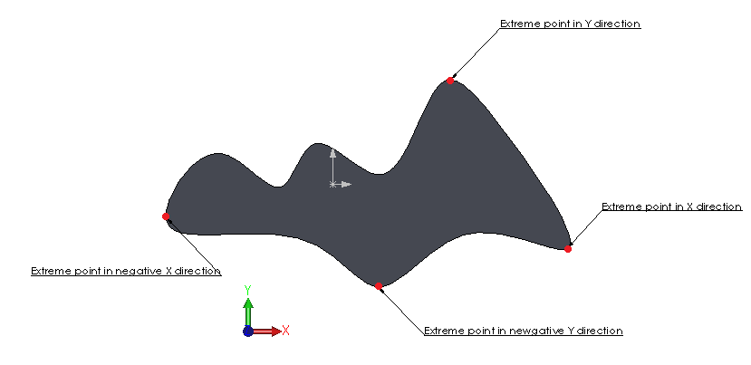
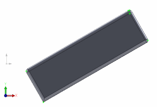

Extreme points are usually used to find the most remote points in the specified directions. The points can be found using the [IBody2::GetExtremePoint]( https://help.solidworks.com/2012/english/api/sldworksapi/solidworks.interop.sldworks~solidworks.interop.sldworks.ibody2~getextremepoint.html) SOLIDWORKS API.

This function expects direction vector as an input and returns the X, Y, Z coordinate of the extreme point in this direction as out parameters.

It is not required to specify the point on the vector when defining the direction.
This function is usually used to find the bounding dimension of the body, especially when the body orientation is not aligned with global XYZ coordinate as it is not required to reorient the body to find its best fit bounding box.

Unlike bounding box returned via [IBody2::GetBodyBox]( https://help.solidworks.com/2012/english/api/sldworksapi/solidworks.interop.sldworks~solidworks.interop.sldworks.ibody2~getbodybox.html) or any other bounding box function extreme points are precise which means that this data can be used for comparison and calculation purposes.

Image below demonstrates typical extreme points in multiple directions of the model.

{ width=400 }

The following code example will find the extreme points of the selected body in XYZ directions and create a sketch points.

{ width=320 height=217 }

~~~ vb
Dim swApp As SldWorks.SldWorks
Dim swModel As SldWorks.ModelDoc2
Dim swSelMgr As SldWorks.SelectionMgr

Sub main()

    Set swApp = Application.SldWorks
    
    Set swModel = swApp.ActiveDoc
    
    If Not swModel Is Nothing Then
    
        Set swSelMgr = swModel.SelectionManager
        
        If swSelMgr.GetSelectedObjectType3(1, -1) = swSelectType_e.swSelSOLIDBODIES Then
        
            Dim swBody As SldWorks.Body2
        
            Set swBody = swSelMgr.GetSelectedObject6(1, -1)
        
            swModel.ClearSelection2 True
            
            swModel.SketchManager.Insert3DSketch True
            swModel.SketchManager.AddToDB = True
            
            Dim vDirs(5) As Variant
            vDirs(0) = Array(1, 0, 0)
            vDirs(1) = Array(0, 1, 0)
            vDirs(2) = Array(0, 0, 1)
            vDirs(3) = Array(-1, 0, 0)
            vDirs(4) = Array(0, -1, 0)
            vDirs(5) = Array(0, 0, -1)
            
            Dim i As Integer
            
            For i = 0 To UBound(vDirs)
                
                Dim x As Double
                Dim y As Double
                Dim z As Double
            
                swBody.GetExtremePoint vDirs(i)(0), vDirs(i)(1), vDirs(i)(2), x, y, z
                swModel.SketchManager.CreatePoint x, y, z
                
            Next
                
            swModel.SketchManager.AddToDB = False
            swModel.SketchManager.Insert3DSketch True
        
        Else
            
            MsgBox "Please select solid body"
            
        End If
        
    Else
        
        MsgBox "Please open part or assembly"
        
    End If
    
End Sub

~~~

