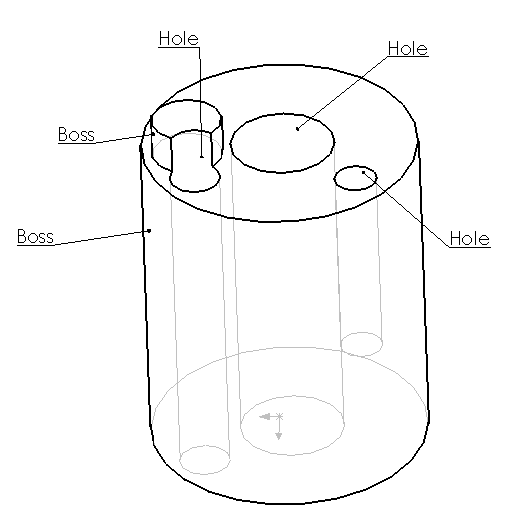

{ width=250 }

This example demonstrates how to identify if the selected cylindrical face is internal (i.e. hole) or external (i.e. boss) using SOLIDWORKS API.

Select cylindrical face and run the macro. Message box is displayed with the type of the selected face. Macro will work with any face (it is not required for faces to have planar adjacent faces).

### Algorithm

This macro identifies if the face is hole or boss based on the direction of the normal of the face. The normals for the holes are always directed towards the cylinder axis, while the normals for the bosses always directed outwards of the cylinder axis.

Macro finds random point on the face (in this example this is a middle between U and V parameters of the face) and normal at this point. After, the vector between this point and the cylinder origin is calculated. If the angle between this vector and normal is less than 90 degrees (PI / 2) than the normal is directed towards the cylinder axis which means that the face is a hole, otherwise (if angle is greater than 90 degrees (PI / 2)) the face is external (boss).

Please see image below:

{ width=400 }

~~~vba
Const PI As Double = 3.14159265359

Dim swApp As SldWorks.SldWorks
Dim swMathUtils As SldWorks.MathUtility

Sub main()

    Set swApp = Application.SldWorks
        
    Set swMathUtils = swApp.GetMathUtility
        
    Dim swModel As SldWorks.ModelDoc2
    
    Set swModel = swApp.ActiveDoc
    
    If Not swModel Is Nothing Then
    
        Dim swSelMgr As SldWorks.SelectionMgr
        
        Set swSelMgr = swModel.SelectionManager
        
        Set swSelMgr = swModel.SelectionManager

        Dim swFace As SldWorks.Face2
        Set swFace = swSelMgr.GetSelectedObject6(1, -1)
        
        If Not swFace Is Nothing Then
            
            If IsHole(swFace) Then
                MsgBox "Selected face is hole"
            Else
                MsgBox "Selected face is boss"
            End If
            
        Else
            MsgBox "Please select face"
        End If
        
    Else
        MsgBox "Please open the model"
    End If
    
End Sub

Function IsHole(face As SldWorks.Face2) As Boolean
    
    Dim swSurf As SldWorks.Surface
    Set swSurf = face.GetSurface
    
    If swSurf.IsCylinder() Then
    
        Dim uvBounds As Variant
        uvBounds = face.GetUVBounds
        
        Dim vEvalData As Variant
        vEvalData = swSurf.Evaluate((uvBounds(1) - uvBounds(0)) / 2, (uvBounds(3) - uvBounds(2)) / 2, 1, 1)
        
        Dim dPt(2) As Double
        dPt(0) = vEvalData(0): dPt(1) = vEvalData(1): dPt(2) = vEvalData(2)
        
        Dim sense As Integer
        If False = face.FaceInSurfaceSense() Then
            sense = -1
        Else
            sense = 1
        End If
        
        Dim dNormVec(2) As Double
        dNormVec(0) = vEvalData(UBound(vEvalData) - 2) * sense: dNormVec(1) = vEvalData(UBound(vEvalData) - 1) * sense: dNormVec(2) = vEvalData(UBound(vEvalData)) * sense
        
        Dim vCylParams As Variant
        vCylParams = swSurf.CylinderParams
        Dim dOrig(2) As Double
        dOrig(0) = vCylParams(0): dOrig(1) = vCylParams(1): dOrig(2) = vCylParams(2)
        
        Dim dDirVec(2) As Double
        dDirVec(0) = dPt(0) - dOrig(0): dDirVec(1) = dPt(1) - dOrig(1): dDirVec(2) = dPt(2) - dOrig(2)
        Dim swDirVec As MathVector
        
        Set swDirVec = swMathUtils.CreateVector(dDirVec)
        
        Dim swNormVec As SldWorks.MathVector
        Set swNormVec = swMathUtils.CreateVector(dNormVec)
        
        IsHole = GetAngle(swDirVec, swNormVec) < PI / 2
        
    Else
        Err.Raise vbError, , "Selected face is not cylindrical"
    End If
    
End Function

Function GetAngle(vec1 As MathVector, vec2 As MathVector) As Double
    
    'cos a= a*b/(|a|*|b|)
    GetAngle = ACos(vec1.Dot(vec2) / (vec1.GetLength() * vec2.GetLength()))
    
End Function

Function ACos(val As Double) As Double
    
    If val = 1 Then
        ACos = 0
    ElseIf val = -1 Then
        ACos = 4 * Atn(1)
    Else
        ACos = Atn(-val / Sqr(-val * val + 1)) + 2 * Atn(1)
    End If
    
End Function
~~~

~~~cs
using SolidWorks.Interop.sldworks;
using SolidWorks.Interop.swconst;
using System.Runtime.InteropServices;
using System;

namespace HoleOrBoss.csproj
{
    public partial class SolidWorksMacro
    {
        public void Main()
        {
            IModelDoc2 doc = swApp.IActiveDoc2;

            if (doc != null)
            {
                IFace2 face = doc.ISelectionManager.GetSelectedObject6(1, -1) as IFace2;

                if (face != null)
                {
                    if (IsHole(face))
                    {
                        swApp.SendMsgToUser("Selected face is hole");
                    }
                    else
                    {
                        swApp.SendMsgToUser("Selected face is boss");
                    }
                }
                else
                {
                    throw new Exception("Face is not selected");
                }
            }
            else
            {
                throw new Exception("No document opened");
            }
        }

        private bool IsHole(IFace2 face)
        {
            ISurface surf = face.IGetSurface();

            if (surf.IsCylinder())
            {
                double[] uvBounds = face.GetUVBounds() as double[];

                double[] evalData = surf.Evaluate((uvBounds[1] - uvBounds[0]) / 2, (uvBounds[3] - uvBounds[2]) / 2, 1, 1) as double[];

                double[] pt = new double[] { evalData[0], evalData[1], evalData[2] };

                int sense = face.FaceInSurfaceSense() ? 1 : -1;

                double[] norm = new double[] { evalData[evalData.Length - 3] * sense, evalData[evalData.Length - 2] * sense, evalData[evalData.Length - 1] * sense };

                double[] cylParams = surf.CylinderParams as double[];

                double[] orig = new double[] { cylParams[0], cylParams[1], cylParams[2] };

                double[] dir = new double[] { pt[0] - orig[0], pt[1] - orig[1], pt[2] - orig[2] };

                IMathUtility mathUtils = swApp.IGetMathUtility();

                IMathVector dirVec = mathUtils.CreateVector(dir) as IMathVector;
                IMathVector normVec = mathUtils.CreateVector(norm) as IMathVector;

                return GetAngle(dirVec, normVec) < Math.PI / 2;
            }
            else
            {
                throw new NotSupportedException("Only cylindrical face is supported");
            }
        }

        private double GetAngle(IMathVector vec1, IMathVector vec2)
        {
            return Math.Acos(vec1.Dot(vec2) / (vec1.GetLength() * vec2.GetLength()));
        }

        public SldWorks swApp;
    }
}
~~~
