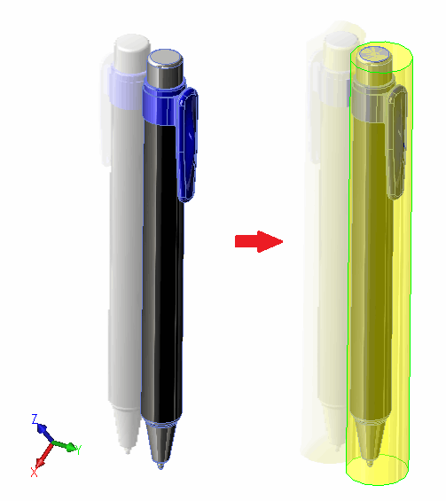

{ width=400 }

This example demonstrates how to find the bounding cylinder of the solid body using SOLIDWORKS API.

Macro requires user to select the input parameter to identify the direction of the cylinder. User either needs to select circular face (in this case the axis will be used as the reference) or plane feature (in this case the normal will be used as the reference).

As the result new feature is created representing the cylindrical boundary of the body.

> This macro will create best-fit bounding cylinder for the bodies at any orientation. It is no necessarily to have the body aligned with XYZ axes.

Macro can be downloaded at [this link](GetBoundingCylinderBin.zip). Unzip the macro and run it from Tools->Macro->Run menu command. Specify the correct filter as shown below:

{ width=500 }

### SolidWorksMacro.cs
This is an entry point of VSTA macro. In this module the input parameters are processed and the output body is created
~~~ cs
using SolidWorks.Interop.sldworks;
using SolidWorks.Interop.swconst;
using System.Runtime.InteropServices;
using System;
using CodeStack;

namespace CodeStack
{
    public partial class SolidWorksMacro
    {
        public void Main()
        {
            try
            {
                IModelDoc2 model = swApp.IActiveDoc2;

                if (model is IPartDoc)
                {
                    BodyHelper proc = new BodyHelper(swApp.IGetMathUtility());

                    object selObj = model.ISelectionManager.GetSelectedObject6(1, -1);

                    CylinderParams cylParams = proc.GetBoundingCylinder(
                        GetBodyToProcess(model as IPartDoc, selObj),
                        GetDirection(model, selObj));

                    CreateCylindricalBody(model as IPartDoc, cylParams);

                }
                else
                {
                    throw new NullReferenceException("No Part Document opened");
                }
            }
            catch (Exception ex)
            {
                swApp.SendMsgToUser2("Error: " + ex.Message, 
                    (int)swMessageBoxIcon_e.swMbStop, (int)swMessageBoxBtn_e.swMbOk);
            }
        }

        private void CreateCylindricalBody(IPartDoc part, CylinderParams cylParams)
        {
            IBody2 cylTempBody = swApp.IGetModeler().CreateBodyFromCyl(new double[]
                    {
                        cylParams.Origin[0], cylParams.Origin[1], cylParams.Origin[2],
                        cylParams.Direction[0], cylParams.Direction[1], cylParams.Direction[2],
                        cylParams.Radius, cylParams.Height
                    }) as IBody2;

            IFeature feat = part.CreateFeatureFromBody3(cylTempBody, false,
                (int)swCreateFeatureBodyOpts_e.swCreateFeatureBodySimplify) as IFeature;

            IBody2 body = feat.GetBody() as IBody2;

            body.MaterialPropertyValues2 = new double[] { 1, 1, 0, 0.5, 0.5, 0.5, 0.5, 0.5, 0.5 };

        }

        private IBody2 GetBodyToProcess(IPartDoc part, object inputObj)
        {
            if (inputObj is IFace2)
            {
                return (inputObj as IFace2).GetBody() as IBody2;
            }
            else
            {
                object[] solidBodies = part.GetBodies2((int)swBodyType_e.swSolidBody, true) as object[];

                if (solidBodies != null && solidBodies.Length == 1)
                {
                    return solidBodies[0] as IBody2;
                }
            }

            throw new NullReferenceException("Failed to find the input body. Either select cylindrical face or use single body part");
        }

        private double[] GetDirection(IModelDoc2 model, object inputObj)
        {
            if (inputObj is IFace2)
            {
                ISurface surf = (inputObj as IFace2).GetSurface() as ISurface;

                if (surf.IsCylinder())
                {
                    double[] cylParams = surf.CylinderParams as double[];

                    return new double[] { cylParams[3], cylParams[4], cylParams[5] };
                }
            }
            else if (inputObj is IFeature)
            {
                IRefPlane refPlane = (inputObj as IFeature).GetSpecificFeature2() as IRefPlane;

                if (refPlane != null)
                {
                    IMathUtility mathUtils = swApp.GetMathUtility() as IMathUtility;
                    IMathVector vec = mathUtils.CreateVector(new double[] { 0, 0, 1 }) as IMathVector;
                    vec = vec.MultiplyTransform(refPlane.Transform) as IMathVector;
                    return vec.ArrayData as double[];
                }
            }

            throw new NullReferenceException("Failed to find the direction. Please select cylindrical face or plane");
        }

        public SldWorks swApp;
    }
}

~~~

### CylinderParams.cs
This structure represents the details of the bounding cylinder
~~~ cs
using System;
using System.Collections.Generic;
using System.Text;

namespace CodeStack
{
    public class CylinderParams
    {
        public double Height;
        public double[] Origin;
        public double[] Direction;
        public double Radius;

        public CylinderParams(double height, double[] origin, double[] dir, double rad)
        {
            Height = height;
            Origin = origin;
            Radius = rad;
            Direction = dir;
        }
    }
}

~~~

### BodyHelper.cs
This utility class allows to find the orientation of the body and fit it into the cylinder
~~~ cs
using System;
using System.Collections.Generic;
using System.Text;
using SolidWorks.Interop.sldworks;
using SolidWorks.Interop.swconst;

namespace CodeStack
{
    public class BodyHelper
    {
        private IMathUtility m_MathUtils;
        private MathHelper m_MathHelper;

        public BodyHelper(IMathUtility mathUtils) 
        {
            m_MathUtils = mathUtils;
            m_MathHelper = new MathHelper(mathUtils);
        }

        public CylinderParams GetBoundingCylinder(IBody2 body, double[] dir)
        {
            double[] xAxis = new double[] { 1, 0, 0 };
            double[] yAxis = new double[] { 0, 1, 0 };
            double[] zAxis = new double[] { 0, 0, 1 };

            bool isAligned = m_MathHelper.ArrayEqual(dir, yAxis);
            IMathTransform alignTransform = null;

            if (!isAligned)
            {
                alignTransform = m_MathHelper.GetTransformBetweenVectorsAroundPoint(
                    dir, yAxis, new double[] { 0, 0, 0 });

                IBody2 bodyCopy = body.ICopy();

                bodyCopy.ApplyTransform(alignTransform as MathTransform);

                body = bodyCopy;
            }

            double[] rootPt;
            double[] endPt;
            GetExtremePoints(body, yAxis, out rootPt, out endPt);

            double height = Math.Abs(endPt[1] - rootPt[1]);

            dir = new double[] { 0, endPt[1] - rootPt[1], 0 };

            List<double[]> perPoints = GetPerimeterPoints(body, xAxis, zAxis);
            List<Point> points = new List<Point>();

            foreach (double[] pt in perPoints)
            {
                points.Add(new Point(pt[0], pt[2]));
            }

            Circle cir = SmallestEnclosingCircle.MakeCircle(points);

            double[] circCenter = new double[] { cir.c.x, rootPt[1], cir.c.y };

            if (!isAligned)
            {
                circCenter = m_MathHelper.TransformPoint(circCenter, alignTransform.IInverse());
                dir = m_MathHelper.TransformVector(dir, alignTransform.IInverse());
            }

            double radius = cir.r;

            return new CylinderParams(height, circCenter, dir, radius);
        }

        private List<double[]> GetPerimeterPoints(IBody2 body, params double[][] directions) 
        {
            List<double[]> perPoints = new List<double[]>();
            double[] pt1;
            double[] pt2;

            foreach (double[] dir in directions)
            {
                GetExtremePoints(body, dir, out pt1, out pt2);

                perPoints.Add(pt1);
                perPoints.Add(pt2);
            }

            return perPoints;
        }

        private void GetExtremePoints(IBody2 body, double[] dir, out double[] pt1, out double[] pt2) 
        {
            double x;
            double y;
            double z;

            body.GetExtremePoint(dir[0], dir[1], dir[2], out x, out y, out z);
            pt1 = new double[] { x, y, z };

            body.GetExtremePoint(-dir[0], -dir[1], -dir[2], out x, out y, out z);
            pt2 = new double[] { x, y, z };
        }
    }
}

~~~

### BodyHelper.cs
This module provides utility functions for working with vectors, transformations and points
~~~ cs
using System;
using System.Collections.Generic;
using System.Text;
using SolidWorks.Interop.sldworks;

namespace CodeStack
{
    public class MathHelper
    {
        private IMathUtility m_MathUtils;

        public MathHelper(IMathUtility mathUtils)
        {
            m_MathUtils = mathUtils;
        }

        public double[] TransformVector(double[] dir, IMathTransform transform)
        {
            IMathVector vec = m_MathUtils.CreateVector(dir) as IMathVector;
            vec = vec.MultiplyTransform(transform) as IMathVector;
            return vec.ArrayData as double[];
        }

        public double[] TransformPoint(double[] pt, IMathTransform transform)
        {
            IMathPoint point = m_MathUtils.CreatePoint(pt) as IMathPoint;
            point = point.MultiplyTransform(transform) as IMathPoint;
            return point.ArrayData as double[];
        }

        public IMathTransform GetTransformBetweenVectorsAroundPoint(
            double[] vec1, double[] vec2, double[] pt)
        {
            IMathVector mathVec1 = m_MathUtils.CreateVector(vec1) as IMathVector;
            IMathVector mathVec2 = m_MathUtils.CreateVector(vec2) as IMathVector;
            IMathVector crossVec = mathVec1.Cross(mathVec2) as IMathVector;

            double dot = mathVec1.Dot(mathVec2);
            double vec1Len = mathVec1.GetLength();
            double vec2Len = mathVec2.GetLength();

            double angle = Math.Acos(dot / vec1Len * vec2Len);

            IMathPoint mathPt = m_MathUtils.CreatePoint(pt) as IMathPoint;

            return m_MathUtils.CreateTransformRotateAxis(mathPt, crossVec, angle) as IMathTransform;
        }

        public bool ArrayEqual(double[] arr1, double[] arr2)
        {
            if (arr1 != null && arr2 != null)
            {
                if (arr1.Length == arr2.Length)
                {
                    for (int i = 0; i < arr1.Length; i++)
                    {
                        if (arr1[i] != arr2[i])
                        {
                            return false;
                        }
                    }
                }
            }

            return false;
        }
    }
}

~~~

This macro requires a reference to the [Smallest enclosing circle - Library (C#)](https://www.nayuki.io/page/smallest-enclosing-circle) by Project Nayuki.