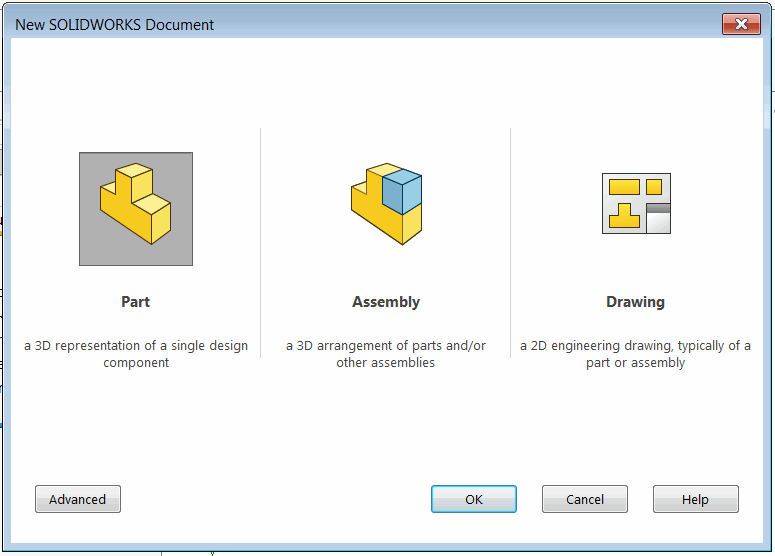

{ width=350 }

This VBA macro handles the creation of new document in SOLIDWORKS (part, assembly or drawing) using SOLIDWORKS API and allows to automatically run custom code or another macro when this event happens. This macro will also handle creation of new virtual document in SOLIDWORKS assembly.

## Configuration

* Create new macro (e.g. *RunOnNewDocCreated.swp*)
* Copy the code into corresponding modules of the macro. The VBA macro tree should look similar to the image below:

{ width=250 }

* Place your code into the *main* sub of the *HandlerModule* module. The pointer to [IModelDoc2](https://help.solidworks.com/2012/english/api/sldworksapi/SolidWorks.Interop.sldworks~SolidWorks.Interop.sldworks.IModelDoc2.html) document is passed as the parameter. Use this pointer instead of [ISldWorks::ActiveDoc](https://help.solidworks.com/2012/english/api/sldworksapi/solidworks.interop.sldworks~solidworks.interop.sldworks.isldworks~activedoc.html) as new document might not be set to active when this event arrives.

~~~ vb
Sub main(model As SldWorks.ModelDoc2)
    'TODO: add your routine here
End Sub
~~~

* It might be useful to automatically run this macro with each session of SOLIDWORKS. Follow the [Run SOLIDWORKS macro automatically on application start](/docs/codestack/solidworks-api/getting-started/macros/run-macro-on-solidworks-start/) link for more information.
* To learn how to run another macro or group of macros refer [Run Group Of Macros](/docs/codestack/solidworks-api/application/frame/run-macros-group/) article

## Macro Module

Entry point which starts new document creation events monitoring

~~~ vb
Dim swFileNewWatcher As FileNewWatcher

Sub main()
    
    Set swFileNewWatcher = New FileNewWatcher
    
    While True
        DoEvents
    Wend
    
End Sub
~~~

## FileNewWatcher Class module

Class which handles SOLIDWORKS new document API notifications

~~~ vb
Dim WithEvents swApp As SldWorks.SldWorks

Private Sub Class_Initialize()
    Set swApp = Application.SldWorks
End Sub

Private Function swApp_FileNewNotify2(ByVal NewDoc As Object, ByVal DocType As Long, ByVal TemplateName As String) As Long
    HandlerModule.main NewDoc
End Function
~~~

## HandlerModule module

Custom VBA code which needs to be run for each newly created document

~~~ vb
Sub main(model As SldWorks.ModelDoc2)
    'TODO:implement the procedure
    MsgBox "File create: " & model.GetTitle()
End Sub
~~~

