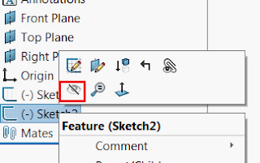

This macro will hide (blank) or show (unblank) all sketches (2D and 3D) in the active document using SOLIDWORKS API.

If the active document is an assembly, sketches from all components will be included as well.

{ width=320 }

## Configuration

Change *HIDE_ALL_SKETCHES* option to specify if sketches need to be hidden or shown.

## CAD+

This macro is compatible with [Toolbar+](https://cadplus.xarial.com/toolbar/) and [Batch+](https://cadplus.xarial.com/batch/) tools so the buttons can be added to toolbar and assigned with shortcut for easier access or run in the batch mode.

In order to enable [macro arguments](https://cadplus.xarial.com/toolbar/configuration/arguments/) set the **ARGS** constant to true

~~~ vb
#Const ARGS = True
~~~

In this case it is not required to make copies of the macro to set individual [options to hide and show](#configuration). Instead use the **-hide**, **-show** arguments to hide and show sketches correspondingly.

You can download the icons for each button: [hide sketches](hide-sketches.svg), [show sketches](show-sketches.svg) or use your own icons.

Watch [video demonstration](https://youtu.be/jsjN8zNRTuc?t=23)

~~~ vb
#Const ARGS = False 'True to use arguments from Toolbar+ or Batch+ instead of the constant

Dim swApp As SldWorks.SldWorks
Dim swModel As SldWorks.ModelDoc2

Const HIDE_ALL_SKETCHES As Boolean = False 'True to hide all sketches, False to show all sketches

Sub main()

    Set swApp = Application.SldWorks
    
    Dim hideAllSketches As Boolean
    
    #If ARGS Then
    
        Dim macroRunner As Object
        Set macroRunner = CreateObject("CadPlus.MacroRunner.Sw")
        
        Dim param As Object
        Set param = macroRunner.PopParameter(swApp)
        
        Dim vArgs As Variant
        vArgs = param.Get("Args")
        
        Dim operation As String
        operation = CStr(vArgs(0))
        
        Select Case LCase(operation)
            Case "-hide"
                hideAllSketches = True
            Case "-show"
                hideAllSketches = False
            Case Else
                Err.Raise vbError, "", "Invalid argument. Valid arguments -hide and -show"
        End Select
    #Else
        hideAllSketches = HIDE_ALL_SKETCHES
    #End If

    Set swModel = swApp.ActiveDoc
    Dim curScrollIntoView As Boolean
    curScrollIntoView = swApp.GetUserPreferenceToggle(swUserPreferenceToggle_e.swFeatureManagerEnsureVisible)
    swApp.SetUserPreferenceToggle swUserPreferenceToggle_e.swFeatureManagerEnsureVisible, False

try_:
    On Error GoTo catch_
    
    If Not swModel Is Nothing Then

        Dim swFeat As SldWorks.Feature
        Set swFeat = swModel.FirstFeature
        
        Dim swSketches() As SldWorks.Feature
        CollectAllSketchFeatures swFeat, swSketches, Not hideAllSketches
        
        If swModel.GetType() = swDocumentTypes_e.swDocASSEMBLY Then
            CollectAllComponentSketchFeatures swModel, swSketches, Not hideAllSketches
        End If
        
        If (Not swSketches) = -1 Then
            Err.Raise vbError, "", "No sketches found"
        End If
        
        If swModel.Extension.MultiSelect2(swSketches, False, Nothing) = UBound(swSketches) + 1 Then
            If hideAllSketches Then
                swModel.BlankSketch
            Else
                swModel.UnblankSketch
            End If
        Else
            Err.Raise vbError, "", "Failed to select sketches"
        End If
        
        GoTo finally_
    
    Else
        Err.Raise vbError, "", "Please open part or assembly"
    End If

catch_:
    swApp.SendMsgToUser2 Err.Description, swMessageBoxIcon_e.swMbStop, swMessageBoxBtn_e.swMbOk
finally_:
    swApp.SetUserPreferenceToggle swUserPreferenceToggle_e.swFeatureManagerEnsureVisible, curScrollIntoView
    
End Sub

Sub CollectAllComponentSketchFeatures(assy As SldWorks.AssemblyDoc, feats() As SldWorks.Feature, isBlankFilter As Boolean)
    
    Dim vComps As Variant
    vComps = assy.GetComponents(False)
    
    Dim processedComps() As String
    
    Dim i As Integer
    
    For i = 0 To UBound(vComps)
        
        Dim swComp As SldWorks.Component2
        Set swComp = vComps(i)
        
        Dim key As String
        key = swComp.GetPathName() & ":" & swComp.ReferencedConfiguration
        
        If Not Contains(processedComps, key) Then
            
            If (Not processedComps) = -1 Then
                ReDim processedComps(0)
            Else
                ReDim Preserve processedComps(UBound(processedComps) + 1)
            End If
            
            processedComps(UBound(processedComps)) = key
            
            CollectAllSketchFeatures swComp.FirstFeature, feats, isBlankFilter
            
        End If
        
    Next
    
End Sub

Sub CollectAllSketchFeatures(firstFeat As SldWorks.Feature, feats() As SldWorks.Feature, isBlankFilter As Boolean)
    
    Const SKETCH_FEAT_TYPE_NAME As String = "ProfileFeature"
    Const SKETCH_3D_FEAT_TYPE_NAME As String = "3DProfileFeature"

    Dim swFeat As SldWorks.Feature
    Set swFeat = firstFeat
    
    While Not swFeat Is Nothing
    
        If swFeat.GetTypeName2 = SKETCH_FEAT_TYPE_NAME Or _
            swFeat.GetTypeName2 = SKETCH_3D_FEAT_TYPE_NAME Then
            
            Dim featVisible As swVisibilityState_e
            featVisible = swFeat.visible
            
            If featVisible = swVisibilityStateUnknown _
                Or (featVisible = swVisibilityStateHide And isBlankFilter) _
                Or (featVisible = swVisibilityStateShown And Not isBlankFilter) Then
            
                If (Not feats) = -1 Then
                    ReDim feats(0)
                Else
                    ReDim Preserve feats(UBound(feats) + 1)
                End If
                
                Set feats(UBound(feats)) = swFeat
            
            End If
            
        End If
        
        Set swFeat = swFeat.GetNextFeature
        
    Wend
    
End Sub

Function Contains(arr() As String, item As String) As Boolean
    
    If (Not arr) = -1 Then
        Contains = False
    Else
        Dim i As Integer
    
        For i = 0 To UBound(arr)
            If LCase(arr(i)) = LCase(item) Then
                Contains = True
                Exit Function
            End If
        Next
        
        Contains = False
    End If
    
End Function
~~~

