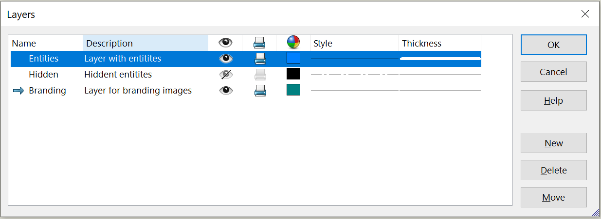

{ width=600 }

These macros allow to import and export the information from the SOLIDWORKS drawing layers into the text file.

The following information is imported and exported:

* Name
* Description
* Visibility
* Will Print
* Color
* Style
* Thickness

## Format

This macro exports all the information into the output text file in the following format

~~~
Layer: Entities
    Description: Layer with entities
    Color: 0 128 255
    Printable: True
    Style: 0
    Visible: True
    Thickness: 5

Layer: Branding
    Description: Layer for branding images
    Color: 0 128 128
    Printable: True
    Style: 0
    Visible: True
    Thickness: 0
~~~

By default file is saved or loaded in th same folder as the original file with the prefix **_Layers.txt**

## CAD+

This macro is compatible with [Toolbar+](https://cadplus.xarial.com/toolbar/) and [Batch+](https://cadplus.xarial.com/batch/) tools so the buttons can be added to toolbar and assigned with shortcut for easier access or run in the batch mode.

In order to enable [macro arguments](https://cadplus.xarial.com/toolbar/configuration/arguments/) set the **ARGS** constant to true

~~~ vb
#Const ARGS = True
~~~

Path the path to text file to import or export as a macro argument.

## Export

~~~ vb
#Const ARGS = False 'True to use arguments from Toolbar+ or Batch+ instead of the constant

Const TOKEN_LAYER = "Layer: "
Const TOKEN_DESCRIPTION = "Description: "
Const TOKEN_COLOR = "Color: "
Const TOKEN_PRINTABLE = "Printable: "
Const TOKEN_STYLE = "Style: "
Const TOKEN_VISIBLE = "Visible: "
Const TOKEN_THICKNESS = "Thickness: "

Dim swApp As SldWorks.SldWorks

Sub main()

    Set swApp = Application.SldWorks
    
    Dim swDraw As SldWorks.DrawingDoc
    
    Set swDraw = swApp.ActiveDoc
    
    Dim filePath As String
    
    #If ARGS Then
                
        Dim macroRunner As Object
        Set macroRunner = CreateObject("CadPlus.MacroRunner.Sw")
        
        Dim param As Object
        Set param = macroRunner.PopParameter(swApp)
        
        Dim vArgs As Variant
        vArgs = param.Get("Args")
        
        filePath = CStr(vArgs(0))
        
    #Else
        filePath = swDraw.GetPathName
        If filePath <> "" Then
            filePath = Left(filePath, InStrRev(filePath, ".") - 1) & "_Layers.txt"
        Else
            Err.Raise vbError, "", "If output file path is not specified file must be saved"
        End If
    #End If
    
    If Not swDraw Is Nothing Then
        ExportLayers swDraw, filePath
    Else
        Err.Raise vbError, "", "Open drawing"
    End If
    
End Sub

Sub ExportLayers(draw As SldWorks.DrawingDoc, filePath As String)
    
    Dim swLayerMgr As SldWorks.LayerMgr
    
    Set swLayerMgr = draw.GetLayerManager
    
    Dim vLayers As Variant
    vLayers = swLayerMgr.GetLayerList

    Dim fileNmb As Integer
    fileNmb = FreeFile
    
    Open filePath For Output As #fileNmb
        
    Dim i As Integer
    
    For i = 0 To UBound(vLayers)
        
        Dim layerName As String
        layerName = CStr(vLayers(i))
        
        Dim swLayer As SldWorks.Layer
        Set swLayer = swLayerMgr.GetLayer(layerName)
        
        Dim RGBHex As String
        RGBHex = Right("000000" & Hex(swLayer.Color), 6)
        
        Print #fileNmb, TOKEN_LAYER & swLayer.Name
        Print #fileNmb, "    " & TOKEN_DESCRIPTION & swLayer.Description
        Print #fileNmb, "    " & TOKEN_COLOR & CInt("&H" & Mid(RGBHex, 5, 2)) & " " & CInt("&H" & Mid(RGBHex, 3, 2)) & " " & CInt("&H" & Mid(RGBHex, 1, 2))
        Print #fileNmb, "    " & TOKEN_PRINTABLE & swLayer.Printable
        Print #fileNmb, "    " & TOKEN_STYLE & swLayer.Style
        Print #fileNmb, "    " & TOKEN_VISIBLE & swLayer.Visible
        Print #fileNmb, "    " & TOKEN_THICKNESS & swLayer.Width
        Print #fileNmb, ""
        
    Next
        
    Close #fileNmb
    
End Sub
~~~

## Import

~~~ vb
#Const ARGS = False 'True to use arguments from Toolbar+ or Batch+ instead of the constant

Const TOKEN_LAYER = "Layer: "
Const TOKEN_DESCRIPTION = "Description: "
Const TOKEN_COLOR = "Color: "
Const TOKEN_PRINTABLE = "Printable: "
Const TOKEN_STYLE = "Style: "
Const TOKEN_VISIBLE = "Visible: "
Const TOKEN_THICKNESS = "Thickness: "

Dim swApp As SldWorks.SldWorks

Sub main()

    Set swApp = Application.SldWorks
    
    Dim swDraw As SldWorks.DrawingDoc
    
    Set swDraw = swApp.ActiveDoc
    
    Dim filePath As String
    
    #If ARGS Then
                
        Dim macroRunner As Object
        Set macroRunner = CreateObject("CadPlus.MacroRunner.Sw")
        
        Dim param As Object
        Set param = macroRunner.PopParameter(swApp)
        
        Dim vArgs As Variant
        vArgs = param.Get("Args")
        
        filePath = CStr(vArgs(0))
        
    #Else
        filePath = swDraw.GetPathName
        If filePath <> "" Then
            filePath = Left(filePath, InStrRev(filePath, ".") - 1) & "_Layers.txt"
        Else
            Err.Raise vbError, "", "If output file path is not specified file must be saved"
        End If
    #End If
    
    If Not swDraw Is Nothing Then
        ImportLayers swDraw, filePath
    Else
        Err.Raise vbError, "", "Open drawing"
    End If
    
End Sub

Sub ImportLayers(draw As SldWorks.DrawingDoc, filePath As String)
    
    Dim swLayerMgr As SldWorks.LayerMgr
    
    Set swLayerMgr = draw.GetLayerManager
    
    Set fso = CreateObject("Scripting.FileSystemObject")
    
    If fso.FileExists(filePath) Then
        
        Dim swCurrentLayer As SldWorks.Layer
        
        Set file = fso.OpenTextFile(filePath)
                
        Do Until file.AtEndOfStream
                
            Dim line As String
                
            line = file.ReadLine
            
            Dim value As String
            
            If IsToken(line, TOKEN_LAYER, value) Then
                
                Set swCurrentLayer = swLayerMgr.GetLayer(value)
                
                If swCurrentLayer Is Nothing Then
                    swLayerMgr.AddLayer value, "", RGB(255, 255, 255), swLineStyles_e.swLineCENTER, swLineWeights_e.swLW_CUSTOM
                    Set swCurrentLayer = swLayerMgr.GetLayer(value)
                End If
                
                If swCurrentLayer Is Nothing Then
                    Err.Raise vbError, "", "Failed to access layer " & value
                End If
                
            Else
                
                If swCurrentLayer Is Nothing Then
                    Err.Raise vbError, "", "Current layer is not set"
                End If
                
                If IsToken(line, TOKEN_DESCRIPTION, value) Then
                    swCurrentLayer.Description = value
                ElseIf IsToken(line, TOKEN_COLOR, value) Then
                    Dim vRgb As Variant
                    vRgb = Split(value, " ")
                    swCurrentLayer.Color = RGB(CInt(Trim(CStr(vRgb(0)))), CInt(Trim(CStr(vRgb(1)))), CInt(Trim(CStr(vRgb(2)))))
                ElseIf IsToken(line, TOKEN_PRINTABLE, value) Then
                    swCurrentLayer.Printable = CBool(value)
                ElseIf IsToken(line, TOKEN_STYLE, value) Then
                    swCurrentLayer.Style = CInt(value)
                ElseIf IsToken(line, TOKEN_VISIBLE, value) Then
                    swCurrentLayer.Visible = CBool(value)
                ElseIf IsToken(line, TOKEN_THICKNESS, value) Then
                    swCurrentLayer.Width = CInt(value)
                End If
                
            End If
            
        Loop
        
        file.Close
        
    Else
        Err.Raise vbError, "", "File does not exist"
    End If
    
End Sub

Function IsToken(txt As String, token As String, ByRef value As String) As Boolean
    
    txt = Trim(txt)
    
    If LCase(Left(txt, Len(token))) = LCase(token) Then
        value = Trim(Right(txt, Len(txt) - Len(token)))
        IsToken = True
    Else
        value = ""
        IsToken = False
    End If
    
End Function
~~~

