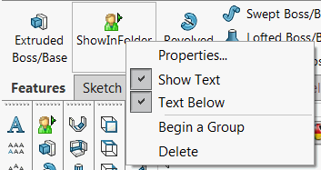

  <iframe allow="autoplay; encrypted-media" allowfullscreen="" frameborder="0"
    width="560" height="315" src="https://www.youtube.com/embed/4CznIatoWUU">
  </iframe>

Macro can be assigned to the custom buttons and placed onto existing toolbars or command tab boxes. This enhances the user experience as macros can be accessed by clicking the button rather then going through the *Run Macro* routine.

In order to associate the macro with the button call the *Customize...* command either from the context menu

{ width=250 }

or from the Tools menu

{ width=250 }

> Note. This command is disabled if no document are opened in SOLIDWORKS

Navigate to *Commands* tab and select the *Macro* group. Last button in this group is *New Macro Button* template.

{ width=350 }

Drag-n-drop this button and place it to any existing toolbar or command tab box in the commands manager

Once dropped the following dialog is popped up:

{ width=250 }

Fill the form with the corresponding data

* Specify full path to the macro
* Select the entry point (method and function name). The list will only contain parameterless functions in the macro. Usually *main* function is an entry point
* Optionally specify the icon. For SOLIDWORKS 2015 or older use 16 by 16 bitmap, for all newer version use 20 by 20 bitmap. Use white color as the transparency key.
* Optionally specify the tooltip and prompt text.

The buttons positions within toolbar will be maintained across SOLIDWORKS sessions. And can be exported-restored using the [SOLIDWORKS Copy Settings Wizard](https://help.solidworks.com/2013/english/solidworks/sldworks/c_copy_settings_wizard.htm).

Macro buttons are performing in the same way as any other standard buttons. It is possible to assign the keyboard shortcut to the macro buttons.

Find the required command in the *Macros* category on the *Keyboard* tab of the *Customize...* dialog and assign the shortcut.

{ width=350 }

In order to edit the properties of macro buttons as well as reorder the buttons or delete it is required to activate the *Customize...* menu command.

While *Customize* dialog is active buttons can be be reordered.

In order to change the attributes of macro buttons use Right Mouse Button click on top of the macro button which will open the *Customize Macro Button* dialog.

In order to remove the button drag it away from the toolbar until red button with cross is appeared on the mouse pointer and release the drag-n-drop.

If macro button was placed on the command tab box use the following context menu to change the properties or remove the button:

{ width=250 }

If you want to place the macro button to the custom toolbar you can use the free [MyToolbar](https://cadplus.xarial.com/toolbar/) add-in.
