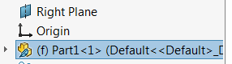

## Symptoms

SOLIDWORKS macro is working with the components in the assembly (e.g. reading/writing properties, materials, working with features etc.).
Error *Run-time Error '91': Object variable or With block variable not set* is displayed when macro is run.

## Cause

Components can be loaded lightweight which means that their underlying model is not loaded into the memory.
In this case all APIs of the component's model are not available

## Resolutions

* Check if the pointer to reference model is not null. Display the error message to the user
* Use [AssemblyDoc::ResolveAllLightWeightComponents](https://help.solidworks.com/2016/english/api/sldworksapi/solidworks.interop.sldworks~solidworks.interop.sldworks.iassemblydoc~resolvealllightweightcomponents.html) or [AssemblyDoc::ResolveAllLightWeight](https://help.solidworks.com/2016/english/api/sldworksapi/SolidWorks.Interop.sldworks~SolidWorks.Interop.sldworks.IAssemblyDoc~ResolveAllLightweight.html) method to forcibly resolve components states

~~~ vb
Dim swApp As SldWorks.SldWorks
Dim swAssy As SldWorks.AssemblyDoc

Sub main()

    Set swApp = Application.SldWorks
    
    Set swAssy = swApp.ActiveDoc
    
    swAssy.ResolveAllLightWeightComponents True
    
    Dim swComp As SldWorks.Component2
    Set swComp = swAssy.SelectionManager.GetSelectedObject6(1, -1)
        
    Dim swRefModel As SldWorks.ModelDoc2
    Set swRefModel = swComp.GetModelDoc2
        
    If Not swRefModel Is Nothing Then 'Check if the pointer is not nothing
        MsgBox "Material of " & swComp.Name2 & ": " & swRefModel.MaterialIdName
    Else
        MsgBox "Component's model is not loaded into the memory" 'display the error
    End If
    
End Sub

~~~

