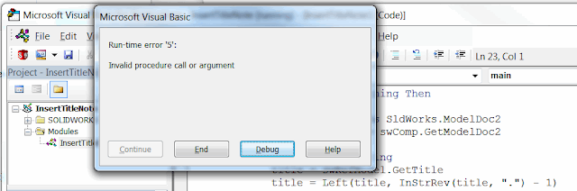
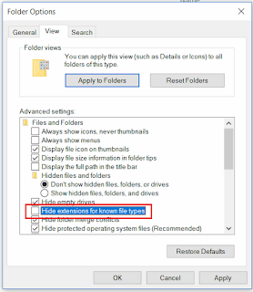

## Symptoms

SOLIDWORKS macro is using the title of the model (e.g. inserting the note, linking the custom property value, generating new file name for exporting).
As the result macro misbehaves (inserting extension twice) or displays the error: *Run-time Error '5': Invalid procedure call or argument*  

The extension is extracted from the document title via [IModelDoc2::GetTitle](https://help.solidworks.com/2018/english/api/sldworksapi/solidworks.interop.sldworks~solidworks.interop.sldworks.imodeldoc2~gettitle.html) SOLIDWORKS API method.

{ width=640 height=211 }

## Cause

There are several factors which affect the way title is displayed to the user:

* Extension visibility in the model's title is displayed based on the windows setting *'Hide extension for known file types'*.
Depending on this setting title of the model can either include or exclude extension (e.g. *Part1 *or *Part1.sldprt*)  

{ width=277 height=320 }

* For the newly created files (i.e. files which were never saved) extension is never displayed
* For drawings the title is a composition of a name and the active sheet. The extension is never displayed for drawings

## Resolution

* Change the setting based on the macro requirement
* Modify the macro code to consider both options. The example below provides two functions to get the title with or without extension regardless of the conditions.

~~~ vb
Dim swApp As SldWorks.SldWorks
Dim swModel As SldWorks.ModelDoc2

Sub main()

    Set swApp = Application.SldWorks

    Set swModel = swApp.ActiveDoc
    
    If Not swModel Is Nothing Then
    
        Debug.Print GetTitleWithoutExtension(swModel)
        Debug.Print GetTitleWithExtension(swModel)
        
    Else
        MsgBox "Please open the model"
    End If
    
End Sub

Function GetTitleWithExtension(model As SldWorks.ModelDoc2) As String
    
    Dim title As String
    Dim ext As String
    
    Select Case model.GetType
        Case swDocumentTypes_e.swDocPART
            ext = ".sldprt"
        Case swDocumentTypes_e.swDocASSEMBLY
            ext = ".sldasm"
        Case swDocumentTypes_e.swDocDRAWING
            ext = ".slddrw"
    End Select
    
    If model.GetPathName() = "" Then
        title = model.GetTitle + ext 'extension is not shown for file which is not saved
    Else
        If IsExtensionShown() Then
            title = model.GetTitle
        Else
            title = model.GetTitle + ext
        End If
    End If
    
    If model.GetType() = swDocumentTypes_e.swDocDRAWING Then
        title = model.GetTitle() 'drawing extension never included into the title
        title = Left(title, InStrRev(title, "-") - 2) + ext 'removing the sheet name from the drawing title
    End If
    
    GetTitleWithExtension = title
    
End Function

Function GetTitleWithoutExtension(model As SldWorks.ModelDoc2) As String
    
    Const EXT_PATTERN = ".sldxxx"
    
    Dim title As String
    
    If model.GetPathName() = "" Then
        title = model.GetTitle 'extension is not shown for file which is not saved
    Else
        If IsExtensionShown() Then
            title = model.GetTitle
            title = Left(title, Len(title) - Len(EXT_PATTERN))
        Else
            title = model.GetTitle
        End If
    End If
    
    If model.GetType() = swDocumentTypes_e.swDocDRAWING Then
        title = Left(title, InStrRev(title, "-") - 2)
    End If
    
    GetTitleWithoutExtension = title
    
End Function

Function IsExtensionShown() As Boolean

    Const REG_KEY As String = "HKEY_CURRENT_USER\Software\Microsoft\Windows\CurrentVersion\Explorer\Advanced\HideFileExt"
    Const UNCHECKED As Integer = 0
    
    Dim wshShell As Object
    Set wshShell = CreateObject("WScript.Shell")
    
    IsExtensionShown = wshShell.RegRead(REG_KEY) = UNCHECKED

End Function
~~~

