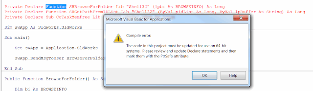

## Symptoms

System is updated from SOLIDWORKS older than 2012 to a newer version.
Or some legacy macro is run.
Macro is utilizing Windows API functions (e.g. has browse file/folder dialog, connects to registry, uses windows handles) via *Declare Function* statement.
When started the *Compile error: The code in this project must be updated for use on 64-bit systems* is displayed.

{ width=640 height=185 }

## Cause

SOLIDWORKS has updated the Visual Basic for Application environment in 2013 release from VB6 to VB7.
VB6 is 32bit application while [VB7](https://msdn.microsoft.com/en-us/vba/language-reference-vba/articles/64-bit-visual-basic-for-applications-overview) is 64bit application.
Due to the difference in variables size in 32/64 it is required to use PtrSafe keyword to assert the environment that it is safe to run the macro in x64 systems and LongPtr or LongLong to properly resolve the Long type variable in 32 and 64 bit environments.

## Resolution

* Modify all of the declaration and include PtrSafe keyword and LongPtr as the variable declarations for Long types
* If it is required to support older versions of SOLIDWORKS (prior to 2012) it is possible to use pre-compile conditional statements #IF-#Else

~~~ vb
#If VBA7 Then
    Private Type BROWSEINFO
      hOwner As LongPtr
      pidlRoot As Long
      pszDisplayName As String
      lpszTitle As String
      ulFlags As Long
      lpfnCallback As LongPtr
      lParam As LongPtr
      iImage As Long
    End Type

    Private Declare PtrSafe Function SHBrowseForFolder Lib "Shell32" (lpbi As BROWSEINFO) As Long
    Private Declare PtrSafe Function SHGetPathFromIDList Lib "Shell32" (ByVal pidList As LongPtr, ByVal lpBuffer As String) As Long
    Private Declare PtrSafe Sub CoTaskMemFree Lib "ole32" (ByVal hMem As LongPtr)
#Else
    Private Type BROWSEINFO
        hOwner As Long
        pidlRoot As Long
        pszDisplayName As Long
        lpszTitle As String
        ulFlags As Long
        lpfnCallback As Long
        lParam As Long
        iImage As Long
    End Type
    
    Private Declare Function SHBrowseForFolder Lib "Shell32" (lpbi As BROWSEINFO) As Long
    Private Declare Function SHGetPathFromIDList Lib "Shell32" (ByVal pidList As Long, ByVal lpBuffer As String) As Long
    Private Declare Sub CoTaskMemFree Lib "ole32" (ByVal hMem As Long)
#End If

Dim swApp As SldWorks.SldWorks

Sub main()

    Set swApp = Application.SldWorks
        
    swApp.SendMsgToUser "Selected folder " & BrowseForFolder
    
End Sub

Public Function BrowseForFolder() As String
  
    Dim bi As BROWSEINFO
    Dim pidl As Long
    Dim path As String
  
    bi.lpszTitle = ""
    bi.ulFlags = 0
    
    pidl = SHBrowseForFolder(bi)
    If pidl <> 0 Then
    
        path = Space$(265)
        SHGetPathFromIDList pidl, path
        path = Left$(path, InStr(path, Chr$(0)) - 1)
    
        CoTaskMemFree lngPIDL
    End If
    
    BrowseForFolder = path
    
End Function

~~~

